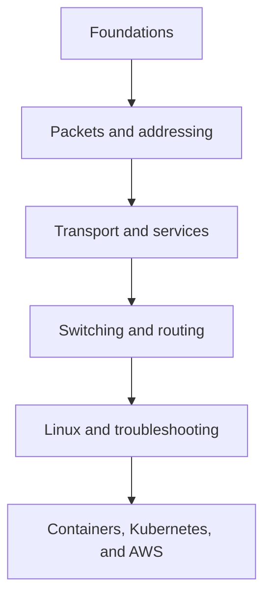

# Networking Fundamentals Handbook

<div align="center">

**A practical, visual, and career-focused guide to computer networking — from first principles to cloud-native infrastructure.**

[](ROADMAP.md)
[](docs/README.md)
[](labs/README.md)
[](LICENSE)
[](CONTRIBUTING.md)

[Start Learning](docs/00-Networking-Basics/README.md) · [View Roadmap](ROADMAP.md) · [Run a Lab](labs/README.md) · [Contribute](CONTRIBUTING.md)

</div>

---

## About

Networking is the foundation beneath web applications, containers, cloud platforms, distributed systems, and security controls. This repository turns that broad subject into a structured handbook that connects **theory**, **packet behavior**, **Linux tools**, **Wireshark analysis**, and **real operational troubleshooting**.

It is designed for students, CCNA learners, DevOps and cloud engineers, backend developers, cybersecurity learners, and software engineers who want to understand what actually happens between two endpoints.

> This is an evolving handbook. Completed chapters are marked clearly; planned links remain visible so the full learning path is easy to understand.

## Learning goals

By completing the handbook and labs, you should be able to:

- explain how data moves through the OSI and TCP/IP models;
- reason about Ethernet, ARP, IP, ICMP, TCP, UDP, DNS, DHCP, NAT, VLANs, switching, and routing;
- inspect interfaces, sockets, routes, neighbors, and packets on Linux;
- read common Wireshark fields and follow a packet conversation;
- diagnose failures systematically instead of guessing;
- connect traditional networking concepts to Docker, Kubernetes, AWS, DevOps, and security;
- answer practical networking interview questions with confidence.

## Learning path



| Stage | Focus | Outcome |
|---|---|---|
| 1. Foundations | Basics, OSI, TCP/IP, encapsulation | Build the correct mental model |
| 2. Local delivery | MAC, ARP, IPv4, subnetting, ICMP | Understand local and routed traffic |
| 3. End-to-end delivery | TCP, UDP, ports, DNS, DHCP, NAT | Understand application connectivity |
| 4. Network design | VLANs, switching, routing, IPv6 | Read and reason about network topology |
| 5. Operations | Wireshark, Linux, troubleshooting | Observe and diagnose real traffic |
| 6. Platforms | DevOps, Docker, Kubernetes, AWS | Apply networking in modern infrastructure |

## Handbook contents

| # | Chapter | Status |
|---:|---|:---:|
| 00 | [Networking Basics](docs/00-Networking-Basics/README.md) | ✅ |
| 01 | [OSI Model](docs/01-OSI-Model/README.md) | ✅ |
| 02 | [TCP/IP Model](docs/02-TCP-IP-Model/README.md) | ✅ |
| 03 | [Data Encapsulation](docs/03-Data-Encapsulation/README.md) | ✅ |
| 04 | [IP Addressing](docs/04-IP-Addressing/README.md) | ✅ |
| 05 | [Subnetting](docs/05-Subnetting/README.md) | ✅ |
| 06 | [MAC Address](docs/06-MAC-Address/README.md) | ✅ |
| 07 | [ARP](docs/07-ARP/README.md) | ✅ |
| 08 | [ICMP](docs/08-ICMP/README.md) | ✅ |
| 09 | [TCP](docs/09-TCP/README.md) | ✅ |
| 10 | [UDP](docs/10-UDP/README.md) | ✅ |
| 11 | [Ports](docs/11-Ports/README.md) | ✅ |
| 12 | [DNS](docs/12-DNS/README.md) | ✅ |
| 13 | [DHCP](docs/13-DHCP/README.md) | ✅ |
| 14 | [NAT](docs/14-NAT/README.md) | ✅ |
| 15 | [VLANs](docs/15-VLAN/README.md) | ✅ |
| 16 | [Switching](docs/16-Switching/README.md) | ✅ |
| 17 | [Routing](docs/17-Routing/README.md) | ✅ |
| 18 | [IPv6](docs/18-IPv6/README.md) | ✅ |
| 19–21 | Wireshark, Linux Networking, Troubleshooting | 🧭 |
| 22–24 | Interviews, Quizzes, Cheatsheets | 🧭 |
| 25–28 | DevOps, Docker, Kubernetes, AWS Networking | 🧭 |

Legend: ✅ complete · 🚧 in progress · 🧭 planned. See the detailed [roadmap](ROADMAP.md).

## What every chapter contains

Each chapter follows one quality standard:

- an introduction and precise theory;
- a visual diagram and real-world analogy;
- a packet journey, practical example, and Linux commands;
- a Wireshark walkthrough and important fields;
- common mistakes, troubleshooting steps, and best practices;
- industry, cloud, DevOps, and cybersecurity perspectives;
- interview questions, mixed-format quiz with answers, FAQ, and summary.

The reusable [chapter template](docs/_templates/CHAPTER-TEMPLATE.md) keeps terminology, navigation, and depth consistent.

## Hands-on labs

The labs are designed to work on a Linux machine or WSL. Each one includes an objective, prerequisites, commands, expected observations, cleanup, troubleshooting, and reflection questions.

Start with [Lab 01: Observe basic connectivity](labs/01-basic-connectivity/README.md), where you inspect interfaces and routes, test reachability, and capture ICMP traffic.

Planned lab tracks include ARP, DNS, TCP handshakes, HTTP/HTTPS, Linux routing, Docker networks, Kubernetes Services and DNS, and AWS VPC routing.

## Quick references

- [Protocol Data Units and headers](cheatsheets/pdu-and-headers.md)
- [IPv4 subnetting](cheatsheets/ipv4-subnetting.md)
- [Lab index](labs/README.md)
- [Documentation roadmap](ROADMAP.md)

## Troubleshooting method

Use evidence and move through the stack:

1. Define the exact source, destination, protocol, port, and symptom.
2. Check link state and local interface configuration.
3. Verify the subnet, gateway, neighbor table, and route selection.
4. Test DNS separately from IP reachability.
5. Check transport state, listening sockets, firewalls, and NAT.
6. Capture packets at the closest useful point and compare request versus response.
7. Record the root cause and the smallest safe fix.

## Repository structure

```text
.
├── docs/               # The handbook and chapter template
├── labs/               # Reproducible practical exercises
├── cheatsheets/        # Fast command and protocol references
├── diagrams/           # Source-controlled visual assets
├── images/             # Screenshots and rendered images
├── packet-captures/    # Sanitized capture files and capture notes
├── assets/             # Shared repository assets
├── CONTRIBUTING.md
├── ROADMAP.md
└── README.md
```

## Interview preparation

Interview content is integrated into every chapter so questions remain connected to the underlying concept. A dedicated interview track will group beginner, intermediate, advanced, DevOps, cloud, CCNA, and scenario-based questions for focused revision.

## Contributing

Corrections, diagrams, labs, packet captures, and clearer explanations are welcome. Read [CONTRIBUTING.md](CONTRIBUTING.md) before opening a change. Technical claims should be verifiable, commands should be tested, captures must be sanitized, and new chapters must follow the shared template.

## License

This project is available under the [MIT License](LICENSE). Educational packet captures or third-party images must include their own source and license information.

## Author

Created and maintained by **Mohammad Alhindi**.

- GitHub: [@mohammadalhindi1](https://github.com/mohammadalhindi1)
- LinkedIn: [Mohammad Alhindi](https://www.linkedin.com/in/mohammad-alhendi13/)

If this handbook helps you, consider starring the repository and sharing what you learned.
