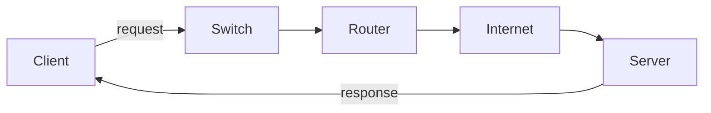

# Chapter 00 — Networking Basics

[← Home](../../README.md) · [Handbook](../README.md) · [OSI Model →](../01-OSI-Model/README.md)

> **Learning objectives**
> - Define a computer network and identify its main components.
> - Distinguish clients, servers, switches, routers, protocols, and transmission media.
> - Explain latency, bandwidth, throughput, loss, and jitter without mixing them up.
> - Use Linux to inspect local network state and test basic reachability.

## 1. Introduction

A **computer network** is a group of endpoints and intermediary devices that exchange data over wired or wireless media by following agreed rules called **protocols**. The Internet is a network of networks, but networking also happens inside a home, data center, cloud VPC, container host, and Kubernetes cluster.

Networking is not only about connecting devices. A useful network must deliver data to the correct destination with acceptable performance, reliability, and security.

## 2. Theory

### Core components

| Component | Role | Example |
|---|---|---|
| Endpoint (host) | Sends or receives data | Laptop, phone, server, VM, container |
| Network interface | Connects a host to a network | Ethernet NIC, Wi-Fi adapter |
| Switch | Forwards frames within a local Layer 2 network | Office access switch |
| Router | Forwards packets between IP networks | Home router, cloud route appliance |
| Medium | Carries signals | Copper, fiber, radio |
| Protocol | Defines communication rules | Ethernet, IP, TCP, DNS, HTTP |
| Network service | Provides a function to clients | DNS resolver, DHCP server, web server |

### Client and server are roles

A client initiates a request; a server listens for and responds to requests. These are roles in a specific interaction, not permanent device types. A laptop can be an HTTP client while also running an SSH server.

### Common network scopes

| Scope | Meaning | Typical example |
|---|---|---|
| PAN | Personal Area Network | Bluetooth devices around one person |
| LAN | Local Area Network | Home, lab, or office network |
| WLAN | Wireless LAN | Wi-Fi network |
| WAN | Wide Area Network | Links between cities or sites |
| Internet | Globally interconnected networks | Public Internet |

### Delivery types

- **Unicast:** one sender to one receiver; normal web traffic is usually unicast.
- **Broadcast:** one sender to every host in a broadcast domain; ARP requests in IPv4 use broadcast.
- **Multicast:** one sender to an interested group; used by some discovery and streaming protocols.
- **Anycast:** the same IP prefix is announced from multiple locations and routing selects a reachable instance; common in global DNS and CDNs.

### Performance vocabulary

| Metric | Correct meaning | Common unit |
|---|---|---|
| Bandwidth | Theoretical link capacity | Mb/s, Gb/s |
| Throughput | Rate of useful data actually delivered | Mb/s |
| Latency | Time required for data to travel | ms |
| Round-trip time (RTT) | Time for a request to go out and a response to return | ms |
| Jitter | Variation in delay between packets | ms |
| Packet loss | Percentage of packets that never arrive | % |

High bandwidth does not guarantee low latency. A satellite link may transfer a large amount of data per second while still taking a long time to complete each round trip.

> **Did you know?** A browser request may trigger DNS resolution, neighbor discovery, routing, a transport handshake, encryption, and application exchange before a page appears.

> **Memory trick:** bandwidth is the width of a road; latency is the travel time; throughput is how many useful vehicles actually arrive.

### Behind the scenes

Applications generally do not build Ethernet frames or IP packets themselves. They use operating-system socket APIs. The kernel selects a source address and route, resolves the next-hop link-layer address when needed, builds headers, and gives the frame to the network interface.

## 3. Visual diagram



The diagram is intentionally logical. A real path may contain many switches, routers, firewalls, load balancers, tunnels, and provider networks.

## 4. Real-world example

When you open `https://example.com`, your device usually:

1. obtains configuration such as an IP address, prefix, gateway, and DNS resolver;
2. asks DNS for the server address;
3. checks whether that address is local or requires a gateway;
4. sends traffic toward the selected next hop;
5. establishes transport and encrypted sessions;
6. exchanges HTTP data with the server.

### Real industry usage

Network knowledge lets platform teams design service paths, developers set correct timeouts, SREs identify failure domains, and support engineers separate a DNS problem from an application problem.

### Cloud perspective

Cloud networks replace much physical interaction with software-defined resources, but the core questions remain: Which interface and address does the workload use? Which route matches? Which policy permits the flow? Where does translation occur?

### DevOps perspective

CI runners, artifact registries, package managers, APIs, health checks, and deployment targets all depend on name resolution and network reachability. A pipeline error such as “connection timed out” is a symptom, not a root cause.

### Cybersecurity perspective

Every reachable service increases attack surface. Defenders reduce exposure with segmentation, least-privilege rules, encryption, strong authentication, patching, logging, and continuous traffic observation.

## 5. Packet journey

Assume a laptop sends data to a server on another network:

1. The application gives data to the operating system through a socket.
2. The transport layer identifies the application endpoints with ports.
3. IP adds source and destination IP addresses.
4. The host compares the destination with its local prefix and selects a route.
5. Because the destination is remote, the next hop is normally the default gateway.
6. The host resolves the gateway's link-layer address and sends a frame to it.
7. Each router removes the incoming link-layer frame, examines the destination IP, chooses a route, and creates a new link-layer frame for the next link.
8. The destination host delivers the payload upward to the listening application.

The link-layer addresses normally change hop by hop. The original source and destination IP addresses usually remain end to end, except when a device performs NAT or another form of translation.

## 6. Linux commands

| Command | What it does | When to use it |
|---|---|---|
| `ip -brief address` | Shows interfaces, state, and assigned addresses | First view of local configuration |
| `ip route` | Shows the kernel routing table | Determine the selected gateway/path |
| `ip neighbor` | Shows IP-to-link-layer neighbor entries | Investigate local next-hop resolution |
| `ping -c 4 HOST` | Sends ICMP Echo Requests | Test IP reachability and observe RTT/loss |
| `ss -tulpen` | Shows listening TCP/UDP sockets | Confirm that a local service is listening |
| `traceroute HOST` | Probes intermediate routed hops | Investigate where a path stops or changes |

Example:

```bash
ip -brief address
ip route
ping -c 4 1.1.1.1
```

Typical `ip -brief address` output:

```text
lo               UNKNOWN        127.0.0.1/8 ::1/128
eth0             UP             192.0.2.10/24
```

- `lo` is the loopback interface; traffic stays inside the host.
- `UP` means the interface is administratively enabled.
- `192.0.2.10/24` is documentation-only example space, not a real assignment for your machine.

Typical route:

```text
default via 192.0.2.1 dev eth0
192.0.2.0/24 dev eth0 proto kernel scope link src 192.0.2.10
```

The first entry handles destinations without a more specific route. The second says the local subnet is directly reachable through `eth0`.

## 7. Practical example

Complete [Lab 01: Observe basic connectivity](../../labs/01-basic-connectivity/README.md). You will create a baseline, inspect the default route, compare local and remote tests, and capture ICMP safely.

## 8. Wireshark example

Use this display filter after generating a ping:

```text
icmp
```

For a basic IPv4 ping, inspect:

| Field | What to verify |
|---|---|
| Ethernet source/destination | Local sender and next-hop link-layer addresses |
| `ip.src`, `ip.dst` | Original IP endpoints |
| IP Time to Live | Remaining hop limit; routers decrement it |
| ICMP type | `8` for Echo Request, `0` for Echo Reply |
| ICMP identifier/sequence | Values that associate replies with requests |

If requests leave but no replies return, the capture proves only that the host transmitted them. It does not prove the remote host received them; investigate the path and policies.

## 9. Common mistakes

- Treating the Internet and Wi-Fi as synonyms. Wi-Fi is one local access technology.
- Calling every network device a router. Switches and routers make different forwarding decisions.
- Assuming a failed ping means the destination is down. ICMP may be filtered while an application port works.
- Confusing bandwidth with speed in every sense. User experience also depends on latency, loss, server time, and protocol behavior.
- Testing a hostname once and immediately blaming “the network.” DNS, routing, transport, TLS, and the application must be isolated.

## 10. Troubleshooting

| Symptom | Evidence to collect | Useful check |
|---|---|---|
| No address on interface | Link state and address list | `ip -brief address` |
| Local subnet works, remote does not | Default route | `ip route` |
| IP works, hostname fails | Resolver and DNS answer | `resolvectl status`, `dig` |
| Connection refused | Listening socket and target port | `ss -tulpen` |
| Connection times out | Route, firewall, capture in both directions | `ip route get`, `tcpdump` |

### Best practices

- Record a healthy baseline before an incident.
- Test by IP and hostname separately.
- State the full flow: source, destination, protocol, and port.
- Prefer modern `ip` and `ss`; learn legacy `ifconfig`, `route`, `arp`, and `netstat` mainly to read older systems.
- Capture only the traffic you need and sanitize files before sharing.

## 11. Interview questions

### What is the difference between a switch and a router?

<details><summary>Answer</summary>

A switch primarily forwards frames within a Layer 2 domain using link-layer addresses. A router forwards IP packets between Layer 3 networks using a routing table. Multilayer switches can perform both roles.

</details>

### A server can ping an IP but cannot open its hostname. What should you test next?

<details><summary>Answer</summary>

Test name resolution directly: inspect the configured resolver and query the name with `dig` or `host`. IP reachability already suggests that at least one network path works, while the hostname symptom points first toward DNS or name configuration.

</details>

### Why can a high-bandwidth link still feel slow?

<details><summary>Answer</summary>

Bandwidth is capacity. High latency, loss, jitter, application processing, congestion, or repeated handshakes can still make interactions slow.

</details>

## 12. Quiz

1. **Multiple choice:** Which device normally forwards packets between different IP networks?  
   A. Hub · B. Router · C. Wireless client · D. Cable
2. **True or false:** A client is always a laptop and a server is always physical hardware.
3. **Multiple choice:** Which metric describes variation in packet delay?  
   A. Jitter · B. Bandwidth · C. Prefix length · D. Port
4. **Practical:** Which two commands would you use first to inspect interface addresses and the default route?
5. **Scenario:** A hostname fails but its IP address responds. Which subsystem should be isolated first, and why?

<details><summary>Quiz answers</summary>

1. **B — Router.**
2. **False.** Client and server describe roles in an interaction.
3. **A — Jitter.**
4. `ip -brief address` and `ip route`.
5. DNS/name resolution, because direct IP reachability works while translation from name to address does not.

</details>

## FAQ

### Is the Internet the same as the web?

No. The Internet is the underlying network of networks. The web is one application ecosystem that runs over it, mainly using HTTP and HTTPS.

### Does ping test whether a website is working?

No. Ping tests ICMP behavior. A website also depends on DNS, TCP or QUIC, TLS, HTTP, the application, and its dependencies.

### Do cloud networks still use routers and subnets?

Yes, but many components are virtualized and managed through provider APIs. The concepts remain essential even when the hardware is hidden.

## 13. Summary

A network connects endpoints through interfaces, media, intermediary devices, and protocols. Reliable troubleshooting starts by identifying the exact flow and collecting evidence about addressing, routes, names, ports, and packets. Continue with the [OSI model](../01-OSI-Model/README.md) to learn how engineers separate these responsibilities into layers.
