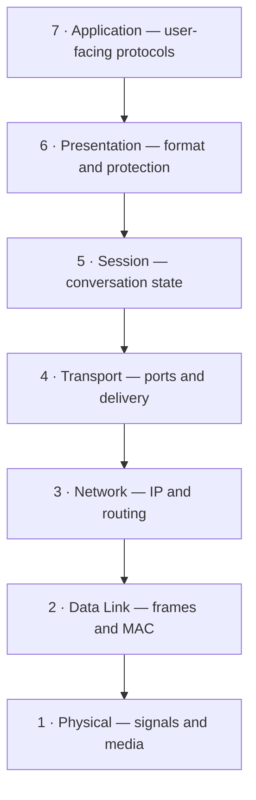

# Chapter 01 — The OSI Model

[← Networking Basics](../00-Networking-Basics/README.md) · [Handbook](../README.md) · [TCP/IP Model →](../02-TCP-IP-Model/README.md)

> **Learning objectives**
> - Explain why the OSI model exists and what each of its seven layers does.
> - Follow data as it is encapsulated, transmitted, and de-encapsulated.
> - Identify protocols, devices, addresses, and protocol data units by layer.
> - Use the model to troubleshoot real connectivity problems without treating it as a rigid implementation diagram.

## 1. Introduction

The **Open Systems Interconnection (OSI) model** is a seven-layer reference model that separates network communication into manageable responsibilities. It gives engineers a shared vocabulary: instead of saying “the network is broken,” they can ask whether the failure involves the physical link, local frame delivery, IP routing, a transport connection, data representation, or the application protocol.

The model is not a literal map of every modern operating system. Real protocols sometimes span layers, and the Internet protocol suite is normally implemented using the simpler TCP/IP model. OSI remains valuable because it provides a precise way to learn, design, discuss, and troubleshoot communication.

## 2. Theory

### The seven layers

| Layer | Name | Main responsibility | Examples | PDU |
|---:|---|---|---|---|
| 7 | Application | Network services used by applications | HTTP, DNS, DHCP, SSH, SMTP | Data |
| 6 | Presentation | Format, encoding, compression, encryption | TLS concepts, UTF-8, JSON, JPEG | Data |
| 5 | Session | Establish, maintain, and end logical conversations | RPC sessions, checkpoints, dialog control | Data |
| 4 | Transport | End-to-end delivery, ports, reliability, flow control | TCP, UDP | Segment / datagram |
| 3 | Network | Logical addressing and routing between networks | IPv4, IPv6, ICMP, IPsec | Packet |
| 2 | Data Link | Local-link delivery, framing, MAC addressing, error detection | Ethernet, Wi-Fi, VLANs, ARP* | Frame |
| 1 | Physical | Transmission of bits as electrical, optical, or radio signals | Copper, fiber, radio, connectors | Bits |

\*ARP sits at the boundary between Layer 2 and Layer 3 in many explanations. Its purpose is to map an IPv4 next-hop address to a link-layer address; forcing every protocol into exactly one box can be misleading.

### Layer 7 — Application

This layer defines how network-aware applications request and provide services. A browser uses HTTP semantics; a resolver uses DNS messages; an SSH client uses the SSH protocol. “Application layer” does not mean the entire application UI or business logic.

### Layer 6 — Presentation

The presentation layer concerns how data is represented: serialization, character encoding, compression, and encryption-related transformation. Modern applications often implement these responsibilities inside libraries rather than a distinct operating-system layer.

### Layer 5 — Session

The session layer manages logical conversations, including establishment, synchronization, recovery points, and termination. In the TCP/IP world, these functions are commonly handled by application protocols, frameworks, or transport-security libraries.

### Layer 4 — Transport

Transport connects application processes end to end. **Ports** identify application endpoints. TCP can provide ordered, reliable byte-stream delivery with retransmission and flow control; UDP provides connectionless datagrams with lower protocol overhead and no built-in delivery guarantee.

### Layer 3 — Network

The network layer uses logical addresses and routing to move packets across multiple networks. Routers examine the destination IP address and choose a next hop. An IP address identifies an interface within an addressing and routing context—not a person or permanent physical device.

### Layer 2 — Data Link

The data-link layer delivers frames across one local link or Layer 2 domain. Ethernet switches learn source MAC addresses and forward frames based on destination MAC addresses. Frame check sequences help detect corruption; they do not provide end-to-end recovery.

### Layer 1 — Physical

The physical layer carries bits as signals. It defines media, signaling, connectors, timing, modulation, and data rates. A damaged cable, disabled radio, incorrect transceiver, or loss of signal is a Layer 1 problem.

> **Did you know?** A router normally removes the incoming Layer 2 frame and builds a new frame for the next link, while forwarding the Layer 3 packet. This is why MAC addresses change hop by hop.

> **Memory trick:** **All People Seem To Need Data Processing** — Application, Presentation, Session, Transport, Network, Data Link, Physical. Use it to recall the order, then learn the actual responsibilities.

### Behind the scenes

When an application calls `send()`, the kernel does not execute seven visibly separate programs. Protocol processing happens through networking stacks, drivers, hardware offload, libraries, and application code. The layered model describes responsibilities and interfaces even when implementation boundaries differ.

## 3. Visual diagram



On the sending host, data moves downward and gains protocol information. On the receiving host, it moves upward as each layer interprets and removes the information relevant to it.

### Address and device map

| Layer | Identifier | Common device or component |
|---:|---|---|
| 7–5 | Names, resource identifiers, session identifiers | Proxy, gateway, application server |
| 4 | TCP/UDP port | Stateful firewall, load balancer |
| 3 | IP address and prefix | Router, Layer 3 switch |
| 2 | MAC address, VLAN ID | Ethernet switch, bridge, access point |
| 1 | Port, channel, signal | Cable, transceiver, repeater, antenna |

Devices are not always restricted to one layer. A modern firewall may inspect Layers 3 through 7, and a multilayer switch can bridge and route.

## 4. Real-world example

When a browser requests an HTTPS page:

1. **Application:** the browser creates an HTTP request and may use DNS first.
2. **Presentation:** TLS protects the application data and negotiates cryptographic representation.
3. **Session:** libraries maintain the logical TLS/HTTP conversation and reuse state where supported.
4. **Transport:** TCP segments the byte stream and uses source/destination ports, or HTTP/3 uses QUIC over UDP.
5. **Network:** IP adds logical source and destination addresses and enables routing.
6. **Data Link:** Ethernet or Wi-Fi frames carry the packet to the next hop.
7. **Physical:** signals transmit the bits across copper, fiber, or radio.

### Real industry usage

Operations teams label alerts and runbooks by layer, network engineers separate switching from routing, developers distinguish an HTTP error from a connection failure, and security teams place controls at several layers instead of relying on one firewall.

### Cloud perspective

Cloud platforms hide much of Layers 1 and 2. Users primarily configure virtual interfaces, IP prefixes, route tables, gateways, load balancers, DNS, and policy. Hidden does not mean absent: provider networking still transmits frames and signals underneath the abstraction.

### DevOps perspective

A failed deployment may involve:

- Layer 7: wrong health-check path;
- Layer 4: service not listening on the expected port;
- Layer 3: missing route between subnets;
- policy across Layers 3/4: firewall or security-group denial;
- Layer 2/1: uncommon in managed cloud, but possible on self-managed infrastructure.

Mapping the symptom prevents wasting time rebuilding an application when the route is missing.

### Cybersecurity perspective

Controls and attacks exist across the stack: physical access controls, switch protections, network segmentation, transport filtering, TLS, authentication, and application validation. Encryption at one layer does not eliminate vulnerabilities at another; HTTPS protects data in transit but does not fix an authorization flaw.

## 5. Packet journey

Assume host A sends an HTTPS request to host B through a router.

### Encapsulation on host A

```text
Application data
└─ TCP header + application data                         = segment
   └─ IP header + TCP segment                           = packet
      └─ Ethernet header + IP packet + Ethernet trailer = frame
         └─ transmitted signals                         = bits
```

1. The browser produces application data.
2. TCP adds ports, sequence information, and control flags.
3. IP adds source and destination IP addresses.
4. Ethernet adds source and next-hop destination MAC addresses plus a trailer.
5. The interface transmits the frame as signals.

### At the router

1. The router receives bits and validates the incoming frame.
2. It removes the Layer 2 header/trailer and examines the destination IP.
3. It decrements the IPv4 TTL or IPv6 Hop Limit and selects a route.
4. It builds a new Layer 2 frame for the outgoing link.

The router normally does not read the encrypted HTTP content. NAT, firewalls, proxies, or other middleboxes may perform additional processing.

### De-encapsulation on host B

The destination validates and removes the link header, processes the IP packet, delivers the TCP segment to the correct socket, and passes the reconstructed byte stream to TLS and the application.

## 6. Linux commands

| Layer | Command | What it reveals | When to use it |
|---:|---|---|---|
| 1/2 | `ip -s link` | Interface state, MAC, counters, drops/errors | Check link and local-frame evidence |
| 2/3 | `ip neighbor` | IP-to-link-layer neighbor cache | Diagnose next-hop resolution |
| 3 | `ip address` | Interface IPs and prefixes | Verify logical addressing |
| 3 | `ip route get DEST` | Selected route, gateway, source, interface | Confirm kernel forwarding decision |
| 3 | `ping -c 4 DEST` | ICMP response, RTT, packet loss | Test IP reachability where ICMP is allowed |
| 3 | `traceroute DEST` | Hop behavior toward a destination | Investigate path changes or stopping points |
| 4 | `ss -tulpen` | Listening/connected TCP and UDP sockets | Verify ports and process bindings |
| 7 | `dig NAME` | DNS question, answer, flags, timing | Isolate name resolution |
| 7 | `curl -v URL` | Connection, TLS, and HTTP details | Test the full application path |
| 2–7 | `tcpdump -ni IFACE FILTER` | Packets visible at an interface | Confirm what left and returned |

### Reading link evidence

```bash
ip -s link show dev eth0
```

Look for `state UP`, RX/TX packet counts, errors, and drops. Counters increasing does not automatically mean the application works; it proves activity at a lower layer.

### Following a full request

```bash
ip route get 1.1.1.1
curl -v --connect-timeout 5 https://example.com/
```

`ip route get` shows the selected Layer 3 path. `curl -v` then exposes DNS use, the connection target, TLS negotiation, and the HTTP response. Avoid `-k` in normal testing because it disables certificate verification.

## 7. Practical example

Use three tests to isolate the failure domain:

```bash
ping -c 2 127.0.0.1
ping -c 4 1.1.1.1
curl -I --connect-timeout 5 https://example.com/
```

- If loopback fails, investigate the local stack.
- If loopback succeeds but the remote IP fails, investigate interface, gateway, routing, policy, and path.
- If the remote IP succeeds but the URL fails, isolate DNS, TCP/UDP, TLS, and HTTP rather than repeating the same ping.

These tests do not prove every lower layer is perfect. They provide evidence that narrows the next question.

## 8. Wireshark example

Generate a simple HTTPS request, then begin with:

```text
dns or tcp or tls
```

Useful focused filters:

| Goal | Display filter |
|---|---|
| DNS exchange | `dns` |
| TCP handshake | `tcp.flags.syn == 1` |
| Traffic for one TCP conversation | `tcp.stream eq 0` |
| TLS handshake messages | `tls.handshake` |
| ICMP errors | `icmp or icmpv6` |

Follow the sequence:

1. DNS query and response reveal the application destination address.
2. TCP `SYN`, `SYN, ACK`, and `ACK` establish the transport connection.
3. TLS ClientHello and ServerHello begin encrypted-session negotiation.
4. Application payload is normally shown as encrypted application data.

Important fields include Ethernet source/destination, IP source/destination and TTL, TCP source/destination ports, flags, sequence/acknowledgment numbers, window, and TLS Server Name Indication when present. Modern encrypted DNS, QUIC, session resumption, proxies, and caches can change this sequence.

## 9. Common mistakes

- Believing OSI is the exact implementation architecture of the Internet.
- Calling a TCP segment a frame at every point. PDU names describe different protocol layers.
- Saying switches are only Layer 2 or firewalls are only Layer 3. Real devices may process multiple layers.
- Assuming Layer 6 always means TLS and Layer 5 always has a visible standalone protocol.
- Thinking every failure should be debugged from Layer 1 upward. Start where evidence and symptoms point, then verify dependencies.
- Treating “ping works” as proof that DNS, a port, TLS, and the application all work.
- Assuming MAC addresses travel end to end across routers.

## 10. Troubleshooting

| Symptom | Likely area | Evidence |
|---|---|---|
| Interface down, no carrier, high physical errors | Layer 1 | `ip link`, interface LEDs, counters, transceiver state |
| Neighbor resolution fails, wrong VLAN | Layer 2 | `ip neighbor`, ARP capture, switch/VLAN configuration |
| No route or wrong gateway | Layer 3 | `ip route`, `ip route get`, traceroute |
| Timeout or refusal on a port | Layer 4 or policy | `ss`, SYN capture, firewall rules |
| TLS certificate/name failure | Layer 6/7 | `curl -v`, certificate details, SNI and hostname |
| HTTP 401, 403, 404, 500 | Layer 7 | HTTP status, application/proxy logs |

### A disciplined workflow

1. Describe the exact flow: source, destination, protocol, port, and time.
2. Decide whether the failure is name resolution, reachability, connection establishment, encryption, or application response.
3. Gather one piece of evidence above and below the suspected boundary.
4. Compare with a known-good host or earlier baseline.
5. Apply the smallest change and repeat the same test.
6. Record the root cause, not just the command that made the symptom disappear.

### Best practices

- Use the model as a communication and isolation tool, not a memorization contest.
- Name the actual protocol and symptom alongside the layer number.
- Keep timestamps synchronized when comparing captures and logs.
- Capture as close as possible to both sides of a disputed boundary.
- Remember that overlays, tunnels, NAT, proxies, and service meshes add inner and outer headers.

## 11. Interview questions

### Why is the OSI model still useful if the Internet uses TCP/IP?

<details><summary>Answer</summary>

It separates responsibilities and provides shared troubleshooting vocabulary. TCP/IP better reflects the deployed protocol suite, while OSI gives finer conceptual boundaries—especially for discussing local delivery, routing, transport, representation, and application behavior.

</details>

### Which addresses change when a packet crosses a normal router?

<details><summary>Answer</summary>

The Layer 2 source and destination addresses change for the new link. The end-to-end IP source and destination normally remain, while TTL/Hop Limit changes. NAT or tunneling can modify or add network-layer addresses.

</details>

### What is encapsulation?

<details><summary>Answer</summary>

Encapsulation is the process by which a layer adds its protocol control information around data from the layer above. At the receiver, de-encapsulation interprets and removes that information as data moves upward.

</details>

### A user receives HTTP 403. Is this primarily a Layer 3 failure?

<details><summary>Answer</summary>

No. An HTTP response proves that substantial lower-layer communication succeeded. A 403 is an application-layer authorization or policy response, although upstream proxies or gateways may be the component generating it.

</details>

### Where do load balancers operate?

<details><summary>Answer</summary>

It depends on the product and mode. A Layer 4 load balancer forwards based mainly on IP and transport information. A Layer 7 load balancer understands application protocols such as HTTP and can route using hostnames, paths, headers, or cookies.

</details>

## 12. Quiz

1. **Multiple choice:** Which layer is responsible for routing between IP networks?  
   A. Physical · B. Data Link · C. Network · D. Presentation
2. **True or false:** MAC addresses normally remain unchanged from the original host to a remote Internet server.
3. **Multiple choice:** Which PDU is associated with Layer 2?  
   A. Segment · B. Frame · C. Packet · D. Data stream
4. **True or false:** A successful ping proves that an HTTPS application is healthy.
5. **Practical:** Which Linux command shows the route the kernel would use for a specific destination?
6. **Scenario:** DNS returns an address and ping succeeds, but TCP connection attempts time out. Which layer and controls should you inspect next?
7. **Scenario:** A switch receives a frame with an unknown unicast destination MAC. What will a traditional switch normally do within that VLAN?

<details><summary>Quiz answers</summary>

1. **C — Network layer.**
2. **False.** Routers rebuild Layer 2 framing for each link.
3. **B — Frame.**
4. **False.** ICMP reachability does not validate TCP/QUIC, TLS, HTTP, or application dependencies.
5. `ip route get DESTINATION`.
6. Inspect Layer 4 behavior and Layer 3/4 policy: confirm the service is listening, capture SYN/replies, and check firewalls, security groups, ACLs, and NAT paths.
7. It normally floods the frame out eligible ports in that VLAN except the ingress port, then learns from observed source addresses.

</details>

## FAQ

### Should I memorize all seven layers?

Memorize the order, but prioritize understanding responsibilities, identifiers, PDUs, and failure evidence. That knowledge is useful after the mnemonic is forgotten.

### Is ARP Layer 2 or Layer 3?

It bridges Layer 3 knowledge and Layer 2 delivery by resolving an IPv4 next-hop address to a link-layer address. Different teaching materials place it differently; explain its function instead of arguing only about the label.

### Is TLS always Layer 6?

OSI discussions commonly map TLS to Presentation because it transforms and protects application data. In real TCP/IP implementations it is usually a library between the application protocol and transport socket, so context matters.

### Does Kubernetes follow the OSI model?

Its traffic still uses physical, link, IP, transport, and application mechanisms. Kubernetes adds abstractions such as Pods, Services, ingress/gateway routing, DNS, overlays, and network policy; these often span multiple OSI layers.

## 13. Summary

The OSI model divides communication into seven responsibilities: applications and representation at the top, end-to-end transport and routing in the middle, and local delivery and signals at the bottom. Encapsulation moves data downward on the sender; de-encapsulation moves it upward on the receiver. Use the model to name the failing behavior, select evidence, and communicate clearly—while remembering that real protocols and devices can cross layer boundaries. Next, study the [TCP/IP model](../02-TCP-IP-Model/README.md) used to describe the deployed Internet protocol suite.
