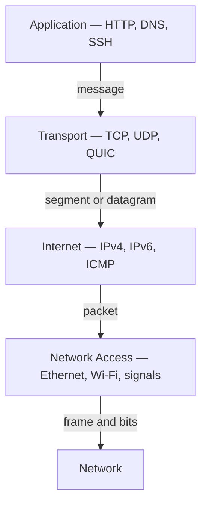

# Chapter 02 — The TCP/IP Model

[← OSI Model](../01-OSI-Model/README.md) · [Handbook](../README.md) · [Data Encapsulation →](../03-Data-Encapsulation/README.md)

> **Learning objectives**
> - Explain the four layers of the TCP/IP model and their responsibilities.
> - Map TCP/IP layers to OSI without pretending the mapping is exact.
> - Follow a web request through application, transport, internet, and link processing.
> - Connect Linux commands and packet-capture evidence to the correct layer.

## 1. Introduction

The **TCP/IP model** describes the protocol architecture that powers the Internet. Its name comes from two central protocols: **Transmission Control Protocol (TCP)** and **Internet Protocol (IP)**. Unlike the seven-layer OSI reference model, TCP/IP is commonly presented as four layers built around protocols that were designed, implemented, and deployed in real networks.

The model answers a practical question: how can applications on different systems communicate across many independent physical networks? Each layer provides a service to the layer above and relies on the layer below.

## 2. Theory

### The four layers

| TCP/IP layer | Responsibility | Common protocols and technologies | Data unit |
|---|---|---|---|
| Application | User-facing network services, message formats, application behavior | HTTP, HTTPS, DNS, DHCP, SSH, SMTP, NTP | Data / message |
| Transport | Process-to-process delivery, ports, reliability or datagrams | TCP, UDP, QUIC* | TCP segment / UDP datagram |
| Internet | Logical addressing and delivery across interconnected networks | IPv4, IPv6, ICMP, IPsec | IP packet |
| Network Access | Local-link framing and physical transmission | Ethernet, Wi-Fi, ARP, VLANs, fiber, radio | Frame / bits |

\*QUIC runs over UDP but implements transport-like reliability, congestion control, security, and streams in user space. It is a good reminder that real systems do not always fit cleanly into one box.

### Application layer

The TCP/IP application layer combines responsibilities that OSI separates into Application, Presentation, and Session. It defines messages and interactions used by software: DNS queries, HTTP requests, SSH sessions, email transfer, time synchronization, and address configuration.

An application protocol may depend on supporting protocols. Opening a website often requires DNS before HTTP, and HTTPS adds TLS protection around HTTP communication.

### Transport layer

The transport layer connects processes rather than merely hosts. A socket endpoint is commonly described by an IP address, transport protocol, and port.

| TCP | UDP |
|---|---|
| Connection-oriented byte stream | Connectionless datagrams |
| Reliable, ordered delivery | No built-in delivery or ordering guarantee |
| Sequence numbers, acknowledgments, retransmission | Small header and preserves message boundaries |
| Flow and congestion control | Application chooses any needed recovery behavior |
| Used by HTTP/1.1, HTTP/2, SSH, SMTP | Used by DNS, DHCP, media, and as the base for QUIC |

TCP reliability does not mean the application operation succeeded. It means bytes were delivered to the peer's TCP stack in order; the remote application can still return an error or fail afterward.

### Internet layer

IP provides **best-effort datagram delivery** across networks. Routers examine destination IP prefixes and forward packets one hop at a time. IP does not guarantee arrival, order, or duplicate prevention; higher layers handle behavior they require.

ICMP communicates network-layer status and diagnostic information. `ping` uses ICMP Echo messages, while routers may send ICMP errors such as Destination Unreachable or Time Exceeded.

### Network Access layer

This layer covers communication on the current link: framing, link-layer addressing, media access, error detection, and signal transmission. A host must deliver a frame to either the final local destination or a next-hop router.

The TCP/IP model intentionally avoids requiring one specific link technology. The same IP packet can cross Ethernet, Wi-Fi, fiber provider links, tunnels, and other media during one journey.

### TCP/IP and OSI mapping

| TCP/IP | Closest OSI layers | Important qualification |
|---|---|---|
| Application | 7 Application, 6 Presentation, 5 Session | TCP/IP applications and libraries perform these functions |
| Transport | 4 Transport | The closest direct mapping |
| Internet | 3 Network | IP and routing are central |
| Network Access | 2 Data Link, 1 Physical | Groups local delivery and transmission |

The mapping is a teaching aid, not a protocol law. Do not use it to force TLS, ARP, QUIC, tunnels, or middleboxes into misleading single-layer labels.

> **Did you know?** The Internet was designed to interconnect networks that could use different link technologies. IP provides the common packet format between them.

> **Memory trick:** **Application Talks, Internet Links** — Application, Transport, Internet, Link/Network Access.

### Behind the scenes

On Linux, applications normally interact with sockets. The kernel implements TCP, UDP, IP, routing, neighbor handling, queueing, and network-device drivers. Some work may be offloaded to the NIC, so packet captures can appear to contain unusual checksums or very large segments before the hardware divides them.

## 3. Visual diagram



The receiving system processes the same responsibilities in reverse. Routers normally operate on Network Access and Internet information; they do not participate in the endpoint's full application conversation unless acting as a proxy or middlebox.

## 4. Real-world example

Consider `curl https://example.com/`:

1. The application resolves the hostname using DNS.
2. It creates a transport connection to the chosen address and port 443.
3. IP selects source/destination addresses and a route.
4. The host sends a local-link frame to the destination or gateway.
5. TLS establishes protection, then HTTP messages are exchanged.
6. The response follows a return path that may differ from the forward path.

### Real industry usage

Backend engineers design application timeouts around transport behavior. Network engineers manage prefixes and routes. SRE and DevOps teams correlate application errors with socket, packet, and link evidence. Security teams enforce policy using IPs, ports, identities, encryption, and application context.

### Cloud perspective

A cloud flow commonly crosses a virtual NIC, subnet, route table, security policy, gateway or load balancer, and destination service. These resources still map to TCP/IP responsibilities even when the provider hides physical links and switching.

### DevOps perspective

Common failure messages can be classified:

| Message | First area to investigate |
|---|---|
| `Could not resolve host` | Application-layer DNS path |
| `Network is unreachable` | Internet-layer addressing/routing |
| `Connection refused` | Transport endpoint: host replied but nothing accepted the port |
| `Connection timed out` | Path, policy, NAT, loss, or silent service behavior |
| HTTP `503` | Application, proxy, load balancer, or unhealthy upstream |

### Cybersecurity perspective

TCP/IP was built for interoperability, so security is layered onto and around it. Use encryption and authentication at the application/session boundary, restrict network paths and transport ports, segment links, validate input, log decisions, and assume source addresses alone are not strong identities.

## 5. Packet journey

Assume a client at `192.0.2.10` connects to a remote HTTPS server at `198.51.100.20`.

### Sending endpoint

1. **Application:** creates a DNS query, establishes TLS, and formats HTTP messages.
2. **Transport:** uses an ephemeral client port and server port 443; TCP tracks sequence and acknowledgment state.
3. **Internet:** creates an IP packet with source `192.0.2.10` and destination `198.51.100.20`.
4. **Network Access:** because the server is remote, creates a frame addressed to the local default gateway's link-layer address.

### Router

The router removes the incoming link framing, validates and processes the IP packet, selects a more specific route, decreases TTL/Hop Limit, and adds new framing for the outgoing link. It may also apply policy or NAT.

### Receiving endpoint

The server accepts the frame intended for its interface, processes the IP destination, matches the transport port to a socket, reconstructs the TCP stream, processes TLS, and passes HTTP data to the server application.

### What changes?

| Field | Normal routed path |
|---|---|
| Link-layer source/destination | Changes at every routed link |
| IP source/destination | Usually end to end; NAT/tunnels can change or wrap them |
| TTL or Hop Limit | Decreases at each router |
| TCP ports | Usually end to end; port translation or proxies can change the flow |
| Application data | End to end, often encrypted; proxies may terminate and recreate it |

## 6. Linux commands

| Layer | Command | Purpose |
|---|---|---|
| Application | `dig example.com` | Inspect DNS query and answer behavior |
| Application | `curl -v https://example.com/` | Observe resolution, connection, TLS, and HTTP |
| Transport | `ss -tanp` | Inspect TCP sockets and states |
| Transport | `ss -lunp` | Inspect UDP sockets |
| Internet | `ip -brief address` | Show IP addresses and interface state |
| Internet | `ip route get ADDRESS` | Show selected source, gateway, and route |
| Internet | `ping -c 4 ADDRESS` | Test ICMP behavior and measure RTT/loss |
| Network Access | `ip -s link` | Show link-layer identity, state, counters, drops, errors |
| Network Access | `ip neighbor` | Show next-hop neighbor resolution |
| Multiple | `tcpdump -ni IFACE 'host ADDRESS'` | Capture matching packets without name lookups |

### Output interpretation

```bash
ip route get 198.51.100.20
```

Example structure:

```text
198.51.100.20 via 192.0.2.1 dev eth0 src 192.0.2.10
```

- `via` is the next-hop gateway.
- `dev` is the outgoing interface.
- `src` is the source address selected by the kernel.

```bash
ss -tan
```

Important TCP states include `LISTEN`, `SYN-SENT`, `ESTAB`, `TIME-WAIT`, and `CLOSE-WAIT`. A state is evidence, not a complete diagnosis: many connections stuck in `SYN-SENT` suggest unanswered connection attempts, while many `CLOSE-WAIT` sockets can indicate an application is not closing after the peer has closed.

## 7. Practical example

Complete [Lab 02: Observe the TCP/IP stack](../../labs/02-observe-tcp-ip-stack/README.md). It combines route selection, DNS, TCP/TLS, HTTP, and a filtered packet capture so you can connect one real request to all four layers.

## 8. Wireshark example

Start a capture before requesting `https://example.com`. Use:

```text
dns or tcp.port == 443 or udp.port == 443
```

The UDP condition includes possible QUIC/HTTP/3 traffic. Depending on the client, cache, resolver, and server, you may see:

1. DNS query and response.
2. TCP three-way handshake followed by TLS, **or** QUIC over UDP.
3. Encrypted application data.
4. Connection shutdown or timeout-based state removal.

Key fields:

| Layer | Fields |
|---|---|
| Application | DNS name/type/answer, HTTP fields if unencrypted |
| Transport | Ports, TCP flags, sequence/ack numbers, window, UDP length |
| Internet | IP source/destination, protocol/next header, TTL/Hop Limit |
| Network Access | MAC addresses, EtherType, VLAN tag when present |

If DNS is cached, no query may appear. If traffic uses encrypted DNS, ordinary port 53 filters will not show the domain. Capture observations must be explained using the actual environment.

## 9. Common mistakes

- Saying TCP/IP has seven layers. The common TCP/IP teaching model has four; some sources split Network Access into five total layers.
- Assuming TCP and IP are the only protocols in the suite.
- Treating TCP/IP and OSI as competing networks. They are models with different histories and purposes.
- Assuming one application request creates exactly one packet.
- Calling ports “physical ports.” TCP/UDP ports are logical transport identifiers.
- Believing IP guarantees delivery or TCP guarantees application success.
- Forgetting that DNS may use UDP, TCP, TLS, HTTPS, or QUIC.

## 10. Troubleshooting

### Layered decision table

| Test | Success suggests | Failure points toward |
|---|---|---|
| `ip -s link` | Interface is active and exchanging traffic | Local link, driver, media, virtual interface |
| `ip route get DEST` | Kernel has a route decision | Addressing, policy routing, missing route |
| `ping IP` | Some IP/ICMP path works | Path/policy/ICMP behavior; not necessarily host down |
| `dig NAME` | Resolver returned an answer | DNS configuration, transport, resolver, authoritative data |
| `nc -vz HOST PORT` | TCP connection accepted | Listener, firewall, route, NAT, server health |
| `curl -v URL` | Application path returns details | DNS, transport, TLS, proxy, or HTTP/application |

### Best practices

- Test the same destination the application uses; unrelated public pings are weak evidence.
- Separate name resolution, route selection, transport connection, TLS, and application response.
- Specify protocol and port in firewall and load-balancer investigations.
- Compare client capture, server capture, and middlebox logs when packets disappear.
- Account for IPv4 and IPv6; a name may return both and clients may prefer IPv6.
- Document NAT, proxies, tunnels, and service meshes because they create additional flows.

## 11. Interview questions

### How does TCP/IP differ from OSI?

<details><summary>Answer</summary>

OSI is a seven-layer reference model with fine conceptual separation. TCP/IP describes the deployed Internet suite, commonly in four layers. TCP/IP Application combines OSI Layers 5–7; Network Access combines OSI Layers 1–2. The mapping is approximate.

</details>

### Does IP guarantee that a packet arrives?

<details><summary>Answer</summary>

No. IP provides best-effort delivery. Packets can be lost, duplicated, delayed, or reordered. Transport or application protocols add any reliability required.

</details>

### Why does a remote server's MAC address not appear in your local Ethernet frame?

<details><summary>Answer</summary>

MAC delivery is local to the current link. For a remote IP, the host sends the frame to the default gateway's MAC address. Each router creates new link-layer framing for its next hop.

</details>

### What does “connection refused” tell you?

<details><summary>Answer</summary>

The destination or an intermediary actively rejected the transport connection, commonly with TCP RST. The IP path reached a responding device, but no service accepted that address/port or a policy rejected it. It differs from a silent timeout.

</details>

### Can two applications use the same port?

<details><summary>Answer</summary>

They may use the same numeric port with different local addresses, transport protocols, namespaces, or socket options. A connection is identified by more than one port; however, two ordinary listeners cannot bind the same address, protocol, and port combination without supported reuse behavior.

</details>

## 12. Quiz

1. **Multiple choice:** Which TCP/IP layer selects delivery across IP networks?  
   A. Application · B. Transport · C. Internet · D. Network Access
2. **True or false:** TCP guarantees that an HTTP request returns status 200.
3. **Multiple choice:** Which value normally identifies a destination application process?  
   A. TTL · B. Port · C. MAC vendor prefix · D. Subnet mask
4. **True or false:** A routed IP packet normally receives new link-layer framing at each router.
5. **Practical:** Which commands would you use to separately test DNS and an HTTPS application response?
6. **Scenario:** `ip route get` succeeds, DNS resolves, and a TCP socket remains `SYN-SENT`. What does this suggest?
7. **Scenario:** Why might a Wireshark capture show UDP port 443 instead of a TCP handshake?

<details><summary>Quiz answers</summary>

1. **C — Internet.**
2. **False.** TCP delivers bytes; the application decides its response.
3. **B — Port.**
4. **True.** Normal routing replaces framing for the next link.
5. Use `dig NAME` for DNS and `curl -v https://NAME/` for DNS/connection/TLS/HTTP details.
6. The client sent or is trying to send a TCP SYN but has not completed the handshake. Investigate capture evidence, firewall/policy, NAT, path, destination listener, and return route.
7. The client may be using QUIC, the transport for HTTP/3, which runs over UDP.

</details>

## FAQ

### Is the model four or five layers?

Both conventions exist. The classic TCP/IP model has four layers. Some teaching materials split Network Access into Data Link and Physical, creating a five-layer Internet model. State which model you use and keep responsibilities consistent.

### Is HTTPS an application-layer or presentation-layer protocol?

HTTP is an application protocol; HTTPS is HTTP protected by TLS. TCP/IP groups this work in Application, while OSI discussions often associate TLS transformation with Presentation. Both descriptions can be useful when their context is clear.

### Where does ARP belong?

ARP supports local IPv4 delivery by mapping a next-hop IP address to a link-layer address. TCP/IP usually discusses it in Network Access, though it connects Internet-layer knowledge to link-layer action.

### Does Kubernetes replace TCP/IP?

No. Pods, Services, ingress/gateways, DNS, overlays, and policies are abstractions built on IP, transport protocols, and link or tunnel mechanisms.

## 13. Summary

The TCP/IP model organizes Internet communication into Application, Transport, Internet, and Network Access. Applications exchange messages, transport connects processes, IP moves packets across networks, and link technologies deliver frames on each hop. Use OSI for detailed conceptual separation and TCP/IP for the deployed protocol suite. Strong troubleshooting tests each responsibility independently and follows evidence across layer boundaries. Continue with [Data Encapsulation](../03-Data-Encapsulation/README.md) to inspect exactly how each layer carries the one above it.
