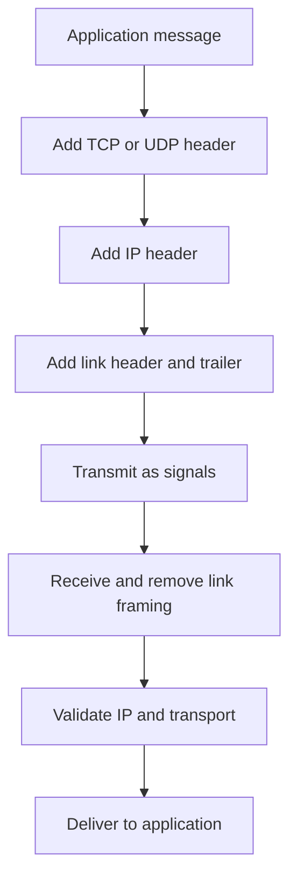

# Chapter 03 — Data Encapsulation

[← TCP/IP Model](../02-TCP-IP-Model/README.md) · [Handbook](../README.md) · [IP Addressing →](../04-IP-Addressing/README.md)

> **Learning objectives**
> - Explain encapsulation and de-encapsulation using correct PDU names.
> - Identify which headers, trailers, and fields each layer adds.
> - Calculate payload and header sizes from a packet capture.
> - Explain MTU, MSS, fragmentation, segmentation, and hardware offload.
> - Track which fields change at endpoints, switches, routers, NAT devices, and proxies.

## 1. Introduction

**Encapsulation** is the process of wrapping data from a higher layer with control information needed by a lower layer. A web message becomes transport payload; the transport unit becomes IP payload; the IP packet becomes link-layer payload; the resulting frame becomes signals on a medium.

At the destination, **de-encapsulation** reverses the process. Each implementation validates and interprets its own header, identifies the next protocol, and passes the remaining payload upward.

Encapsulation is not pointless duplication. Each header answers different questions: Which application process? Which destination network? Which next hop? How should the receiver validate and interpret the payload?

## 2. Theory

### Protocol Data Units

| Layer | Common PDU name | Key control information |
|---|---|---|
| Application | Data, message, request, response | Method, name, type, status, application metadata |
| Transport | TCP segment or UDP datagram | Ports, sequence/ack state, flags, length/checksum |
| Internet | IP packet | Source/destination IP, TTL/Hop Limit, next protocol |
| Data Link | Frame | Source/destination link address, EtherType, error detection |
| Physical | Bits/signals | Encoding, timing, modulation, signal characteristics |

“Packet” is often used informally for many captured units. In precise explanations, say frame, IP packet, TCP segment, or UDP datagram when the distinction matters.

### Multiplexing and protocol identifiers

Every layer needs to know what comes next:

- Ethernet **EtherType** identifies IPv4 (`0x0800`), ARP (`0x0806`), IPv6 (`0x86DD`), and other payloads.
- The IPv4 **Protocol** or IPv6 **Next Header** identifies TCP (`6`), UDP (`17`), ICMP, extension headers, and more.
- TCP/UDP **destination ports** help the operating system select a socket/application.
- Application protocols include their own types, methods, names, and content metadata.

### Common header sizes

| Header | Minimum or fixed size | Important variability |
|---|---:|---|
| Ethernet II | 14 bytes | VLAN tag adds 4 bytes; FCS often counted separately |
| IPv4 | 20 bytes | Options can extend it to 60 bytes |
| IPv6 base | 40 bytes | Extension headers follow the base header |
| TCP | 20 bytes | Options extend it; common during handshakes |
| UDP | 8 bytes | Fixed |

### MTU and MSS

The **Maximum Transmission Unit (MTU)** is the largest network-layer packet a link can carry without link-specific fragmentation behavior. Standard Ethernet commonly exposes an IP MTU of 1500 bytes.

The TCP **Maximum Segment Size (MSS)** is the largest TCP payload an endpoint advertises for a segment. For ordinary IPv4 over an MTU of 1500 with minimum headers:

```text
MSS = MTU − IPv4 header − TCP header
    = 1500 − 20 − 20
    = 1460 bytes
```

For IPv6 with a 40-byte base header and a 20-byte TCP header, the corresponding value is 1440 bytes before considering extension headers. MSS is not the same as MTU.

### Segmentation, fragmentation, and reassembly

- **Application chunking:** the application/library divides its own content.
- **TCP segmentation:** TCP represents a byte stream in segments suitable for transport and path constraints.
- **IP fragmentation:** one IP packet is divided into IP fragments. IPv4 routers may fragment when permitted; IPv6 routers do not fragment forwarded packets.
- **Link framing:** each IP packet or fragment is placed into a frame for the current link.
- **Reassembly:** TCP reconstructs its byte stream; IP fragment reassembly occurs at the final IP destination.

Avoid IP fragmentation when possible. Path MTU Discovery depends on useful ICMP feedback; blocking all ICMP can create “small packets work, large transfers stall” failures.

> **Did you know?** Wireshark may flag outgoing checksums as incorrect because the OS leaves checksum calculation for the NIC after the capture point. This is often checksum offload, not corrupt traffic.

> **Memory trick:** **Data → Segment → Packet → Frame → Bits**. For UDP, say datagram instead of segment.

### Behind the scenes

Performance features complicate capture interpretation:

- TCP Segmentation Offload can let the kernel hand a large buffer to the NIC.
- Generic Segmentation Offload groups work before transmission.
- Generic Receive Offload combines received units before upper-layer processing.
- Checksum offload calculates checksums later in hardware.

A capture taken on the sending host can therefore differ from what appears on the wire. Capture on another device or disable offload temporarily in an authorized lab when exact wire representation matters.

## 3. Visual diagram



### Nested view

```text
Ethernet frame
├─ Ethernet header
├─ IPv4 packet
│  ├─ IPv4 header
│  └─ TCP segment
│     ├─ TCP header
│     └─ TLS-protected application data
└─ Ethernet FCS
```

The capture location determines which outer layers are visible. Loopback capture may have no Ethernet header; a tunnel adds an additional outer packet; host captures commonly omit Ethernet FCS.

## 4. Real-world example

Suppose an application sends 4 KiB of HTTPS data. The application does not normally create one 4 KiB Ethernet frame. TLS creates records, TCP represents encrypted bytes in its stream, TCP/IP processing produces units appropriate for the path, and each IP packet is framed for its current link.

The receiver may read the data in different chunk sizes from those used by the sender. TCP preserves byte order, not application message boundaries.

### Real industry usage

Understanding encapsulation is essential when configuring VPN overhead, diagnosing MTU black holes, reading load-balancer captures, estimating protocol overhead, designing overlays, and explaining why an application payload size differs from bytes counted on an interface.

### Cloud perspective

VPC networks, site-to-site VPNs, transit gateways, and private connectivity often add tunnel headers. The effective payload MTU can shrink. Cloud providers publish MTU limits by interface and service; do not assume every path supports the same jumbo-frame size.

### DevOps perspective

Container overlays, service meshes, ingress proxies, and encrypted tunnels add encapsulation or create new connections. A Pod-to-Pod request might have an inner application flow, an overlay packet, and an outer underlay frame. Observability must identify which layer and network namespace is being measured.

### Cybersecurity perspective

Defenders inspect headers for policy and anomaly detection, but encapsulation can hide inner traffic from devices that cannot decode a tunnel. Encryption protects payload content, not all metadata. Fragmentation and ambiguous parsing have historically been used to evade inconsistent security devices, so normalizing and reassembling traffic consistently matters.

## 5. Packet journey

### Endpoint A

1. HTTP produces an application message.
2. TLS encrypts and authenticates records.
3. TCP adds ports, sequence/ack information, flags, window, and checksum.
4. IP adds logical endpoints, lifetime, and transport protocol identifier.
5. Ethernet adds local-link endpoints and EtherType; hardware may append FCS.
6. The interface encodes the frame as signals.

### Layer 2 switch

The switch receives a frame, learns from the source MAC, and forwards based on the destination MAC/VLAN. It normally does not remove the IP or TCP headers. It may update or replace link metadata in special features, but ordinary switching keeps the frame within the same Layer 2 domain.

### Router

The router removes incoming link framing, processes the IP header, decrements TTL/Hop Limit, chooses a next hop, and creates new outgoing link framing. With IPv4, the header checksum changes. With NAT, IP addresses and possibly ports/checksums also change.

### Endpoint B

The destination validates each layer, matches the socket, reorders/reassembles TCP data as required, verifies/decrypts TLS records, and gives application bytes to HTTP processing.

## 6. Linux commands

| Command | What it does | When to use it |
|---|---|---|
| `ip link show` | Displays interface MTU and link state | Verify local MTU assumptions |
| `ip route get DEST` | Shows chosen path and source | Identify actual outgoing route |
| `ping -M do -s SIZE DEST` | IPv4 probe with Don't Fragment | Investigate usable packet size where allowed |
| `tracepath DEST` | Estimates path MTU and hops | Diagnose path-MTU behavior without raw assumptions |
| `ss -ti` | Shows detailed TCP state and metrics | Inspect MSS, congestion, RTT, retransmission evidence |
| `tcpdump -ni IFACE -s 0 -XX FILTER` | Captures full packets with hex/ASCII | Inspect headers and raw bytes |
| `ethtool -k IFACE` | Shows interface offload features | Explain capture/checksum differences |

### Safe MTU probe

For IPv4, ICMP Echo adds 8 bytes and IPv4 commonly adds 20 bytes. A payload of 1472 produces a 1500-byte IP packet:

```bash
ping -c 2 -M do -s 1472 1.1.1.1
```

Failure does not automatically prove an MTU problem: ICMP may be filtered. Test only authorized destinations, reduce the size systematically, and compare with `tracepath` and real application behavior.

### Read TCP details

```bash
ss -ti dst 198.51.100.20
```

Depending on state and kernel, output may include MSS, path MTU, RTT, congestion window, retransmissions, and delivery rate. These are live measurements, not fixed protocol constants.

## 7. Practical example

Complete [Lab 03: Inspect encapsulation](../../labs/03-inspect-encapsulation/README.md). You will capture one controlled request, expand its protocol tree, calculate payload size, inspect bytes, and compare MTU with observed packet sizes.

## 8. Wireshark example

Filter a TCP conversation:

```text
tcp.stream eq 0
```

Select a data-carrying packet and expand:

1. **Frame:** capture length and arrival metadata.
2. **Ethernet II:** destination MAC, source MAC, EtherType.
3. **Internet Protocol:** header length, total length, ID/flags/fragment offset, TTL, protocol, endpoints.
4. **TCP:** ports, sequence/ack numbers, header length, flags, window, checksum, options.
5. **TLS/Application:** record type and encrypted bytes, or decoded application fields where safe and available.

Verify calculations using fields, not guesses:

```text
tcp.len == ip.len - ip.hdr_len - tcp.hdr_len
```

This relationship applies to TCP over IPv4 in the selected packet. VLAN tags, Ethernet padding, IPv6 extension headers, tunnels, capture truncation, and offload affect other calculations.

## 9. Common mistakes

- Saying every layer adds both a header and trailer. Ethernet commonly has both; many protocols add only a header.
- Assuming Ethernet FCS is always visible in Wireshark.
- Confusing MTU, frame size, MSS, and application payload.
- Assuming one `send()` call equals one TCP segment or one receiver `read()`.
- Treating IP fragmentation and TCP segmentation as the same process.
- Believing routers remove transport headers during normal forwarding.
- Diagnosing outgoing checksum warnings as corruption without checking offload.
- Assuming an overlay MTU equals the physical interface MTU.

## 10. Troubleshooting

| Symptom | Encapsulation-related possibility | Evidence |
|---|---|---|
| Small requests work; large transfers stall | Path MTU black hole | `tracepath`, size probes, ICMP Packet Too Big/Fragmentation Needed |
| Capture shows giant outgoing TCP units | TSO/GSO before NIC segmentation | `ethtool -k`, capture on another device |
| Bad checksums only on sending host | Checksum offload | Compare offload settings and remote capture |
| Tunnel works until another tunnel is added | Excess overhead reduces effective MTU | Outer/inner header sizes, interface/tunnel MTU |
| Fragments dropped | Firewall/NAT/security policy or missing fragment state | Fragment filters and device logs |

### Best practices

- Measure the actual path instead of assuming local MTU applies end to end.
- Permit required ICMP/ICMPv6 control messages according to secure policy.
- Set tunnel and workload MTUs consistently.
- Record capture point, interface, namespace, snap length, and offload state.
- Use full packet capture only when needed and sanitize payloads before sharing.
- Prefer MSS adjustment only when architecture requires it; fix underlying MTU design when possible.

## 11. Interview questions

### What is the difference between encapsulation and encryption?

<details><summary>Answer</summary>

Encapsulation wraps data with protocol information so layers can deliver and interpret it. Encryption transforms content to protect confidentiality and usually integrity. Encrypted data is still encapsulated inside transport, IP, and link headers.

</details>

### What changes when a packet crosses a router?

<details><summary>Answer</summary>

Incoming link framing is removed and new framing is created. TTL/Hop Limit decreases; IPv4 header checksum is recalculated. End-to-end addresses and ports normally remain unless NAT, tunneling, or proxying changes the flow.

</details>

### Why is TCP MSS normally smaller than MTU?

<details><summary>Answer</summary>

MTU limits the IP packet carried by the link. TCP payload must leave space for IP and TCP headers, so advertised MSS is based on the receive path's maximum IP packet size minus those headers.

</details>

### Why can Wireshark show an invalid checksum for a valid outgoing packet?

<details><summary>Answer</summary>

The capture may occur before the NIC performs checksum offload. The placeholder appears invalid locally, while the NIC writes the correct checksum before transmission.

</details>

## 12. Quiz

1. **Multiple choice:** Which PDU normally contains an IP packet as its payload on Ethernet?  
   A. TCP segment · B. Ethernet frame · C. DNS message · D. Signal clock
2. **True or false:** TCP MSS and link MTU describe the same maximum size.
3. **Calculation:** With MTU 1500, IPv4 header 20, and TCP header 32 bytes, what is the maximum TCP payload fitting that packet?
4. **True or false:** IPv6 routers fragment oversized forwarded packets.
5. **Scenario:** A VPN adds 60 bytes of outer headers but workloads continue sending packets sized for a 1500-byte path. What problem might appear?
6. **Practical:** Which Wireshark fields reveal IPv4 total length and TCP header length?

<details><summary>Quiz answers</summary>

1. **B — Ethernet frame.**
2. **False.** MSS is transport payload; MTU limits a network-layer packet on a link.
3. `1500 − 20 − 32 = 1448 bytes`.
4. **False.** The IPv6 source handles fragmentation using a Fragment extension header; routers send ICMPv6 Packet Too Big when required.
5. Fragmentation, Packet Too Big behavior, or a black hole if effective MTU is exceeded and feedback is blocked.
6. `ip.len` and `tcp.hdr_len`.

</details>

## FAQ

### Is the Ethernet FCS part of the 1500-byte MTU?

No. The standard 1500-byte Ethernet MTU refers to the Layer 3 payload, commonly the IP packet. Ethernet headers, FCS, preamble, and inter-frame gap are separate on-wire overhead.

### Can a packet have multiple IP headers?

Yes. Tunneling encapsulates an inner packet inside an outer packet. VPNs, overlays, and transition mechanisms commonly create multiple network-layer headers.

### Why is `frame.len` larger than `ip.len`?

The frame includes link-layer headers and possibly tags/trailers around the IP packet. Capture format and whether FCS is present also affect the value.

### Does TLS hide IP addresses and ports?

Ordinary TLS protects application content, not the outer IP and transport headers needed for delivery. VPN tunnels can hide inner addresses from intermediate observers while exposing outer tunnel endpoints.

## 13. Summary

Encapsulation lets independent layers carry application data using their own control information. Transport adds process delivery, IP adds routed delivery, and link framing handles the current hop. Correct packet analysis depends on header-length fields, capture location, MTU, tunnels, and offload behavior. Use the [PDU quick reference](../../cheatsheets/pdu-and-headers.md) and practical lab to reinforce the packet anatomy, then continue with [IP Addressing](../04-IP-Addressing/README.md).
