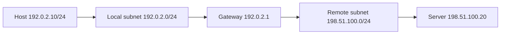

# Chapter 04 — IP Addressing

[← Data Encapsulation](../03-Data-Encapsulation/README.md) · [Handbook](../README.md) · [Subnetting →](../05-Subnetting/README.md)

> **Learning objectives**
> - Read an IPv4 address and CIDR prefix as network and host bits.
> - Distinguish network, usable host, broadcast, private, public, loopback, link-local, and documentation addresses.
> - Explain why an interface can have multiple addresses and how a source address is selected.
> - Inspect Linux addressing, routes, and packet fields without changing system configuration.

## 1. Introduction

An IP address is a logical identifier assigned to a network interface within an IP routing context. IPv4 uses 32 bits, commonly written as four decimal octets such as `192.0.2.10`. The prefix length—`/24`, for example—states how many leading bits describe the network prefix.

An address alone is incomplete configuration. A host also needs a prefix, routes, and often a default gateway and DNS resolver. Two interfaces can use the same numeric address only when they are isolated in different routing domains; duplicates on the same network cause conflict.

## 2. Theory

### From binary to dotted decimal

Each IPv4 octet contains eight bits with place values:

| Bit value | 128 | 64 | 32 | 16 | 8 | 4 | 2 | 1 |
|---|---:|---:|---:|---:|---:|---:|---:|---:|

`192` is `11000000` because `128 + 64 = 192`. An IPv4 address contains four such octets:

```text
192.0.2.10
11000000.00000000.00000010.00001010
```

### Prefix length and mask

CIDR prefix `/24` means the first 24 bits are network bits and the remaining 8 are host bits. Its dotted mask is `255.255.255.0`.

```text
Address:  192.0.2.10     11000000.00000000.00000010.00001010
Mask /24: 255.255.255.0  11111111.11111111.11111111.00000000
Network:  192.0.2.0      11000000.00000000.00000010.00000000
```

The network address results from a bitwise AND between address and mask. Subnetting chapter 05 develops this calculation for arbitrary prefixes.

### Address roles inside a traditional IPv4 subnet

For `192.0.2.0/24`:

| Role | Address | Meaning |
|---|---|---|
| Network | `192.0.2.0` | Identifies the subnet |
| First host | `192.0.2.1` | First traditional usable host address |
| Last host | `192.0.2.254` | Last traditional usable host address |
| Broadcast | `192.0.2.255` | Reaches all IPv4 hosts on that broadcast domain |

The “subtract two” rule does not apply universally. `/31` is valid for point-to-point links, and `/32` identifies a single host route/address.

### Important IPv4 ranges

| Range | Purpose |
|---|---|
| `10.0.0.0/8` | Private address space |
| `172.16.0.0/12` | Private address space (`172.16`–`172.31`) |
| `192.168.0.0/16` | Private address space |
| `127.0.0.0/8` | Loopback |
| `169.254.0.0/16` | Link-local automatic addressing |
| `100.64.0.0/10` | Shared address space, commonly carrier-grade NAT |
| `224.0.0.0/4` | Multicast |
| `192.0.2.0/24` | Documentation (TEST-NET-1) |
| `198.51.100.0/24` | Documentation (TEST-NET-2) |
| `203.0.113.0/24` | Documentation (TEST-NET-3) |
| `0.0.0.0/0` | Default route prefix; all IPv4 destinations |

Private does not mean secure. Private addresses are not globally routed on the public Internet, but they still require policy, segmentation, patching, and authentication.

### Unicast, multicast, broadcast, and anycast

- **Unicast:** identifies one interface for ordinary one-to-one delivery.
- **Multicast:** identifies a receiver group.
- **Broadcast:** IPv4 delivery to all hosts in a subnet/broadcast domain.
- **Anycast:** the same address/prefix is announced from several locations; routing selects a reachable instance.

Anycast uses ordinary unicast-format addresses. It is a routing design, not a special address shape.

### Assignment methods

- **Static:** configured deliberately and remains until changed.
- **DHCP:** leased dynamically with prefix, routes, DNS, and other options.
- **Cloud/platform control plane:** a provider assigns virtual-interface addresses and programs the surrounding network.
- **Link-local:** selected for local-link communication when appropriate configuration is unavailable.

> **Did you know?** `172.32.0.1` is not private. Only `172.16.0.0` through `172.31.255.255` belong to `172.16.0.0/12`.

> **Memory trick:** **10/8, 172.16/12, 192.168/16** are the three RFC 1918 private blocks. Memorize the prefixes, not just the first octet.

### Behind the scenes

An interface can have several IPv4 and IPv6 addresses. When an application does not bind a source address, the kernel uses routing and source-selection rules. The destination, route table, policy rules, address scope, and interface state all influence the chosen source.

## 3. Visual diagram



The host compares a destination with local prefixes. A local destination is delivered directly; a remote destination normally uses a matching route, often via a default gateway.

## 4. Real-world example

A laptop has `192.168.1.50/24` and gateway `192.168.1.1`.

- Destination `192.168.1.80` matches the local `/24`, so the laptop resolves and sends directly.
- Destination `8.8.8.8` does not match, so the default route sends it to `192.168.1.1`.
- The home router commonly translates the private source address to a public address using NAT.

The prefix—not visual similarity—decides whether a destination is local.

### Real industry usage

Teams design address plans to avoid overlap, reserve growth, summarize routes, separate environments, and integrate offices, clouds, VPNs, containers, and partners. Overlapping private ranges are a common merger and hybrid-cloud problem.

### Cloud perspective

Cloud subnets allocate addresses from a VPC/VNet prefix. Providers reserve some addresses, attach primary/secondary private addresses to virtual interfaces, and optionally map public addresses through provider-managed translation. Provider-specific reserved-address rules can differ from traditional subnet math.

### DevOps perspective

Hard-coded IPs make services brittle. Prefer DNS/service discovery for applications, but understand underlying addresses for allowlists, health checks, runners, proxies, cluster networking, and incident analysis. Infrastructure as Code should validate that CIDRs do not overlap.

### Cybersecurity perspective

IP addresses are useful policy attributes and evidence, but usually weak identities. NAT, proxies, DHCP, shared hosts, spoofing, and reassignment complicate attribution. Combine network policy with workload/user identity, authentication, timestamps, and logs.

## 5. Packet journey

Host `192.0.2.10/24` sends to `198.51.100.20`:

1. The kernel looks up `198.51.100.20` using longest-prefix match.
2. The default route selects gateway `192.0.2.1` and interface `eth0`.
3. The kernel selects `192.0.2.10` as source for that route.
4. Link-layer resolution finds the gateway's MAC—not the remote server's MAC.
5. The IP packet keeps destination `198.51.100.20` while routers forward it.
6. If NAT is used, a translator changes source IP and possibly source port, updating checksums/state.
7. Return traffic must have a valid reverse path and matching state/policy.

## 6. Linux commands

| Command | What it shows | Use |
|---|---|---|
| `ip -brief address` | Interface state and addresses/prefixes | Quick inventory |
| `ip address show dev IFACE` | Scope, lifetime, flags, multiple addresses | Detailed interface audit |
| `ip route` | Connected, static, dynamic, and default routes | Understand reachability |
| `ip route get DEST` | Actual route and selected source | Test the kernel decision |
| `ip rule` | Policy-routing rule order | Explain multiple tables/source policies |
| `hostname -I` | Host addresses (limited context) | Quick display, not full diagnosis |
| `ping -I SOURCE DEST` | Sends ICMP using a chosen source/interface | Compare source-dependent paths |

Example:

```bash
ip -brief address
ip route
ip route get 1.1.1.1
```

Typical detailed address flags:

- `scope host`: valid only inside the host, such as loopback.
- `scope link`: valid on the current link.
- `scope global`: usable beyond the link subject to routing/policy; it does not necessarily mean publicly routable.
- `dynamic`: learned through a dynamic mechanism such as DHCP.
- `valid_lft` and `preferred_lft`: address lifetimes, especially important in IPv6.

## 7. Practical example

Complete [Lab 04: Audit local IP configuration](../../labs/04-audit-ip-configuration/README.md). It is read-only: you will inventory addresses, classify scopes, test longest-prefix route selection, and compare configured DNS with IP reachability.

## 8. Wireshark example

Useful display filters:

```text
ip
ip.addr == 192.0.2.10
ip.src == 192.0.2.10 and ip.dst == 198.51.100.20
ip.flags.mf == 1 or ip.frag_offset > 0
```

Important IPv4 header fields:

| Field | Meaning |
|---|---|
| Version | `4` for IPv4 |
| Header Length | Header size including options |
| DSCP/ECN | Service marking and congestion notification |
| Total Length | Entire IPv4 packet size |
| Identification/Flags/Offset | IPv4 fragmentation support |
| TTL | Lifetime in router hops |
| Protocol | Next payload, e.g. TCP `6`, UDP `17` |
| Header checksum | Protects IPv4 header only |
| Source/Destination | Logical endpoints for this packet |

Capturing on a host behind NAT shows private addresses on the inside. A capture outside the translator shows translated addresses. Always document capture location.

## 9. Common mistakes

- Treating an IP address without its prefix as complete network information.
- Believing the first three octets always define the network.
- Calling every `172.x.x.x` address private.
- Assigning a network or broadcast address to a normal host subnet.
- Using the same subnet on two routed interfaces and expecting deterministic behavior.
- Assuming `scope global` means public Internet address.
- Confusing default gateway with DNS server.
- Believing a public IP is automatically reachable; firewalls, NAT, routes, and listeners still matter.

## 10. Troubleshooting

| Symptom | Check | Likely causes |
|---|---|---|
| Address missing | `ip address` | DHCP failure, interface down, config not applied |
| Duplicate-address warning/intermittent traffic | Neighbor table and ARP capture | Duplicate static/DHCP assignment |
| Local hosts unreachable | Prefix and connected route | Wrong mask, VLAN, link resolution |
| Remote networks unreachable | `ip route get DEST` | Missing/wrong gateway or policy rule |
| One source works, another fails | `ip route get DEST from SOURCE` | Source routing, policy, return path, firewall |
| IP works but name fails | Resolver status and `dig` | DNS—not addressing itself |

### Best practices

- Maintain a documented, non-overlapping IP address plan.
- Use IP Address Management (IPAM) for shared environments.
- Reserve static infrastructure ranges outside ordinary dynamic pools or create explicit reservations.
- Validate CIDRs in Infrastructure as Code and CI.
- Use documentation ranges in public examples.
- Record prefix, gateway, DNS, VLAN/subnet, assignment owner, and environment together.

## 11. Interview questions

### What does `/24` mean?

<details><summary>Answer</summary>

The first 24 bits are the network prefix and the remaining 8 bits identify addresses within that prefix. The equivalent contiguous IPv4 mask is `255.255.255.0`.

</details>

### Is `172.40.1.1` private?

<details><summary>Answer</summary>

No. The private `172` block is `172.16.0.0/12`, covering second octets 16 through 31.

</details>

### How does a host decide whether to use its gateway?

<details><summary>Answer</summary>

The kernel performs route lookup using the destination and selects the longest matching prefix, then policy/metric rules. A connected local route allows direct delivery; a route with a next hop sends toward that gateway.

</details>

### Can one interface have multiple IP addresses?

<details><summary>Answer</summary>

Yes. Interfaces commonly have several IPv4/IPv6 addresses, aliases, temporary addresses, service addresses, or multiple scopes. Routing and source-selection rules decide which is used.

</details>

## 12. Quiz

1. **Multiple choice:** Which is private?  
   A. `172.15.1.1` · B. `172.20.1.1` · C. `172.32.1.1` · D. `192.0.2.1`
2. **True or false:** `/24` always means a network begins at `.0` regardless of the address.
3. **Calculation:** What is the network for `192.0.2.77/24`?
4. **True or false:** `scope global` guarantees an address is publicly routed.
5. **Scenario:** A host configured as `10.0.1.20/16` thinks `10.0.2.50` is local, but the network design routes between two `/24` VLANs. What is wrong?
6. **Practical:** Which command shows the exact source and gateway Linux selects for a destination?

<details><summary>Quiz answers</summary>

1. **B — `172.20.1.1`.**
2. **False.** Prefix boundaries depend on the mask; `/24` boundaries do end at octet boundaries, but the complete statement and address context matter. For prefixes such as `/26`, subnets can start at `.0`, `.64`, `.128`, or `.192`.
3. `192.0.2.0/24`.
4. **False.** Linux scope and public routability are different concepts.
5. The host prefix is too broad. `/16` makes both addresses appear on-link; it should match the designed `/24` subnet and route through the gateway.
6. `ip route get DESTINATION`.

</details>

## FAQ

### Is `0.0.0.0` an address or a route?

Context matters. Applications may bind `0.0.0.0` to listen on all local IPv4 addresses. The prefix `0.0.0.0/0` represents every IPv4 destination and is used for a default route.

### What is `255.255.255.255`?

It is the limited broadcast address for the local IPv4 network and is not forwarded by routers.

### Why does my machine show Docker or VPN addresses too?

Containers, VMs, VPNs, and tunnels create virtual interfaces with their own prefixes and routes. Identify which routing table and interface serve the destination you are testing.

### Why not use public addresses internally without owning them?

It creates collisions with real Internet destinations and breaks routing. Use allocated space or appropriate private/shared/documentation ranges for their intended purposes.

## 13. Summary

IPv4 addresses are 32-bit logical interface identifiers interpreted together with a prefix. Correct delivery depends on connected prefixes, longest-prefix route selection, source address, gateways, and return paths. Learn the special ranges and inspect real kernel decisions rather than guessing from address appearance. Continue with [Subnetting](../05-Subnetting/README.md) to turn this foundation into systematic calculations.
