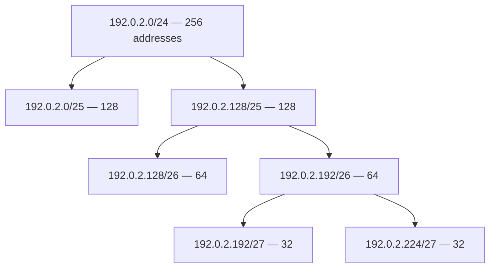

# Chapter 05 — IPv4 Subnetting

[← IP Addressing](../04-IP-Addressing/README.md) · [Handbook](../README.md) · Next: MAC Address

> **Learning objectives**
> - Calculate network, broadcast, usable range, and capacity for any IPv4 prefix.
> - Convert between CIDR, subnet masks, host bits, and block sizes.
> - Design non-overlapping VLSM allocations from requirements.
> - Explain longest-prefix match, summarization, and common routing mistakes.
> - Verify results with Linux/Python tools while understanding the calculation.

## 1. Introduction

**Subnetting** divides an IP address block into smaller prefixes. It creates routing boundaries, controls broadcast domains, separates environments, uses address space efficiently, and makes policies easier to express.

The essential idea is simple: a prefix length divides 32 IPv4 bits into **network bits** and **host bits**. Increasing the prefix borrows host bits to create smaller subnets. Correct subnetting is binary math expressed through CIDR.

## 2. Theory

### Prefix anatomy

For `192.0.2.77/27`:

```text
/27 = 27 network bits + 5 host bits
Addresses = 2^5 = 32
Traditional usable hosts = 32 − network − broadcast = 30
Mask = 255.255.255.224
```

The last mask octet `224` is `11100000`. The five zero bits are host bits.

### Network and broadcast calculation

`/27` has blocks of 32 in the fourth octet:

```text
0, 32, 64, 96, 128, 160, 192, 224
```

`77` falls between `64` and `95`, therefore:

| Property | Result |
|---|---|
| Network | `192.0.2.64/27` |
| First usable | `192.0.2.65` |
| Last usable | `192.0.2.94` |
| Broadcast | `192.0.2.95` |
| Addresses | 32 |
| Traditional usable | 30 |

### Block size

In the changing mask octet:

```text
Block size = 256 − mask octet
```

For `/20`, the mask is `255.255.240.0`; block size is `16` in the third octet. Networks begin at third-octet values `0, 16, 32, 48...`.

### Host capacity table

| Needed usable hosts | Smallest traditional subnet | Capacity |
|---:|---:|---:|
| 2 | `/30` | 2 |
| 6 | `/29` | 6 |
| 14 | `/28` | 14 |
| 30 | `/27` | 30 |
| 62 | `/26` | 62 |
| 126 | `/25` | 126 |
| 254 | `/24` | 254 |
| 510 | `/23` | 510 |

Use `/31` for supported point-to-point links rather than applying the traditional subtract-two rule.

### Fixed-length and variable-length subnetting

- **FLSM:** every subnet uses the same prefix. It is simple but can waste addresses.
- **VLSM:** subnets use different prefixes based on need. Allocate largest requirements first to avoid fragmentation and alignment problems.

### VLSM example

Allocate `192.0.2.0/24` for departments needing 100, 50, 25, and 10 usable hosts:

| Need | Prefix | Allocation | Usable range | Broadcast |
|---:|---:|---|---|---|
| 100 | `/25` | `192.0.2.0/25` | `.1–.126` | `.127` |
| 50 | `/26` | `192.0.2.128/26` | `.129–.190` | `.191` |
| 25 | `/27` | `192.0.2.192/27` | `.193–.222` | `.223` |
| 10 | `/28` | `192.0.2.224/28` | `.225–.238` | `.239` |

`192.0.2.240/28` remains free. Each subnet begins on a valid boundary.

### Longest-prefix match

Routers choose the most specific matching route, not the route that appears visually closest and not automatically the lowest metric across different prefix lengths.

```text
10.0.0.0/8       via A
10.20.0.0/16     via B
10.20.30.0/24    via C
```

Destination `10.20.30.50` uses `/24` via C. Metrics/preferences break ties between comparable candidates after prefix specificity and routing policy.

### Route summarization

Contiguous, aligned prefixes can be advertised as a shorter summary. For example, four `/24` networks from `192.0.0.0` through `192.0.3.0` can summarize to `192.0.0.0/22`.

A summary must share the stated leading bits and should not accidentally claim networks that are routed elsewhere. Summarization reduces routing-table size but can create black holes without correct more-specific routes or discard routes.

> **Did you know?** Subnets must be aligned. `192.0.2.20/27` is a valid host address but not a valid `/27` network boundary; its network is `192.0.2.0/27`.

> **Memory trick:** more prefix bits → more subnets, fewer addresses per subnet. Moving `/24` to `/25` halves the block; `/25` to `/26` halves it again.

### Behind the scenes

Hosts also use prefixes to decide whether a destination is on-link. A wrong mask can make the host ARP for a remote address instead of sending to its gateway, or send local traffic unnecessarily to a router.

## 3. Visual diagram



Every additional prefix bit splits a parent prefix into two equal child prefixes.

## 4. Real-world example

A company has a `/22` and needs user, server, management, and point-to-point networks. A professional design does not simply create four equal subnets. It documents capacity, growth, failure domains, security zones, cloud/on-premise overlap, reserved ranges, DHCP pools, static infrastructure, and summarization.

### Real industry usage

Subnet design shapes VLAN boundaries, cloud subnets, routing tables, firewall policies, DHCP scopes, Kubernetes Pod/Service CIDRs, VPN compatibility, and incident blast radius.

### Cloud perspective

AWS, Azure, and other providers reserve addresses and impose minimum/maximum subnet sizes or service constraints. Traditional math gives total addresses; always subtract provider reservations and service needs separately. Plan Availability Zone subnets and future growth before allocating the VPC CIDR.

### DevOps perspective

Infrastructure as Code should reject overlapping CIDRs before deployment. Container and cluster CIDRs must avoid VPC, office, VPN, and partner networks. “No route to host” after connecting a VPN often comes from overlap rather than a missing container.

### Cybersecurity perspective

Subnets support segmentation but do not enforce it by themselves. Routing, ACLs, firewalls, security groups, network policies, identities, and monitoring decide permitted flows. Large flat networks increase broadcast scope and lateral-movement opportunities.

## 5. Packet journey

Host `192.0.2.70/27` sends to `192.0.2.90`:

1. Its own network is `192.0.2.64/27` with broadcast `.95`.
2. `.90` is inside the same prefix.
3. The host resolves the destination locally and sends directly.

The same host sends to `192.0.2.100`:

1. `.100` is in `192.0.2.96/27`, not the local subnet.
2. Route lookup selects a gateway or more-specific route.
3. The frame targets the gateway; the IP packet targets `.100`.

With an incorrect `/24` mask, the host wrongly treats `.100` as local and may repeatedly ARP without reaching it.

## 6. Linux commands

| Command | Use |
|---|---|
| `ipcalc ADDRESS/PREFIX` | Show network, broadcast, mask, range, capacity |
| `sipcalc ADDRESS/PREFIX` | Detailed IPv4/IPv6 calculation where installed |
| `ip route` | Inspect connected and routed prefixes |
| `ip route get DEST` | Verify longest-prefix and source selection |
| `ip address` | Compare configured address/prefix with design |
| `ip neighbor` | Detect wrong on-link assumptions/neighbor attempts |

Python standard library verification:

```bash
python3 - <<'PY'
import ipaddress
n = ipaddress.ip_interface('192.0.2.77/27').network
print('network:', n)
print('broadcast:', n.broadcast_address)
print('addresses:', n.num_addresses)
print('first/last:', n.network_address + 1, n.broadcast_address - 1)
PY
```

The tool confirms the answer. You should still be able to explain why `.77` belongs to the `.64–.95` block.

## 7. Practical example

Complete [Lab 05: Design a VLSM address plan](../../labs/05-vlsm-address-plan/README.md). It uses realistic departments, infrastructure links, growth, and validation rather than isolated arithmetic questions.

## 8. Wireshark example

Subnet masks are not carried in every ordinary IP packet. Wireshark sees source/destination addresses; the capturing host/router configuration determines how those addresses are interpreted.

Useful evidence:

```text
arp or icmp
ip.src == 192.0.2.70
```

If a host has an overly broad mask, it may send ARP requests for an address that should be routed. If a gateway reports unreachable, ICMP fields can identify the reporting router and error type. DHCP captures can show a supplied subnet mask and router option:

```text
dhcp.option.type == 1 or dhcp.option.type == 3
```

## 9. Common mistakes

- Using `2^host_bits` as usable hosts without considering network/broadcast or `/31` behavior.
- Starting a subnet on an invalid boundary.
- Allocating VLSM smallest-first and blocking larger aligned space.
- Overlapping subnets on different routed interfaces.
- Assuming a switch routes between subnets.
- Adding only a forward route and forgetting the reverse path.
- Creating default routes that point routers at each other, causing loops.
- Choosing a subnet that fits today with no documented growth decision.
- Treating calculator output as understanding.

## 10. Troubleshooting

| Symptom | Subnet-related cause | Evidence |
|---|---|---|
| Some hosts in “same network” cannot connect | Mismatched masks | Compare `ip address`, ARP, connected routes |
| Duplicate IP symptoms | Overlapping pools/static ranges | DHCP/IPAM and neighbor changes |
| Route works one way | Missing reverse prefix | Route tables on both paths |
| Packets loop | Mutual/default route mistake | TTL exceeded and traceroute repetition |
| VPN hides a local network | Overlapping CIDRs and more-specific route | Route table before/after VPN |
| Cloud subnet runs out early | Provider reservations and growth ignored | IPAM/provider allocation view |

### Best practices

- Start with requirements and failure/security boundaries, not arbitrary prefix sizes.
- Allocate VLSM largest-first and on binary boundaries.
- Reserve contiguous growth space deliberately.
- Keep an authoritative IPAM inventory.
- Validate overlap, containment, and capacity automatically in CI.
- Design forward and reverse routing together.
- Summarize only aligned contiguous space you truly own and route.

## 11. Interview questions

### Find the network for `172.20.35.200/20`.

<details><summary>Answer</summary>

`/20` mask is `255.255.240.0`, block size 16 in the third octet. `35` falls in `32–47`, so network is `172.20.32.0/20` and broadcast is `172.20.47.255`.

</details>

### Why allocate largest VLSM requirements first?

<details><summary>Answer</summary>

Large prefixes need larger aligned contiguous blocks. Small allocations can fragment those boundaries and make a later large subnet impossible even when the total number of free addresses seems sufficient.

</details>

### What route wins: `10.0.0.0/8` metric 10 or `10.1.0.0/16` metric 100 for `10.1.2.3`?

<details><summary>Answer</summary>

The `/16` wins because it is the longest, most specific matching prefix. Metrics generally compare routes within the relevant routing selection process, not override prefix specificity.

</details>

### Why can an incorrect subnet mask break only some destinations?

<details><summary>Answer</summary>

It changes which destinations the host considers directly connected. Addresses inside both the correct and incorrect interpretation may work, while addresses incorrectly considered local trigger unresolved neighbor discovery instead of gateway delivery.

</details>

## 12. Quiz

1. What is the mask for `/26`?
2. How many traditional usable hosts fit in `/27`?
3. Find network and broadcast for `198.51.100.141/28`.
4. What is the smallest traditional subnet for 45 usable hosts?
5. True or false: `192.0.2.64/26` overlaps `192.0.2.128/26`.
6. Which route matches `10.2.3.4` more specifically: `/8`, `/16` for `10.2.0.0`, or default?
7. Scenario: Router A knows LAN B, but Router B has no route back to LAN A. What symptom do you expect?

<details><summary>Quiz answers</summary>

1. `255.255.255.192`.
2. 30.
3. Block size 16; `.141` is in `.128–.143`. Network `198.51.100.128/28`, broadcast `.143`.
4. `/26`, providing 62 traditional usable addresses.
5. False; they are adjacent `/26` blocks.
6. `10.2.0.0/16`.
7. Requests may reach LAN B, but replies take the wrong path or are dropped. Connectivity fails despite a correct forward route—a missing reverse route.

</details>

## FAQ

### Are class A, B, and C networks still used?

Modern routing uses CIDR, not classful boundaries. Classful terminology appears in history and some beginner material, but design and calculate using explicit prefixes.

### Does every subnet lose two usable addresses?

No. Traditional multi-access IPv4 subnets reserve network and broadcast. `/31` supports two point-to-point endpoints, and `/32` is one host route. Provider platforms can reserve additional addresses.

### Can VLANs share a subnet?

Ordinary design maps one IP subnet to one Layer 2 broadcast domain. Stretching a subnet across VLANs requires bridging/overlay behavior and changes the failure model; separate routed VLANs should use separate subnets.

### Is route summarization always safe?

No. A summary can attract traffic for unallocated or differently routed child networks. Confirm alignment, ownership, reachability, and black-hole handling.

## 13. Summary

Subnetting is binary boundary management. Prefix length determines block size and capacity; the containing block determines network and broadcast. VLSM allocates largest-first, longest-prefix match drives routing, and correct design includes return paths, growth, and non-overlap. Keep the [subnetting cheatsheet](../../cheatsheets/ipv4-subnetting.md) nearby, but verify every result by explaining the boundary.
