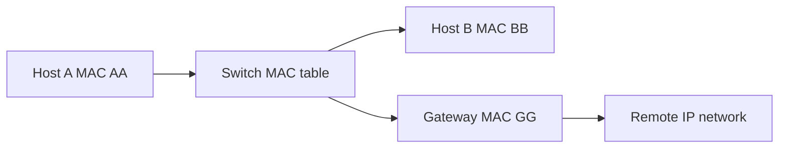

# Chapter 06 — MAC Addresses and Local Delivery

[← Subnetting](../05-Subnetting/README.md) · [Handbook](../README.md) · [ARP →](../07-ARP/README.md)

> **Learning objectives**
> - Read a 48-bit Ethernet MAC address and distinguish unicast, multicast, broadcast, universal, and local forms.
> - Explain how switches learn and forward frames within a VLAN.
> - Explain why IP and MAC addresses solve different delivery problems.
> - Inspect link-layer identity and Ethernet headers on Linux and Wireshark.

## 1. Introduction

A **Media Access Control (MAC) address** is a link-layer identifier used by technologies such as Ethernet and Wi-Fi for delivery on a local Layer 2 network. A common Ethernet MAC is 48 bits displayed as six hexadecimal octets: `02:42:ac:11:00:02`.

MAC addresses are not Internet routing addresses. Routers forward using IP prefixes and rebuild link-layer framing for each hop. A remote server's MAC address is therefore neither required nor visible on your local Ethernet segment.

## 2. Theory

### 48-bit format

```text
02:42:ac:11:00:02
│        └──────── device/interface-specific portion
└──────────────── first octet contains address-type bits
```

Historically, globally administered addresses use an IEEE-assigned organizational prefix and manufacturer-assigned interface portion. Modern virtualization, containers, privacy features, and software-defined networks also create locally administered addresses.

### Important first-octet bits

In the first octet:

- The least significant bit is the **I/G bit**: `0` individual/unicast, `1` group/multicast.
- The next bit is the **U/L bit**: `0` universally administered, `1` locally administered.

`02` in binary is `00000010`, so `02:...` is locally administered unicast.

### Address types

| Type | Example | Meaning |
|---|---|---|
| Unicast | `00:1a:2b:3c:4d:5e` | One link-layer interface |
| Broadcast | `ff:ff:ff:ff:ff:ff` | Every station in the broadcast domain/VLAN |
| Multicast | `01:00:5e:...` | An IPv4 multicast-derived group address |
| Locally administered | often begins `02`, `06`, `0a`, `0e` | Generated/assigned locally rather than globally unique vendor assignment |

### Switch learning

An Ethernet switch builds a MAC address table per VLAN:

1. A frame arrives on a port.
2. The switch learns the **source MAC → ingress port/VLAN** mapping.
3. It looks up the destination MAC.
4. Known unicast is forwarded to the mapped port.
5. Unknown unicast is flooded to eligible ports in that VLAN except ingress.
6. Broadcast and relevant multicast are flooded/handled within their Layer 2 scope.
7. Dynamic entries age out after inactivity.

Switches learn from **source** addresses, not destination addresses.

### MAC versus IP

| MAC address | IP address |
|---|---|
| Local-link delivery | Routed delivery across networks |
| Usually changes in outer framing at each router | Usually remains end to end unless translated/tunneled |
| Flat identifier; no routing hierarchy | Hierarchical prefix used for routing |
| Switch/bridge forwarding | Router forwarding |
| Resolved for next hop | Selected by application/DNS/routing context |

### VLAN scope

A VLAN creates a logical Layer 2 broadcast domain. The same physical switch can hold separate MAC tables/entries per VLAN. Broadcast traffic does not cross into another VLAN without a Layer 3 function, and a router does not forward ordinary Ethernet broadcasts.

> **Did you know?** A MAC address is not guaranteed globally unique forever. Cloning, virtualization, randomization, manufacturing errors, and manual configuration can create duplicates.

> **Memory trick:** IP answers **where across networks**; MAC answers **which interface on this link**.

### Behind the scenes

Operating systems can randomize Wi-Fi MAC addresses to reduce passive tracking. Containers and VMs receive generated MAC addresses. Bonding, bridges, failover protocols, and load-balancing designs may deliberately move or share a link-layer identity.

## 3. Visual diagram



Host A frames local traffic to BB. For a remote IP, it frames traffic to gateway GG. The IP destination remains the remote endpoint.

## 4. Real-world example

A laptop sends to a server outside its subnet. DNS gives the server IP, routing selects the default gateway, and ARP/neighbor discovery supplies the gateway's MAC. The Ethernet frame has laptop MAC as source and gateway MAC as destination; the IP packet inside has laptop IP and remote server IP.

### Real industry usage

Network teams use MAC tables to locate endpoints, diagnose loops and flapping, enforce access controls, and map switch ports. Virtualization and orchestration systems use bridges and virtual MACs for workload attachment.

### Cloud perspective

Cloud virtual interfaces have MAC addresses, but provider fabrics abstract physical switching. Users commonly troubleshoot at virtual-interface, IP, route, and policy levels. Features that assume arbitrary Layer 2 broadcast or custom MAC movement may not work like an on-premises Ethernet LAN.

### DevOps perspective

Docker bridges learn container MACs; Kubernetes nodes and CNIs may bridge, route, or tunnel Pod traffic. MAC evidence is namespace- and capture-point-specific. A container's MAC is rarely a stable service identity and should not be hard-coded.

### Cybersecurity perspective

MAC allowlists are weak authentication because addresses can be observed and changed. Useful controls include switch port security, 802.1X, DHCP snooping, Dynamic ARP Inspection, segmentation, and monitoring—combined with real identity and encryption.

## 5. Packet journey

### Local destination

1. Host A determines destination IP is on-link.
2. It resolves destination IP to MAC B.
3. It sends Ethernet frame `A → B` containing IP packet `IP-A → IP-B`.
4. The switch learns A on ingress and forwards/floods toward B.

### Remote destination

1. Host A determines destination IP is remote.
2. It resolves default gateway IP to MAC G.
3. It sends frame `A → G` containing packet `IP-A → remote IP`.
4. Router removes the frame, routes the packet, and creates a new frame for the next link.

## 6. Linux commands

| Command | What it reveals |
|---|---|
| `ip -brief link` | Interface state and link-layer address |
| `ip link show dev IFACE` | MAC, MTU, flags, master/bridge information |
| `ip neighbor` | IP-to-link-layer neighbor mappings |
| `bridge link` | Interfaces attached to Linux bridges |
| `bridge fdb show` | Linux bridge forwarding database |
| `tcpdump -eni IFACE` | Ethernet source/destination and packet summary |
| `ethtool -P IFACE` | Permanent hardware address where supported |

Example:

```bash
ip -brief link
ip neighbor
ip route get 1.1.1.1
```

The route command identifies the gateway; the neighbor table can then show that gateway's link address. `FAILED`, `INCOMPLETE`, `STALE`, `REACHABLE`, and `DELAY` are neighbor states, not switch-table states.

## 7. Practical example

Complete [Lab 06: Inspect Layer 2 identity](../../labs/06-inspect-layer2-identity/README.md). It inventories physical and virtual MACs, identifies the default gateway neighbor, and confirms Ethernet endpoints in a controlled capture.

## 8. Wireshark example

Useful filters:

```text
eth.addr == 02:42:ac:11:00:02
eth.dst == ff:ff:ff:ff:ff:ff
eth.dst.ig == 1
eth.src.ulg == 1
```

Inspect Ethernet II:

| Field | Meaning |
|---|---|
| Destination | Next link-layer recipient/group |
| Source | Sender on this link |
| Type | Payload protocol such as IPv4, ARP, IPv6 |
| VLAN tag | Optional 802.1Q VLAN/priority data |
| FCS | Error-detection trailer, often absent from host captures |

If you capture on a switched host port, you normally see your traffic plus broadcasts/multicasts—not every other host's unicast traffic.

## 9. Common mistakes

- Calling MAC a permanent, guaranteed-unique device identity.
- Expecting a remote Internet server's MAC in the local neighbor table.
- Believing switches learn destination MACs.
- Confusing a switch MAC table with a host ARP/neighbor table.
- Assuming Wi-Fi randomization means an attack.
- Using MAC allowlisting as strong security.
- Forgetting VLAN context when interpreting duplicate-looking MAC entries.

## 10. Troubleshooting

| Symptom | Evidence | Possibility |
|---|---|---|
| Unknown unicast flooding | Switch MAC table and captures | Entry aged out, destination silent, topology issue |
| MAC flapping between ports | Switch logs/table | Loop, duplicate MAC, HA movement, miswiring |
| Gateway neighbor incomplete | Host neighbor table/ARP | VLAN mismatch, gateway down, link/policy issue |
| Duplicate MAC symptoms | Tables on several switches | Cloned VM/container/manual configuration |
| Traffic crosses wrong segment | VLAN tagging/native VLAN config | Trunk/access mismatch |

### Best practices

- Interpret a MAC together with VLAN, switch, port, interface, and timestamp.
- Use globally unique assignments where required and locally administered addresses intentionally.
- Avoid hard-coding ephemeral container or randomized client MACs.
- Protect access networks with identity-aware controls.
- Monitor unexpected MAC movement while allowing documented HA behavior.
- Capture at the correct link/namespace before drawing conclusions.

## 11. Interview questions

### Why does a host use the gateway's MAC for a remote destination?

<details><summary>Answer</summary>

Ethernet delivers only on the local link. Routing selects the gateway as next hop, so the local frame targets the gateway while the encapsulated IP packet keeps the remote destination IP.

</details>

### How does a switch build its MAC table?

<details><summary>Answer</summary>

It learns the source MAC and ingress port/VLAN of received frames. It uses destination lookups for forwarding, floods unknown unicast, and ages dynamic entries.

</details>

### Can a MAC address be changed?

<details><summary>Answer</summary>

Yes. Operating systems, VMs, containers, privacy features, and administrators can use locally administered or cloned addresses. Hardware may also expose a permanent address separately.

</details>

### What is MAC flapping?

<details><summary>Answer</summary>

The same source MAC is learned repeatedly on different ports in a short time. Causes include Layer 2 loops, duplicated addresses, certain HA designs, or topology/configuration errors.

</details>

## 12. Quiz

1. **True or false:** switches normally learn from the destination MAC.
2. What is the Ethernet broadcast address?
3. What does the U/L bit indicate?
4. A host sends to a remote IP. Which MAC is normally the frame destination?
5. What does a switch do with unknown unicast within a VLAN?
6. Why can the same MAC entry be meaningful in two different VLANs?

<details><summary>Quiz answers</summary>

1. False; they learn source MACs.
2. `ff:ff:ff:ff:ff:ff`.
3. Whether an address is universally or locally administered.
4. The selected next-hop/default gateway MAC.
5. Floods it to eligible VLAN ports except ingress.
6. MAC learning is scoped by VLAN/bridge domain; the forwarding context includes the VLAN.

</details>

## FAQ

### Is a MAC address visible across the Internet?

Not as the original Ethernet header. Routers replace link framing hop by hop. Applications or device telemetry might separately transmit an address, but that is not Ethernet forwarding.

### Why do I see several MAC addresses on one computer?

Physical NICs, Wi-Fi, Bluetooth, VMs, containers, bridges, VPNs, and randomized profiles can each have link-layer addresses.

### Is ARP a MAC protocol?

ARP maps an IPv4 next-hop address to a link-layer address. The next chapter explains its request/reply process and cache behavior.

### Does IPv6 use ARP?

No. IPv6 uses Neighbor Discovery through ICMPv6 for related functions.

## 13. Summary

MAC addresses support local Layer 2 delivery. Switches learn source locations per VLAN and forward based on destination addresses; routers replace framing between links. MAC and IP are complementary, not competing identifiers. Never treat a MAC as permanent identity without context. Continue with [ARP](../07-ARP/README.md) to see how IPv4 discovers the correct next-hop MAC.
