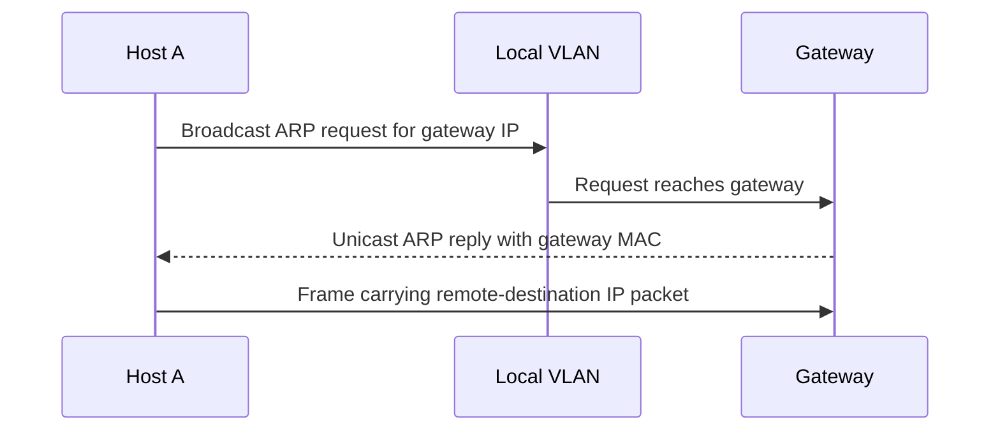

# Chapter 07 — ARP

[← MAC Address](../06-MAC-Address/README.md) · [Handbook](../README.md) · [ICMP →](../08-ICMP/README.md)

> **Learning objectives**
> - Explain how ARP maps an IPv4 next-hop address to a link-layer address.
> - Distinguish local-destination resolution from default-gateway resolution.
> - Read ARP requests, replies, neighbor-cache states, and gratuitous ARP.
> - Diagnose duplicate addresses and incomplete resolution safely.

## 1. Introduction

The **Address Resolution Protocol (ARP)** lets an IPv4 host discover the link-layer address associated with an on-link IPv4 address. Before an Ethernet frame can reach a local host or gateway, the sender needs a destination MAC. ARP supplies that mapping.

ARP is local to a Layer 2 broadcast domain. Routers do not normally forward ARP broadcasts. For a remote destination, a host resolves the **next-hop gateway**, not the final remote server.

## 2. Theory

### Request and reply

For host `192.0.2.10` seeking `192.0.2.1`:

```text
Request: Who has 192.0.2.1? Tell 192.0.2.10.
Reply:   192.0.2.1 is at 00:11:22:33:44:55.
```

The request is normally sent to Ethernet broadcast `ff:ff:ff:ff:ff:ff`. The reply is normally unicast to the requester. Both peers can learn useful sender information from the exchange.

### ARP fields

| Field | Typical Ethernet/IPv4 value | Purpose |
|---|---|---|
| Hardware type | `1` | Ethernet |
| Protocol type | `0x0800` | IPv4 |
| Hardware size | `6` | MAC length |
| Protocol size | `4` | IPv4 length |
| Opcode | `1` request, `2` reply | Operation |
| Sender MAC/IP | Requester's identity | Mapping offered by sender |
| Target MAC/IP | Unknown/target | Mapping being requested or answered |

### Neighbor cache

Hosts cache mappings to avoid broadcasting before every packet. Linux states can include:

| State | Meaning |
|---|---|
| `REACHABLE` | Recently confirmed |
| `STALE` | Mapping exists but needs confirmation before long-term reuse |
| `DELAY` / `PROBE` | Reachability confirmation in progress |
| `INCOMPLETE` | Resolution started; no usable reply yet |
| `FAILED` | Resolution attempts failed |
| `PERMANENT` | Static entry |

An entry becoming `STALE` is normal lifecycle behavior, not immediate failure.

### Gratuitous ARP

A host can announce or probe its own address without a conventional prior request. Gratuitous ARP is used to:

- update peer caches after failover or MAC movement;
- detect duplicate IPv4 addresses;
- announce a newly configured address;
- support high-availability virtual IP movement.

### Proxy ARP

A router answers ARP on behalf of another IP, making that address appear on-link. Proxy ARP can solve specific designs but hides routing boundaries and complicates troubleshooting; use it deliberately.

> **Did you know?** ARP does not ask “what is the MAC of this remote server?” It asks for the MAC of the next IPv4 hop on the current link.

> **Memory trick:** routing chooses **which next-hop IP**; ARP discovers **which MAC carries it locally**.

### Behind the scenes

Linux treats IPv4 ARP and IPv6 Neighbor Discovery through a common neighbor subsystem. Queueing may hold initial packets while resolution completes. If no mapping is learned, the kernel cannot build the required local frame.

## 3. Visual diagram



## 4. Real-world example

A host wants `198.51.100.20` but is configured as `192.0.2.10/24` with gateway `192.0.2.1`. Route lookup selects the gateway. ARP resolves `192.0.2.1 → gateway MAC`, then Ethernet carries the IP packet to the router.

### Real industry usage

Engineers inspect ARP/neighbor tables during duplicate-address incidents, gateway failures, VLAN mismatches, HA failovers, and silent local reachability problems.

### Cloud perspective

Cloud fabrics often proxy, suppress, or implement ARP behavior virtually. Captures may not resemble a physical LAN, and arbitrary L2 protocols or virtual-IP movement may require provider-supported mechanisms.

### DevOps perspective

Linux bridges, containers, VMs, and network namespaces each have their own neighbor context. Inspect the namespace generating the traffic. Clearing the host cache does not clear a container namespace's cache.

### Cybersecurity perspective

ARP has no authentication. ARP spoofing/poisoning can redirect local traffic. Defenses include segmentation, DHCP snooping plus Dynamic ARP Inspection, static bindings for narrow cases, 802.1X, encryption, and monitoring for unexpected mapping changes.

## 5. Packet journey

1. Application sends data to an IPv4 destination.
2. Route lookup chooses a directly connected destination or gateway.
3. Kernel checks neighbor cache for that next-hop IP.
4. If missing, it broadcasts an ARP request and temporarily queues traffic.
5. Owner/proxy replies with a MAC.
6. Kernel stores the mapping and transmits queued frames.
7. If replies never arrive, resolution becomes incomplete/failed and application traffic cannot leave toward that hop.

## 6. Linux commands

| Command | Purpose |
|---|---|
| `ip neighbor` | Show neighbor mappings and state |
| `ip neighbor show dev IFACE` | Limit output to one link |
| `arp -n` | Legacy IPv4 ARP-cache view |
| `arping -I IFACE IP` | Test local ARP reachability/duplicate behavior |
| `tcpdump -eni IFACE arp` | Observe request/reply frames |
| `ip route get DEST` | Identify the next hop that ARP should resolve |

Read-only workflow:

```bash
ip route get 1.1.1.1
ip neighbor
sudo tcpdump -eni IFACE -c 10 arp
```

Avoid flushing neighbor caches on production hosts as a casual test; it changes live state and can create a burst of resolution traffic.

## 7. Practical example

Complete [Lab 07: Observe ARP resolution](../../labs/07-observe-arp/README.md). It captures a controlled gateway mapping and compares packet fields with the Linux neighbor cache.

## 8. Wireshark example

Filters:

```text
arp
arp.opcode == 1
arp.opcode == 2
arp.duplicate-address-detected
```

Verify Ethernet destination, opcode, sender MAC/IP, and target MAC/IP. In a request, target MAC may be all zeros while the Ethernet destination is broadcast. Wireshark expert warnings are clues, not proof of malicious behavior.

## 9. Common mistakes

- Expecting ARP to cross routers.
- Resolving the final remote IP instead of the gateway.
- Treating `STALE` as broken.
- Confusing switch MAC tables with host ARP caches.
- Clearing caches before capturing the original failure.
- Assuming every unsolicited ARP is malicious; HA and normal announcements use it.
- Assuming encryption prevents ARP redirection; it protects content/identity only when correctly verified.

## 10. Troubleshooting

| Symptom | Evidence | Likely area |
|---|---|---|
| `INCOMPLETE` gateway | ARP requests without replies | VLAN, link, gateway, wrong subnet |
| MAC changes repeatedly | Cache history/switch logs | Duplicate IP, HA, spoofing, flapping |
| Remote address gets ARP requests | Host prefix/routes | Mask too broad or proxy ARP design |
| Failover IP remains unreachable | Gratuitous ARP and switch table | Peers not updated, filtering, MAC movement |

### Best practices

- Capture before changing the cache.
- Pair neighbor evidence with route selection and VLAN context.
- Use static entries sparingly and document ownership.
- Monitor duplicate IP and unexpected gateway-MAC changes.
- Use authenticated/encrypted application protocols even on local networks.

## 11. Interview questions

### Why is an ARP request broadcast but the reply usually unicast?

<details><summary>Answer</summary>

The requester does not know the target MAC, so it asks the entire local domain. The target learns the requester's sender MAC from the request and can reply directly.

</details>

### What happens when ARP resolution fails?

<details><summary>Answer</summary>

The host cannot construct the required local frame for that next hop. Neighbor state becomes incomplete/failed, queued traffic times out, and higher layers report reachability or timeout symptoms.

</details>

### What is gratuitous ARP used for?

<details><summary>Answer</summary>

Announcing/updating a host's own IP-to-MAC mapping, detecting duplicates, and moving virtual IPs during high-availability failover.

</details>

## 12. Quiz

1. What address is normally resolved for a remote destination?
2. True or false: routers forward ordinary ARP broadcasts.
3. What Ethernet destination carries a typical ARP request?
4. What does `INCOMPLETE` indicate?
5. Scenario: ARP requests target a host that should be across a router. What configuration should you inspect first?

<details><summary>Quiz answers</summary>

1. The selected on-link next hop/default gateway.
2. False.
3. `ff:ff:ff:ff:ff:ff`.
4. Resolution is in progress but no usable mapping has been learned.
5. The source host's subnet prefix and routing table; it may wrongly consider the destination on-link.

</details>

## FAQ

### Does ARP work with IPv6?

No. IPv6 uses ICMPv6 Neighbor Discovery.

### Can ARP find a hostname?

No. DNS resolves names to IP addresses; ARP maps an on-link IPv4 next hop to a link-layer address.

### Is ARP Layer 2 or Layer 3?

It bridges IPv4 knowledge and link delivery. Explain its function and scope rather than relying only on a layer label.

## 13. Summary

ARP resolves an on-link IPv4 next hop into a MAC address. Requests are commonly broadcast, replies unicast, and mappings cached with lifecycle states. Routing decides the next-hop IP first; ARP enables its local frame delivery. Continue with [ICMP](../08-ICMP/README.md) to understand IP diagnostics and errors.
