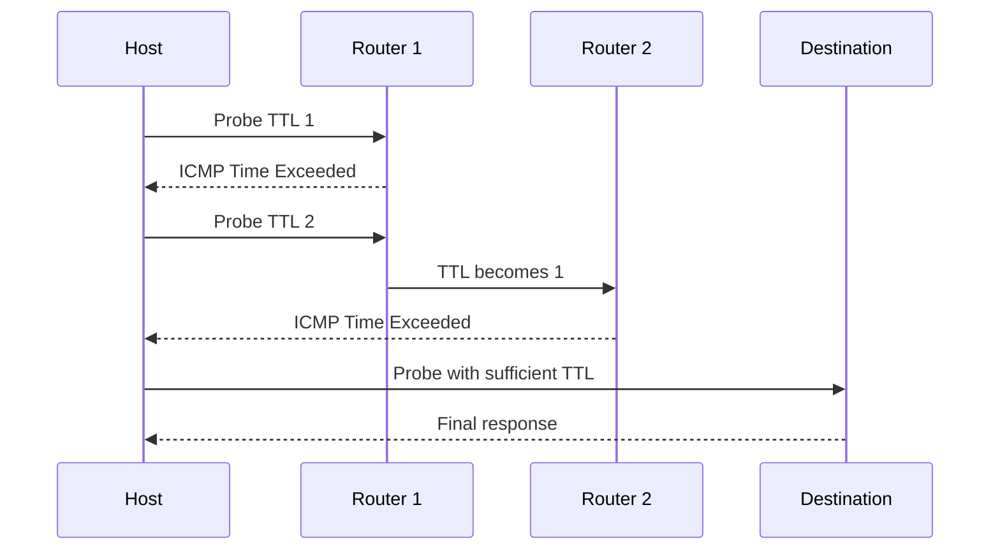

# Chapter 08 — ICMP

[← ARP](../07-ARP/README.md) · [Handbook](../README.md) · Next: TCP

> **Learning objectives**
> - Explain ICMP's role in IP error reporting and diagnostics.
> - Interpret Echo, Destination Unreachable, Time Exceeded, and Packet Too Big messages.
> - Explain how ping, traceroute, and Path MTU Discovery use ICMP.
> - Avoid the false conclusion that blocked ping means a host is down.

## 1. Introduction

The **Internet Control Message Protocol (ICMP)** carries status, error, and diagnostic information for IP. ICMP is not merely “the ping protocol.” Routers and hosts use it to report unreachable destinations, expired packet lifetimes, packet-size problems, redirects, and other network conditions.

ICMPv4 accompanies IPv4; ICMPv6 is even more fundamental to IPv6, supporting Neighbor Discovery, router discovery, and Path MTU Discovery.

## 2. Theory

### Important ICMPv4 messages

| Type | Name | Typical purpose |
|---:|---|---|
| 0 | Echo Reply | Response to Echo Request |
| 3 | Destination Unreachable | Network/host/protocol/port/fragmentation problem |
| 5 | Redirect | Suggest a better local next hop |
| 8 | Echo Request | Reachability/RTT probe |
| 11 | Time Exceeded | TTL reached zero or fragment reassembly timed out |
| 12 | Parameter Problem | Invalid IP header information |

The **code** refines the type. For example, Destination Unreachable can mean port unreachable or fragmentation needed. Read type and code together.

### Important ICMPv6 messages

| Type | Name |
|---:|---|
| 1 | Destination Unreachable |
| 2 | Packet Too Big |
| 3 | Time Exceeded |
| 4 | Parameter Problem |
| 128 / 129 | Echo Request / Reply |

ICMPv6 also carries Neighbor Discovery messages such as Router Solicitation/Advertisement and Neighbor Solicitation/Advertisement.

### Ping

`ping` sends Echo Requests and measures replies, packet loss, and round-trip time. Success proves that this ICMP exchange works along a path at that moment. Failure does **not** prove the destination is off: hosts/firewalls may filter Echo while TCP/UDP services work.

### Traceroute and TTL

IPv4 TTL and IPv6 Hop Limit decrease at each router. When the value reaches zero, a router discards the packet and normally returns Time Exceeded. Traceroute sends probes with increasing lifetime values and records responders.

Different implementations use UDP, ICMP Echo, or TCP probes. Firewalls, load balancing, asymmetric routes, rate limiting, and nonresponding routers affect results.

### Path MTU Discovery

IPv4 can use Don't Fragment probes and ICMP “fragmentation needed.” IPv6 routers never fragment forwarded packets; they return ICMPv6 Packet Too Big. Blocking essential ICMP can create MTU black holes where small traffic works but larger transfers stall.

> **Did you know?** An ICMP error usually includes the original IP header and part of its payload so the sender can associate the error with a flow.

> **Memory trick:** ping asks **are Echo replies possible?**; traceroute asks **where does TTL expire?**; neither alone proves application health.

### Behind the scenes

Operating systems deliver ICMP errors to transport sockets. A UDP application may receive “port unreachable”; TCP may react to unreachable or MTU information. ICMP rate limiting is common to protect control-plane resources.

## 3. Visual diagram



## 4. Real-world example

A browser transfer stalls only for large responses. Small pings work. A VPN lowered the effective MTU, but ICMP Packet Too Big is blocked. TCP cannot learn a safe segment size, producing a path MTU black hole. The fix is correct MTU/ICMP policy—not endlessly increasing application timeout.

### Real industry usage

NOCs and SREs use ICMP for path checks, latency/loss baselines, route changes, MTU diagnosis, and monitoring. Good monitoring combines ICMP with DNS, TCP, TLS, HTTP, and server metrics.

### Cloud perspective

Security groups/NACLs/firewalls may control ICMP by type/code. Cloud load balancers may not answer ping even while services are healthy. Test the actual service path and retain required ICMP for path behavior.

### DevOps perspective

Container and Kubernetes probes usually test application endpoints, not ICMP. `ping` may be absent or lack raw-socket capability in minimal containers. Use `curl`, `nc`, DNS tools, and observability appropriate to the failing layer.

### Cybersecurity perspective

ICMP can assist discovery and covert channels, but blocking all ICMP breaks legitimate control functions. Apply rate limits and allow necessary types/codes according to architecture, especially ICMPv6 Neighbor Discovery and Packet Too Big.

## 5. Packet journey

1. Source sends an IP packet.
2. A router cannot forward it because TTL expired, route is unavailable, or size exceeds path constraints.
3. Router drops the original packet and creates an ICMP error toward the source.
4. Error includes identifying portion of the original packet.
5. Source kernel matches it to a socket/flow and exposes behavior to the application.

ICMP errors can themselves be lost or filtered. Their absence does not identify exactly where the original packet disappeared.

## 6. Linux commands

| Command | Purpose |
|---|---|
| `ping -c 4 HOST` | Echo RTT/loss sample |
| `ping -M do -s SIZE HOST` | IPv4 no-fragment size probe |
| `traceroute HOST` | Hop discovery with default probe type |
| `traceroute -T -p 443 HOST` | TCP-based trace toward service port |
| `tracepath HOST` | Unprivileged path/PMTU observations |
| `mtr -rw HOST` | Repeated hop statistics |
| `tcpdump -ni IFACE 'icmp or icmp6'` | Capture ICMPv4/v6 |

Use finite counts and authorized targets. Intermediate-hop “loss” in MTR may be control-plane rate limiting if later hops show no loss.

## 7. Practical example

Complete [Lab 08: Diagnose with ICMP](../../labs/08-diagnose-with-icmp/README.md). It compares loopback, gateway, Internet, traceroute, and service evidence without assuming ping is decisive.

## 8. Wireshark example

Filters:

```text
icmp or icmpv6
icmp.type == 8 or icmp.type == 0
icmp.type == 11
icmpv6.type == 2
```

For Echo, inspect identifier, sequence number, data, TTL, and request/reply RTT. For errors, expand the embedded original packet to identify the failed flow. Validate checksum warnings against capture offload/location.

## 9. Common mistakes

- Concluding “host down” from failed ping.
- Calling ICMP a transport protocol with application ports.
- Blocking all ICMP/ICMPv6.
- Reading traceroute stars as proof that hop is broken when later hops respond.
- Treating every MTR intermediate loss percentage as forwarded-data loss.
- Testing a public host instead of the actual application endpoint.
- Ignoring asymmetric routing: return path can differ.

## 10. Troubleshooting

| Observation | Interpretation |
|---|---|
| Echo works; port fails | IP/ICMP path exists; inspect transport/listener/policy |
| Echo fails; HTTPS works | Echo filtered/ignored; service path works |
| Time Exceeded repeats | Possible loop or intentionally limited probe behavior |
| Port Unreachable | Host/path responded but UDP destination port unavailable |
| Packet Too Big | Reduce packet size/fix path MTU |
| Stars then later hops | Intermediate device did not answer probes but forwarded them |

### Best practices

- Correlate ICMP with actual service tests and captures.
- Allow required control messages securely, especially for IPv6 and PMTUD.
- Baseline RTT/loss over time instead of trusting one sample.
- Record probe type because traceroute modes differ.
- Interpret hop data end to end, not row by row in isolation.

## 11. Interview questions

### Can a server be reachable if ping fails?

<details><summary>Answer</summary>

Yes. Echo may be filtered or disabled while TCP/UDP application traffic is permitted. Test the real protocol and port.

</details>

### How does traceroute discover routers?

<details><summary>Answer</summary>

It sends probes with increasing TTL/Hop Limit. Each router where lifetime expires can return ICMP Time Exceeded; the final destination responds according to probe type.

</details>

### Why is ICMPv6 important?

<details><summary>Answer</summary>

IPv6 depends on ICMPv6 for errors, Path MTU Discovery, Neighbor Discovery, router discovery, and address-related functions. Blanket blocking can break basic IPv6 operation.

</details>

## 12. Quiz

1. Which ICMPv4 type is Echo Request?
2. What causes Time Exceeded during traceroute?
3. True or false: successful ping proves HTTP is healthy.
4. Why can large transfers fail while small packets work?
5. Scenario: hop 4 shows 80% loss but destination shows 0%. Is hop 4 dropping 80% of forwarded traffic?

<details><summary>Quiz answers</summary>

1. Type 8.
2. Probe TTL reaches zero at that router.
3. False.
4. A path MTU black hole or fragmentation/Packet Too Big policy problem is one likely cause.
5. Probably not; it likely rate-limits responses addressed to itself while forwarding normally. Destination evidence is more representative.

</details>

## FAQ

### Does ICMP use ports?

No. It uses types and codes, not TCP/UDP ports.

### Why does traceroute show different paths?

Routing changes, load balancing, probe protocols, anycast, and asymmetric return paths can change responders.

### Is ping a security risk?

It reveals some reachability information, but ICMP also provides essential control functions. Use scoped policy and rate limiting rather than indiscriminate blocking.

## 13. Summary

ICMP communicates IP-layer status and diagnostic information. Ping samples Echo behavior; traceroute exploits packet lifetime; PMTUD depends on size feedback. Interpret ICMP together with actual service traffic and never equate blocked Echo with a dead host. Next comes TCP, where reliable byte-stream transport is established end to end.
