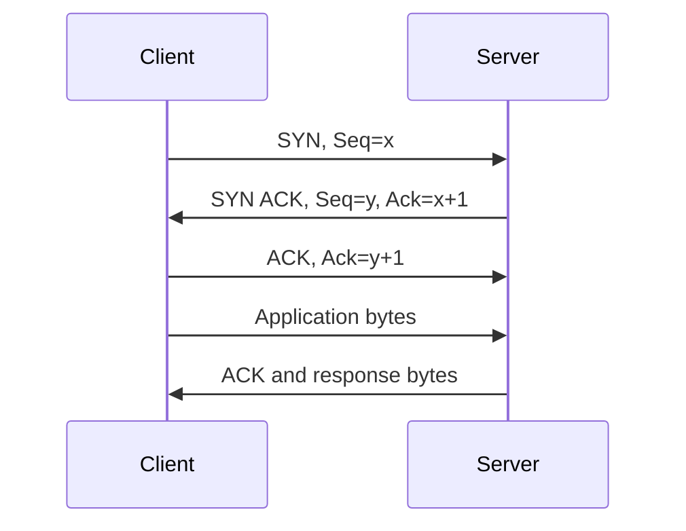

# Chapter 09 — TCP

[← ICMP](../08-ICMP/README.md) · [Handbook](../README.md) · [UDP →](../10-UDP/README.md)

> **Learning objectives**
> - Explain TCP connections, sequence numbers, acknowledgments, windows, retransmission, and teardown.
> - Inspect TCP state with Linux and Wireshark.
> - Diagnose resets, timeouts, loss, latency, and application stalls using evidence.

## 1. Introduction

Transmission Control Protocol (TCP) provides applications with a reliable, ordered byte stream between two sockets. It does not guarantee that a service is healthy or that a request succeeds; it manages transport delivery by detecting loss, reordering data, controlling how much may be in flight, and reacting to congestion.

HTTP/1.1, HTTP/2, SSH, database protocols, and many control-plane APIs commonly use TCP. HTTP/3 is a useful contrast: it uses QUIC over UDP and implements reliability above UDP.

## 2. Theory

### Connection identity and state

A TCP connection is identified by source IP, source port, destination IP, and destination port. Client and server maintain independent sequence spaces and state.

| Mechanism | Purpose |
|---|---|
| Sequence number | Locates bytes in one direction's stream |
| Acknowledgment | Reports the next byte expected |
| Receive window | Limits data according to receiver capacity |
| Retransmission | Sends data again when delivery is not confirmed |
| Congestion control | Adapts sending to network conditions |
| Flags | Coordinate setup, acknowledgment, reset, and close |

### Three-way handshake

1. Client sends `SYN` with its initial sequence number and options.
2. Server replies `SYN, ACK` and acknowledges the client's sequence space.
3. Client sends `ACK`; the connection becomes established.

Important negotiated options include Maximum Segment Size (MSS), Window Scale, Selective Acknowledgment (SACK) permission, and timestamps. MSS limits TCP payload per segment; it is not the same as interface MTU.

### Reliability is byte-oriented

TCP preserves byte order, not application message boundaries. One application write may appear in several segments, and several writes may be delivered in one read. Applications need their own framing, such as a length field, delimiter, or protocol grammar.

### Flow control versus congestion control

- **Flow control** protects the receiving host and is advertised through the receive window.
- **Congestion control** protects the network and uses sender-side algorithms and loss/latency signals.

The sender is constrained by both. A zero receive window points toward a slow receiver; repeated retransmissions can indicate loss, reordering, filtering, or an incorrect capture location.

> **Did You Know?** An ACK value acknowledges every earlier byte in that direction; TCP acknowledgments are normally cumulative.

> **Memory Tricks:** **SYN, SYN-ACK, ACK = ask, agree, begin.** A graceful close uses FIN; an abrupt rejection or invalid state commonly uses RST.

### Behind the Scenes

The operating system TCP stack handles timers, retransmission queues, acknowledgment policy, window scaling, congestion state, and socket buffers. Offloading can make a host capture show unusually large segments or checksum warnings even when packets on the wire are valid.

## 3. Visual diagram



## 4. Real-world example

A browser resolves a web name, selects a server address, and opens a TCP connection from an ephemeral client port to port 443. After the handshake, TLS negotiates encryption and HTTP travels inside the encrypted connection. A successful TCP handshake proves transport reachability to a listener; it does not prove TLS, HTTP, authentication, or backend health.

### Real Industry Usage

Load balancers track TCP connections and may create a different upstream connection to the application. Proxies, NAT devices, and firewalls maintain connection state and idle timers. Connection pooling reduces handshake cost but can preserve stale paths during deployments.

### Cloud Perspective

Security groups, network ACLs, routes, load balancers, NAT, and asymmetric paths can affect TCP differently. Stateful controls often allow return traffic automatically; stateless controls require explicit rules in both directions, including ephemeral ports.

### DevOps Perspective

Align client, proxy, load-balancer, and server timeouts. Observe connection errors, handshake latency, retransmissions, resets, pool saturation, and request latency together. Retrying an unsafe request after a transport timeout can duplicate work.

### Cybersecurity Perspective

SYN floods exhaust connection resources; SYN cookies and rate controls can reduce impact. Exposed listeners, weak TLS above TCP, blind trust in source IPs, and unbounded idle connections expand attack surface.

## 5. Packet journey

For a connection from `192.0.2.10:51514` to `198.51.100.20:443`:

1. Routing chooses the next hop and interface.
2. ARP or NDP resolves the local next-hop link address.
3. The client sends SYN; routers forward it while changing link-layer headers each hop.
4. The server listener accepts the connection and returns SYN-ACK.
5. ACK completes setup; TLS/application bytes follow.
6. Each endpoint acknowledges received bytes and adjusts its advertised window.
7. FIN/ACK exchanges close gracefully, or RST terminates abruptly.

NAT may rewrite an address or port, so captures on opposite sides can show different tuples for the same logical flow.

## 6. Linux commands

| Command | What it does | When to use it |
|---|---|---|
| `ss -ltnp` | Shows listening TCP sockets and owning processes | Confirm bind address and port |
| `ss -tnpi` | Shows established sockets and TCP details | Inspect RTT, congestion, retransmission state |
| `ip route get ADDRESS` | Shows selected route and source | Validate path before blaming TCP |
| `nc -vz HOST PORT` | Attempts a TCP connection | Separate connect failure from application failure |
| `curl -v URL` | Shows connection and application progress | Locate DNS, connect, TLS, or HTTP failure |
| `tcpdump -ni any 'tcp port 443'` | Captures matching TCP traffic | Confirm handshake, reset, or silence |

Example:

```bash
ss -tnpi dst 198.51.100.20
tcpdump -ni any 'host 198.51.100.20 and tcp port 443'
curl -v --connect-timeout 5 https://example.com/
```

`SYN-SENT` with repeated SYNs suggests no usable reply reaches the client. `ESTAB` means the handshake completed, not that the application is responsive. A listener on `127.0.0.1:8080` is not reachable through the host's external address.

## 7. Practical example

On an authorized Linux system, start a temporary listener and inspect it:

```bash
python3 -m http.server 8080 --bind 127.0.0.1
ss -ltnp 'sport = :8080'
curl -v http://127.0.0.1:8080/
```

Capture on loopback in another terminal:

```bash
sudo tcpdump -ni lo 'tcp port 8080'
```

Identify handshake packets, application data, acknowledgments, and teardown. Stop the server afterward. Use [Lab 09](../../labs/09-compare-tcp-udp/README.md) for a guided TCP/UDP comparison.

## 8. Wireshark example

Useful display filters:

```text
tcp.flags.syn == 1
tcp.stream eq 0
tcp.analysis.retransmission
tcp.flags.reset == 1
tcp.window_size_value == 0
```

Inspect source/destination ports, sequence and acknowledgment numbers, header length, flags, window, checksum, options, payload length, and expert analysis. Use **Follow TCP Stream** to reconstruct application bytes when they are not encrypted.

Treat analysis labels as clues, not verdicts. A capture that begins midstream, drops packets, uses host offloading, or observes only one side can produce misleading warnings.

## 9. Common mistakes

- Saying TCP sends “messages” instead of an ordered byte stream.
- Treating handshake success as proof of application health.
- Confusing receive-window flow control with congestion control.
- Assuming every retransmission proves network loss.
- Ignoring bind address, address family, NAT, or proxy boundaries.
- Expecting a graceful FIN when a process crash or policy device sends RST.
- Reading relative sequence numbers as literal wire values without checking settings.

### Common Beginner Mistakes

Testing `ping` alone is insufficient: ICMP success does not prove a TCP port is allowed or listening, and blocked ICMP does not prove TCP is broken. Test the exact destination, address family, protocol, and port.

## 10. Troubleshooting

| Evidence | Likely investigation |
|---|---|
| Repeated SYN, no reply | Route, firewall, security rule, server availability, return path |
| Immediate RST after SYN | No listener, active rejection, wrong address/port |
| Handshake then TLS/application failure | Move above TCP; inspect TLS, protocol, proxy, or service logs |
| Retransmissions and duplicate ACKs | Loss, reordering, congestion, MTU, overloaded endpoint, capture quality |
| Zero window | Receiver or application is not draining its socket buffer |
| Works locally only | Bind address, host firewall, NAT/publishing, external route |
| Long idle connection dies | Stateful device timeout, keepalive policy, stale pool |

### Best Practices

- Test the exact tuple and address family used by the application.
- Capture near both endpoints when a middlebox or asymmetric path is suspected.
- Correlate packets with socket state and application/load-balancer logs.
- Use bounded timeouts and deliberate, safe retry policies.
- Reuse connections thoughtfully and drain them during deployments.
- Establish a baseline for RTT and retransmission rates before incidents.

## 11. Interview questions

### Why does TCP need three handshake steps?

<details><summary>Answer</summary>Both sides must prove reachability, establish state, exchange initial sequence spaces, acknowledge the peer, and negotiate options. The final ACK confirms the client received the server's SYN.</details>

### FIN versus RST?

<details><summary>Answer</summary>FIN closes one sending direction gracefully after queued bytes; RST aborts or rejects a connection and can discard pending state.</details>

### What does a retransmission prove?

<details><summary>Answer</summary>It proves the sender did not receive the expected acknowledgment in time or inferred loss. It does not alone identify where or why the original segment or ACK was lost.</details>

### A port works on localhost but not remotely. What do you check?

<details><summary>Answer</summary>Listener bind address/family, host and upstream policy, route/NAT or port publishing, then SYN/SYN-ACK evidence at client and server.</details>

## 12. Quiz

1. **Multiple choice:** Which field tells a sender how much receive-buffer space the peer currently advertises? A) TTL B) Window C) MSS D) Source port
2. **True/False:** TCP preserves application message boundaries.
3. **Practical:** Which commands confirm a listener and capture its handshake?
4. **Scenario:** SYN is followed immediately by RST from the destination. What does that usually suggest?

<details><summary>Answers</summary>

1. **B — Window.** Window scaling may expand the effective value.
2. **False.** TCP provides an ordered byte stream.
3. `ss -ltnp` and a scoped `tcpdump`/Wireshark capture; `nc -vz` or `curl -v` can generate the test.
4. The destination is reachable but no matching listener exists, or a device/host actively rejects the connection.

</details>

## FAQ

### Is TCP always slower than UDP?

No. Performance depends on protocol design, path, loss, congestion control, connection reuse, and application behavior. UDP merely provides fewer transport services.

### Does TCP keep data secure?

No. Reliability is not confidentiality or authentication. Use TLS or another appropriate security protocol.

### Why can a packet capture show a bad TCP checksum?

On a sending host, checksum offload may calculate it after the capture point. Verify capture location and offload behavior before concluding corruption.

## 13. Summary

TCP creates a stateful, reliable, ordered byte stream using sequence numbers, acknowledgments, windows, retransmission, and congestion control. Diagnose it by following the exact tuple, separating handshake from application behavior, and correlating socket state, packets, middleboxes, and logs.

## References

- [RFC 9293 — Transmission Control Protocol](https://www.rfc-editor.org/rfc/rfc9293)
- [RFC 5681 — TCP Congestion Control](https://www.rfc-editor.org/rfc/rfc5681)
- [RFC 7323 — TCP Extensions for High Performance](https://www.rfc-editor.org/rfc/rfc7323)
- [Wireshark User's Guide](https://www.wireshark.org/docs/wsug_html_chunked/)
- [Repository references](../../REFERENCES.md)
