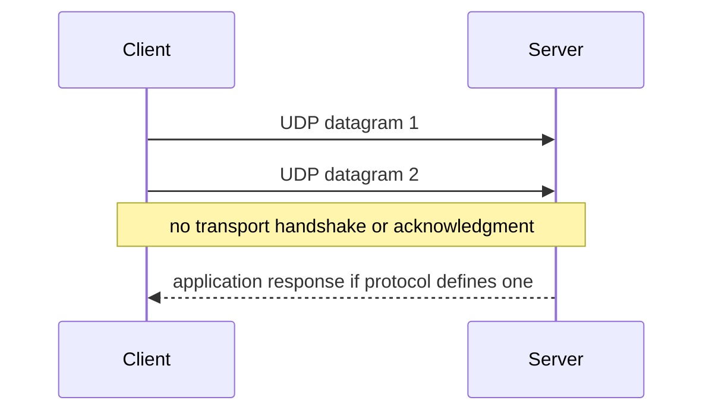

# Chapter 10 — UDP

[← TCP](../09-TCP/README.md) · [Handbook](../README.md) · [Ports →](../11-Ports/README.md)

> **Learning objectives**
> - Explain UDP datagrams, message boundaries, checksum, and connectionless behavior.
> - Identify when applications choose UDP and which reliability they add.
> - Diagnose UDP without expecting a handshake or TCP states.

## 1. Introduction

**User Datagram Protocol (UDP)** provides process-to-process datagrams using ports with a small fixed header. It has no handshake, ordered stream, retransmission, flow control, or congestion control built into UDP itself. Applications must tolerate loss or implement the behavior they require.

## 2. Theory

### Eight-byte header

| Field | Size | Purpose |
|---|---:|---|
| Source port | 16 bits | Sending process; may be zero in limited IPv4 cases |
| Destination port | 16 bits | Receiving process |
| Length | 16 bits | Header plus payload |
| Checksum | 16 bits | Integrity across pseudo-header/header/payload |

UDP preserves datagram boundaries: one sent datagram is received as one datagram if delivered and buffer capacity permits. Oversized datagrams risk fragmentation or loss.

### What UDP does not mean

UDP does not mean “unreliable application.” QUIC adds reliability, congestion control, encryption, and streams over UDP. DNS retries or switches transport. Voice/video may prefer timely loss over late retransmission.

### Common uses

DNS, DHCP, NTP, syslog, real-time media, discovery, gaming, telemetry, and QUIC/HTTP/3 commonly use UDP.

> **Did you know?** A UDP “connection” shown by tools can simply be a socket associated with a default peer; UDP still has no transport handshake.

> **Memory trick:** UDP delivers independent envelopes; TCP delivers an ordered byte stream.

### Behind the scenes

When no UDP socket matches a received destination port, a host may send ICMP Port Unreachable. Firewalls often drop silently, so no response cannot distinguish loss, policy, or an application that legitimately stays silent.

## 3. Visual diagram



## 4. Real-world example

A DNS client sends a query via UDP port 53. If no answer arrives, it retries according to resolver policy. Large/truncated responses may use TCP or newer encrypted transports. Reliability belongs to the DNS resolver behavior, not UDP.

### Real industry usage

Teams choose UDP for request/response efficiency, multicast/discovery, real-time delivery, or user-space transports such as QUIC.

### Cloud perspective

Confirm that load balancers, NAT gateways, security policies, health checks, and idle state support UDP. UDP state timeouts are often shorter than TCP.

### DevOps perspective

Logging/metrics over UDP may drop under load without backpressure. Use it only when loss is acceptable or application-level buffering/acknowledgment exists.

### Cybersecurity perspective

Spoofable source addresses and small-request/large-response protocols enable reflection/amplification abuse. Apply ingress/egress filtering, response-rate limits, authentication, and avoid exposing open amplifiers.

## 5. Packet journey

1. Application sends one datagram to destination address/port.
2. UDP adds header and checksum.
3. IP routes packet; link layers frame each hop.
4. Destination kernel validates and demultiplexes to a socket.
5. No listener may trigger ICMP Port Unreachable or silent policy drop.
6. Any reply is a separate application-defined datagram.

## 6. Linux commands

| Command | Use |
|---|---|
| `ss -lunp` | UDP sockets/listeners |
| `nc -u HOST PORT` | Send UDP data in controlled tests |
| `dig @SERVER NAME` | Test DNS over UDP by default |
| `tcpdump -ni IFACE 'udp port PORT'` | Capture datagrams |
| `nstat -az | grep Udp` | Kernel UDP counters |

UDP `nc -u -z` success reporting is not equivalent to a TCP handshake; use protocol-specific responses and captures.

## 7. Practical example

Use [Lab 09](../../labs/09-compare-tcp-udp/README.md) to compare a TCP handshake with connectionless UDP delivery on loopback.

## 8. Wireshark example

```text
udp
udp.port == 53
udp.length > 1200
icmp.type == 3 and icmp.code == 3
```

Inspect ports, UDP length, checksum, application decoder, IP fragmentation, request/response identifiers, and ICMP errors. Checksum offload can affect local captures.

## 9. Common mistakes

- Calling UDP always faster or better for games.
- Expecting handshake/state evidence.
- Treating no reply as proof the port is closed.
- Sending huge datagrams and ignoring MTU.
- Assuming UDP applications need no congestion control.
- Confusing UDP checksum warnings with wire corruption before checking offload.

## 10. Troubleshooting

| Evidence | Interpretation |
|---|---|
| Request leaves, no response | Server silence, loss, policy, NAT, wrong protocol/payload |
| ICMP Port Unreachable | Destination reports no matching UDP service |
| Fragmented datagrams | Payload exceeds path/link constraints |
| Receive-buffer errors | Application/kernel cannot consume bursts |
| Works briefly through NAT | UDP mapping/idle timeout issue |

### Best practices

- Use protocol-aware health checks.
- Keep datagrams below safe path limits.
- Add retries, IDs, deduplication, rate limits, and congestion behavior where needed.
- Monitor kernel drops and application receive buffers.
- Secure public UDP services against spoofing/amplification.

## 11. Interview questions

### Does UDP guarantee delivery?

<details><summary>Answer</summary>No. It provides checksum-protected datagrams and ports; applications add any delivery semantics.</details>

### Why does QUIC use UDP?

<details><summary>Answer</summary>UDP provides widely deployable datagrams while QUIC implements encrypted connections, streams, reliability, and congestion control in user space.</details>

### Can UDP be “connected”?

<details><summary>Answer</summary>An OS can associate a UDP socket with a default peer and filter input, but no UDP handshake or reliable connection state is created.</details>

## 12. Quiz

1. UDP header size? 2. Does UDP preserve datagram boundaries? 3. What may a closed UDP port return? 4. Why avoid oversized datagrams? 5. Name two reliability functions an application might add.

<details><summary>Quiz answers</summary>

1. 8 bytes. 2. Yes. 3. ICMP Port Unreachable, though policy may drop silently. 4. Fragmentation/loss risk. 5. Retries, acknowledgments, sequence IDs, deduplication, congestion control (any two).

</details>

## FAQ

### Is UDP insecure?

It provides no encryption/authentication, just as TCP does not. Applications use protocols such as QUIC/DTLS or their own secure design.

### Can UDP use multicast?

Yes; UDP is commonly used with IP multicast because independent datagrams map naturally to group delivery.

### Why is DNS sometimes TCP?

DNS uses TCP for cases including zone transfer, retry after truncation, and policies/transports that require it.

## 13. Summary

UDP provides lightweight, boundary-preserving datagrams without transport handshake or reliability. Its simplicity gives applications control—and responsibility—for recovery, pacing, security, and congestion. Continue with [Ports and Sockets](../11-Ports/README.md).
