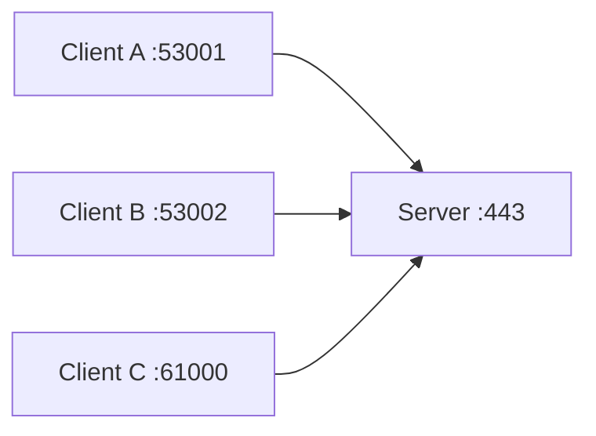

# Chapter 11 — Ports and Sockets

[← UDP](../10-UDP/README.md) · [Handbook](../README.md) · [DNS →](../12-DNS/README.md)

> **Learning objectives**
> - Explain TCP/UDP ports, sockets, listeners, ephemeral ports, and flow tuples.
> - Distinguish binding to loopback, one interface, or all addresses.
> - Audit service exposure and diagnose refusal versus timeout.

## 1. Introduction

A **port** is a 16-bit transport-layer number used by TCP or UDP to direct traffic to an application socket. Port numbers range from `0` to `65535`. TCP port 53 and UDP port 53 are different namespaces.

A port is not a process, firewall rule, or physical connector. A **socket** combines protocol and local/remote addressing state through which a process communicates.

## 2. Theory

### Ranges

| Range | Conventional meaning |
|---|---|
| `0–1023` | System/well-known ports |
| `1024–49151` | Registered ports |
| `49152–65535` | Dynamic/private range (OS ephemeral ranges vary) |

IANA registration documents conventions; applications can technically listen elsewhere. Do not identify a service solely from port number.

### Tuples and listeners

A TCP flow is commonly identified by protocol plus source IP/port and destination IP/port. Many clients can connect to one server port because their source endpoints differ.

A listener bound to:

- `127.0.0.1:8080` accepts only local IPv4 loopback traffic;
- `192.0.2.10:8080` accepts traffic for that address;
- `0.0.0.0:8080` accepts on all local IPv4 addresses subject to policy;
- `[::]:8080` is IPv6 wildcard and dual-stack behavior depends on OS/socket settings.

### Ephemeral ports

Clients usually let the OS select a temporary source port. NAT may translate it again. Large connection rates can exhaust ephemeral/NAT tuples or create many `TIME-WAIT` entries.

> **Did you know?** Two services can use numeric port 53 simultaneously when one uses TCP and the other UDP, or when bindings use distinct addresses/namespaces.

> **Memory trick:** IP selects the host/interface; port selects the process endpoint; protocol decides which port namespace.

### Behind the scenes

Binding rules depend on protocol, address, namespaces, reuse options, privileges, and kernel settings. Containers have their own network namespaces; publishing a container port creates forwarding/proxy behavior rather than changing the application's internal listener.

## 3. Visual diagram



The destination port is shared; each flow remains distinct through its full endpoint tuple.

## 4. Real-world example

A web app listens on `127.0.0.1:3000`, while Nginx listens publicly on `0.0.0.0:443` and proxies internally. Opening firewall port 3000 would not make the loopback-only listener remotely reachable—and binding it publicly might bypass intended TLS/authentication.

### Real industry usage

Ports define service endpoints, load-balancer targets, Kubernetes Services, container publishing, firewall rules, health checks, and observability labels.

### Cloud perspective

Reachability requires listener, route, security group/NACL/firewall, load balancer, NAT/public mapping, and return path. “Port open in security group” is only one condition.

### DevOps perspective

Docker `-p 8080:80` maps host port 8080 to container port 80. Kubernetes `targetPort`, `port`, and `nodePort` are distinct. Document each hop to avoid mismatches.

### Cybersecurity perspective

Minimize exposed listeners, bind internal services narrowly, authenticate/encrypt, patch services, and inventory actual sockets. Port scans identify reachable behavior, not necessarily the claimed application.

## 5. Packet journey

1. Client resolves destination IP and selects ephemeral source port.
2. Packet carries source/destination ports in TCP/UDP header.
3. Firewalls/NAT/load balancers may filter or translate tuple.
4. Destination kernel matches protocol, address, port, and state to a socket.
5. No TCP listener normally produces RST; no UDP listener may produce ICMP Port Unreachable.

## 6. Linux commands

| Command | Use |
|---|---|
| `ss -lntup` | Listening TCP/UDP sockets |
| `ss -tanp` | TCP connections and process info |
| `ss -lunp` | UDP sockets |
| `lsof -i :PORT` | Processes using a port |
| `nc -vz HOST PORT` | TCP connection test |
| `curl -v URL` | Application-aware connection test |
| `sysctl net.ipv4.ip_local_port_range` | Linux IPv4 ephemeral range |

Run process visibility commands with appropriate authorization; other users' process names may require privilege.

## 7. Practical example

[Lab 09](../../labs/09-compare-tcp-udp/README.md) creates loopback-only TCP and UDP listeners and verifies bindings, traffic, and failure behavior.

## 8. Wireshark example

```text
tcp.port == 443
udp.port == 53
tcp.dstport == 8080
tcp.flags.reset == 1
```

Track the entire tuple and direction. A response swaps source/destination endpoints. NAT captures differ on inside and outside interfaces.

## 9. Common mistakes

- Saying a port is “open” without specifying host, IP family, protocol, path, and viewpoint.
- Confusing host/container/service ports.
- Binding development servers to all interfaces accidentally.
- Expecting firewall allow to create a listener.
- Assuming port number proves application identity.
- Ignoring ephemeral exhaustion and NAT state.

## 10. Troubleshooting

| Symptom | Check |
|---|---|
| Refused | Listener/address/protocol and RST |
| Timeout | Route, policy, NAT, return path, silent service |
| Works locally only | Loopback binding/firewall/proxy path |
| Address already in use | Existing binding, protocol/address/reuse context |
| Container reachable internally only | Publish/Service mapping and bind address |

### Best practices

- Inventory listeners continuously.
- Bind least broadly and expose through intended proxy/load balancer.
- Specify TCP versus UDP in every rule and document mapping hops.
- Use application-aware health checks.
- Protect administrative and database ports with network and identity controls.

## 11. Interview questions

### Can multiple clients use one server port?

<details><summary>Answer</summary>Yes. Connections differ by source/destination addresses and ports plus protocol.</details>

### Why does `127.0.0.1:8080` fail remotely?

<details><summary>Answer</summary>The socket accepts only loopback-destined traffic; remote packets target another interface address.</details>

### Refused versus timeout?

<details><summary>Answer</summary>Refused is an active rejection, commonly TCP RST. Timeout means no useful response within the limit and has broader possible causes.</details>

## 12. Quiz

1. Maximum port number? 2. Are TCP 53 and UDP 53 the same endpoint? 3. What does `0.0.0.0:80` mean? 4. Why can 10,000 clients reach one server port? 5. What should you check before opening a firewall?

<details><summary>Quiz answers</summary>

1. 65535. 2. No. 3. IPv4 wildcard listener on local addresses. 4. Unique full tuples. 5. Confirm intended process, bind address/protocol, authentication/encryption, and required sources.

</details>

## FAQ

### Is port 443 always HTTPS?

No. It is conventionally registered for HTTPS, but observed behavior must be verified.

### What is an ephemeral port?

A temporary local source port selected for an outgoing flow; exact OS range/configuration varies.

### Does opening a port start a service?

No. A service must listen; policy only permits or denies traffic.

## 13. Summary

Ports identify transport endpoints inside TCP or UDP namespaces. Actual reachability depends on socket binding, full tuples, routing, policy, translation, and application behavior. Audit listeners and test the intended protocol from the intended viewpoint. Next: DNS.
