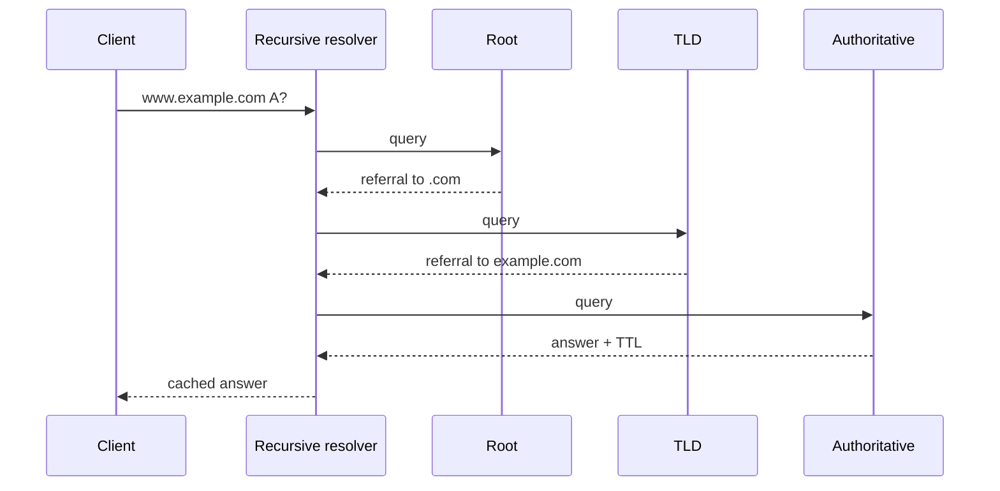

# Chapter 12 — Domain Name System (DNS)

[← Ports and Sockets](../11-Ports/README.md) · [Handbook](../README.md) · Next: DHCP

> **Learning objectives**
> - Explain recursive and iterative resolution from a client to authoritative DNS.
> - Read A, AAAA, CNAME, MX, NS, TXT, PTR, SOA, and SRV records.
> - Interpret TTL, caching, negative answers, DNS transport, and response codes.
> - Diagnose DNS with `dig`, `resolvectl`, packet captures, and layered evidence.

## 1. Introduction

The **Domain Name System** is a distributed, hierarchical database that maps names to data. It commonly translates a hostname such as `www.example.com` into IPv4 or IPv6 addresses, but DNS also publishes mail routes, service locations, delegation, verification data, and reverse mappings.

DNS is not one central server and it does not “connect” to the application. It supplies information. The client then uses the returned data to begin a separate network flow.

## 2. Theory

### Roles

| Role | Responsibility |
|---|---|
| Stub resolver | Library on the client that asks a configured recursive resolver |
| Recursive resolver | Finds/caches the final answer for the client |
| Root server | Refers the resolver toward the correct top-level domain |
| TLD server | Refers toward authoritative servers for a delegated domain |
| Authoritative server | Publishes the zone's official records |

### Resolution path

For `www.example.com`, a cache miss can cause the recursive resolver to ask root, then `.com`, then the authoritative server for `example.com`. Referrals usually provide NS records and sometimes glue addresses. The resolver returns and caches the answer according to TTL.

### Important records

| Type | Purpose | Example meaning |
|---|---|---|
| A | Name to IPv4 address | Web endpoint IPv4 |
| AAAA | Name to IPv6 address | Web endpoint IPv6 |
| CNAME | Alias to another canonical name | `www` points to CDN name |
| MX | Mail exchanger with preference | Where domain mail is delivered |
| NS | Authoritative name servers | Zone delegation |
| TXT | Arbitrary text | Ownership, SPF and verification data |
| PTR | Reverse address-to-name mapping | Operational reverse lookup |
| SOA | Zone authority metadata | Serial, timers, primary server |
| SRV | Service target, port, priority, weight | Service discovery |

A CNAME is not an HTTP redirect. DNS returns another name; the client resolves it before making the application request.

### Names, zones, and delegation

The fully qualified domain name `api.eu.example.com.` is read from right to left: root (`.`), `com`, `example`, `eu`, `api`. A DNS **zone** is an administratively served portion of the namespace; it is not necessarily identical to an entire domain subtree because child zones can be delegated.

### Caching and TTL

TTL tells caches how long a record may be reused. Low TTL can speed planned changes but increases query load; high TTL improves cache efficiency but keeps old data longer. Changing TTL immediately before a migration does not remove answers already cached under the previous TTL.

Negative answers such as NXDOMAIN can also be cached using zone policy. “I fixed the record” therefore does not guarantee every client sees it immediately.

### UDP, TCP, TLS, HTTPS, and QUIC

Classic DNS commonly uses UDP port 53. TCP port 53 is used when needed, including zone transfers and responses that require retry. EDNS extends capabilities such as UDP message size. DNS can also be encrypted:

- DNS over TLS (DoT), commonly TCP 853;
- DNS over HTTPS (DoH), HTTPS transport;
- DNS over QUIC (DoQ), QUIC transport.

Encrypted DNS protects the client-to-resolver exchange from ordinary observation; it does not automatically make answers correct or prevent the resolver from knowing queries.

### Response codes

| Code | Meaning |
|---|---|
| NOERROR | Query processed; answer may still be empty |
| NXDOMAIN | The queried name does not exist |
| SERVFAIL | Resolver/server could not complete resolution |
| REFUSED | Server policy refused the query |

An empty NOERROR response and NXDOMAIN are different. The first can mean the name exists but has no record of the requested type.

> **Did you know?** Browsers and operating systems may cache DNS independently, so `dig` and an application can temporarily behave differently.

> **Memory trick:** **Root → TLD → Authoritative; resolver remembers.**

### Behind the scenes

Applications may use `/etc/hosts`, NSS rules, local caches, VPN-specific resolvers, split DNS, search domains, or built-in encrypted DNS. `dig` asks DNS directly and may not reproduce the application's complete name-resolution path.

## 3. Visual diagram



On cache hit, the resolver can answer without repeating the hierarchy.

## 4. Real-world example

When a user opens a site, the browser may resolve several names: the page, CDN, API, fonts, and analytics. Each can return multiple addresses. The client chooses an address and opens TCP or QUIC separately; DNS success does not prove the service is reachable.

### Real industry usage

DNS supports traffic steering, CDNs, failover, email, service discovery, domain verification, and gradual migrations. Mature teams treat DNS changes as production changes with review, rollback, monitoring, and ownership.

### Cloud perspective

Cloud DNS includes public zones, private zones visible only inside selected networks, resolver endpoints, forwarding rules, and provider service-discovery records. Split-horizon DNS can intentionally return different answers internally and publicly.

### DevOps perspective

Deployments fail when a record targets the wrong load balancer, private runners use a public resolver, search domains differ, or stale caches survive a cutover. Pipelines should validate expected records from relevant network locations—not only one laptop.

### Cybersecurity perspective

Protect registrar and DNS-provider accounts with strong MFA and limited roles. Use DNSSEC where its authenticity guarantees fit the design, monitor unexpected changes, restrict zone transfers, and treat TXT records as public data. DNS filtering is one control, not complete malware protection.

## 5. Packet journey

1. The application asks the OS resolver for a name.
2. Local files/cache are checked according to system policy.
3. The stub sends a query to its configured resolver.
4. The resolver answers from cache or follows delegations.
5. The response contains answer, authority, and/or additional sections plus flags and TTLs.
6. The client selects returned data and begins a separate connection.

The source port is usually ephemeral and the destination is the resolver's DNS port. NAT, VPNs, or encrypted DNS can change what a local capture shows.

## 6. Linux commands

| Command | Purpose | Useful observation |
|---|---|---|
| `resolvectl status` | Shows per-link resolver configuration | DNS servers, domains, protocols |
| `dig NAME A` | Queries a record type | status, flags, answer, TTL, server |
| `dig +trace NAME` | Walks delegation iteratively | root/TLD/authoritative path |
| `dig @SERVER NAME` | Queries a specific server | compare resolver answers |
| `dig -x ADDRESS` | Performs reverse lookup | PTR record |
| `host NAME` | Concise common lookup | quick answer |
| `getent ahosts NAME` | Uses system name-service path | closer to application resolution |

Example:

```bash
dig example.com A
dig example.com AAAA
dig +short example.com
```

In full `dig` output inspect `status`, `flags`, QUESTION, ANSWER, query time, and `SERVER`. `aa` means authoritative answer; `rd` requests recursion; `ra` says recursion is available.

## 7. Practical example

Complete [Lab 10: Trace DNS resolution](../../labs/10-trace-dns/README.md). You will compare system and direct resolution, observe cache effects, trace delegation, and inspect a sanitized capture.

## 8. Wireshark example

Filters:

```text
dns
dns.qry.name == "example.com"
dns.flags.response == 1
dns.flags.rcode != 0
tcp.port == 53
```

Inspect transaction ID, flags, question name/type/class, answers, TTL, response code, and whether the response is truncated (`TC`). TCP DNS begins with a two-byte length prefix. DoH traffic appears as encrypted HTTPS unless endpoint/application metadata identifies it.

## 9. Common mistakes

- Saying DNS only converts names to IP addresses.
- Confusing recursive resolver with authoritative server.
- Treating CNAME as an HTTP redirect.
- Expecting TTL changes to erase existing caches.
- Assuming one answer exists globally at every moment.
- Believing successful DNS proves port or application health.
- Publishing secrets in TXT records.
- Using `nslookup`/`dig` alone when the application uses different resolver policy.

## 10. Troubleshooting

| Symptom | Evidence | Possible cause |
|---|---|---|
| `Could not resolve host` | `getent`, `resolvectl`, `dig` | resolver config, search name, outage |
| NXDOMAIN | authoritative query and spelling | name absent or wrong zone |
| SERVFAIL | `dig +trace`, DNSSEC/server state | delegation, validation, server failure |
| Different internal/public answers | query specified resolvers | split DNS, cache, steering |
| Old address after change | TTL and cache locations | cached previous answer |
| UDP query fails, TCP works | capture and firewall policy | blocked fragments/UDP/EDNS behavior |

### Best practices

- Use FQDNs in automation where search domains would be ambiguous.
- Query the same resolver and network context as the affected application.
- Lower TTL well before planned migration, then restore it afterward.
- Validate delegation, authoritative answers, and application connectivity separately.
- Keep registrar, zone, certificate, and service ownership documented.
- Avoid sensitive data in names and TXT values.

## 11. Interview questions

### Recursive vs authoritative DNS?

<details><summary>Answer</summary>

A recursive resolver finds and caches answers for clients. An authoritative server publishes official records for zones it serves and normally does not recurse for arbitrary clients.

</details>

### What happens after DNS returns an IP?

<details><summary>Answer</summary>

The application selects an address and starts a separate transport/application flow. Routing, firewall, TLS, and service health can still fail.

</details>

### Why might `dig` work while an application fails?

<details><summary>Answer</summary>

The application can use `/etc/hosts`, NSS, a local cache, search domains, a proxy, VPN-specific DNS, a different address family, or built-in encrypted DNS. Compare its actual resolution path with `getent` and application logs.

</details>

### What is DNS TTL?

<details><summary>Answer</summary>

It is the maximum time a cache may reuse record data before refreshing it. It is not a guaranteed propagation timer or health-check interval.

</details>

## 12. Quiz

1. **Multiple choice:** Which server publishes a zone's official records?  
   A. Stub · B. Authoritative · C. DHCP · D. Gateway
2. **True/false:** A CNAME redirects the browser to a new URL.
3. **Scenario:** `dig A name` returns NOERROR with no answer. Is that necessarily NXDOMAIN?
4. **Practical:** Which command follows DNS delegation from root?
5. **Scenario:** Users still reach an old address after a change. Name three caches to consider.
6. **True/false:** DNS always uses UDP port 53.

<details><summary>Quiz answers</summary>

1. **B — Authoritative server.**
2. **False.** It aliases one DNS name to another.
3. No. The name can exist without the requested record type.
4. `dig +trace NAME`.
5. Recursive resolver, OS/local service, application/browser; intermediaries may also cache.
6. **False.** Classic DNS also uses TCP, and encrypted DNS uses TLS, HTTPS, or QUIC transports.

</details>

## FAQ

### Why are several IPs returned?

Redundancy, load distribution, CDN geography, IPv4/IPv6, and traffic steering can all produce multiple answers. The application decides which to try.

### Does flushing my cache update everyone?

No. It affects only that cache. Other clients and resolvers retain records until their cached lifetime expires or they are cleared administratively.

### Is DNSSEC encryption?

No. DNSSEC provides origin authentication and integrity for signed DNS data. It does not hide query names or answers.

### What is reverse DNS?

PTR records under special reverse zones map an address back to a name. Forward and reverse records are maintained separately and need not match automatically.

## 13. Summary

DNS is a hierarchical, cached database served by authoritative servers and consumed through resolvers. Correct diagnosis separates local policy, recursive resolution, delegation, authoritative data, transport, caching, and the application connection that follows. Query deliberately, read response codes and TTLs, and always test from the affected network context.
