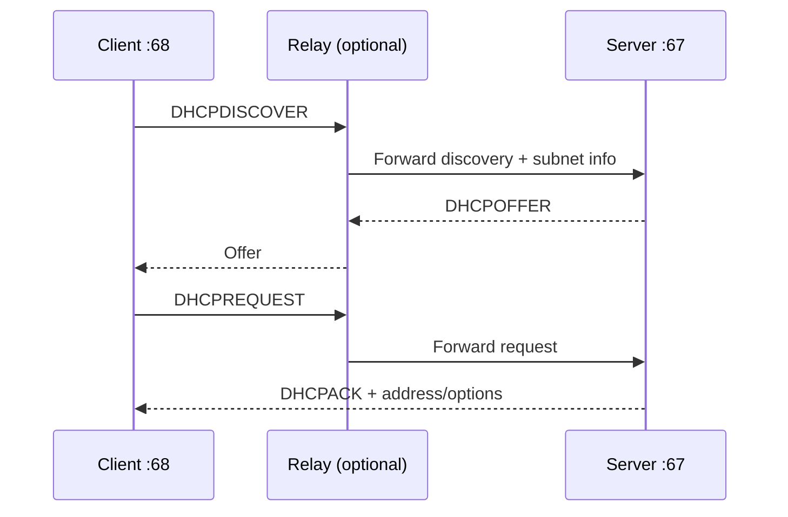

# Chapter 13 — Dynamic Host Configuration Protocol (DHCP)

[← DNS](../12-DNS/README.md) · [Handbook](../README.md) · [NAT →](../14-NAT/README.md)

> **Learning objectives**
> - Follow DHCPv4 discovery, offer, request, acknowledgment, renewal, and rebinding.
> - Explain leases, scopes, reservations, exclusions, options, and relay agents.
> - Distinguish DHCPv4 from IPv6 SLAAC and DHCPv6.
> - Diagnose missing addresses, wrong gateways/DNS, exhaustion, conflicts, and rogue servers.

## 1. Introduction

**DHCP** automatically supplies hosts with network configuration. For IPv4 this commonly includes an address, subnet mask, default gateway, DNS servers, lease time, and other options. Without DHCP, each host would require manual configuration and administrators would need to prevent duplicates themselves.

DHCP is configuration—not routing or DNS itself. Receiving a lease does not prove the gateway works, the DNS answer is correct, or an application is healthy.

## 2. Theory

### Core components

| Component | Role |
|---|---|
| DHCP client | Requests and applies configuration |
| DHCP server | Owns scopes/pools and grants leases/options |
| Scope/pool | Addresses and policy available for a subnet |
| Reservation | Predictable lease associated with a client identity |
| Exclusion | Addresses the server must not lease |
| Relay agent | Forwards DHCP between client subnet and remote server |
| Lease database | Tracks offered, active, expired, and reserved assignments |

### DORA

The common first DHCPv4 exchange is:

1. **Discover:** client broadcasts to find servers.
2. **Offer:** one or more servers propose configuration.
3. **Request:** client requests one offered address and identifies the chosen server.
4. **Acknowledge:** server confirms the lease and options.

The client initially has no usable IPv4 address, so messages commonly use UDP client port 68 and server port 67 with broadcast behavior. Exact flags and addresses depend on client state and relay use.

### Important DHCPv4 options

| Option | Meaning |
|---:|---|
| 1 | Subnet mask |
| 3 | Router/default gateway |
| 6 | DNS servers |
| 12 | Host name |
| 15 | Domain name |
| 42 | NTP servers |
| 51 | Lease time |
| 53 | DHCP message type |
| 54 | Server identifier |
| 58 | Renewal time (T1) |
| 59 | Rebinding time (T2) |

Clients and servers can support many additional options. Options are policy data; accepting them can influence traffic, so DHCP must be trusted and controlled.

### Lease lifecycle

A lease is time-limited. Common behavior:

- At **T1**, often 50% of lease time, the client tries to renew directly with its server.
- At **T2**, often 87.5%, it broadens the attempt and tries to rebind with any available server.
- At expiry, the client must stop using the address unless renewed.

The server can send DHCPNAK when requested configuration is no longer valid. A client can send DHCPDECLINE when conflict detection suggests the offered address is already in use, and DHCPRELEASE when giving up a lease cleanly.

### Relay agents

Routers do not normally forward broadcasts. A DHCP relay receives the local client broadcast and forwards it as a unicast request to a remote server, including information about the client subnet. This allows centralized servers to serve many routed subnets.

The server chooses the correct scope from relay/interface information. Wrong relay configuration can give no offer or an address from the wrong subnet.

### Reservations versus static addresses

A DHCP reservation keeps central visibility and options while consistently leasing an address to a known client identifier. A manually static address is configured on the host and must be coordinated outside the dynamic pool. Neither is universally better; infrastructure policy decides.

### DHCP and IPv6

IPv6 hosts can receive configuration using:

- **SLAAC:** Router Advertisements provide prefix/default-router information and the host forms addresses.
- **Stateless DHCPv6:** supplies additional data such as DNS while SLAAC supplies addressing.
- **Stateful DHCPv6:** server assigns addresses and maintains leases.

DHCPv6 uses UDP ports 546 (client) and 547 (server) and multicast rather than IPv4 broadcast. DHCPv6 does not normally supply the IPv6 default gateway; Router Advertisements do.

> **Did you know?** A client can have a valid DHCP lease and still fail because the leased prefix, gateway, DNS server, route, or VLAN is wrong.

> **Memory trick:** **DORA gets the lease; T1 renews, T2 rebinds.**

### Behind the scenes

The client identifier used for leases is not always simply the visible MAC address. Operating systems, virtualization, network managers, and privacy behavior can use client IDs or DUIDs. Cloned VMs with duplicated identity files can request conflicting or unexpected leases.

## 3. Visual diagram



Without a relay, client and server exchange the initial messages on the same broadcast domain.

## 4. Real-world example

A laptop joins office Wi-Fi. The access network places it in an employee VLAN. DHCP offers an address from that VLAN, a `/24` mask, gateway, internal DNS resolvers, and an eight-hour lease. The laptop checks for conflict, installs the address/routes, and can then resolve names and reach permitted services.

### Real industry usage

DHCP supports office clients, phones, network boot, Wi-Fi, labs, and server provisioning. Enterprise systems integrate DHCP with IPAM, DNS registration, access control, logging, failover, and monitoring.

### Cloud perspective

Cloud platforms typically provide managed configuration to virtual interfaces and expose “DHCP option sets” or similar resources. Addresses may look dynamically delivered but are controlled by the cloud network plane. Do not run an unauthorized DHCP server inside a cloud or virtual network.

### DevOps perspective

VM templates must not clone machine/client identities. PXE and automated installation depend on DHCP options and relay. Container networks often use platform-specific IPAM rather than ordinary broadcast DHCP, while physical nodes and VMs still depend on their environment's configuration service.

### Cybersecurity perspective

A rogue DHCP server can supply an attacker-controlled gateway or DNS resolver. Defenses include switch DHCP snooping, trusted ports, access control, segmentation, monitoring, and limiting who can run infrastructure services. DHCP starvation attempts exhaust pools; rate limits and authenticated access reduce risk.

## 5. Packet journey

1. Client enters a network with no valid lease and broadcasts Discover.
2. Switch floods broadcast within the VLAN; DHCP snooping may inspect it.
3. A local server responds or a relay forwards to a remote server.
4. Server selects a scope using receiving interface/relay address and policy.
5. Offer carries proposed address and options.
6. Request announces the chosen offer so other servers can withdraw theirs.
7. ACK commits the lease; client configures address, connected route, gateway, and resolver.
8. Client later renews, rebinds, releases, or lets the lease expire.

## 6. Linux commands

| Command | Purpose |
|---|---|
| `ip address` | Shows assigned addresses, flags, lifetimes |
| `ip route` | Shows routes created from configuration |
| `resolvectl status` | Shows DNS received per interface |
| `networkctl status IFACE` | Shows systemd-networkd lease/config details |
| `nmcli device show IFACE` | Shows NetworkManager IP, gateway, DNS, DHCP data |
| `journalctl -u NetworkManager` | Client events when NetworkManager is used |
| `tcpdump -ni IFACE 'udp port 67 or 68'` | Captures DHCPv4 exchange |

Do not run lease release/renew commands on a remote production host without an out-of-band path; you can disconnect yourself.

Example read-only audit:

```bash
ip -brief address
ip route
resolvectl status
nmcli device show 2>/dev/null
```

## 7. Practical example

Complete [Lab 11: Audit a DHCP lease](../../labs/11-audit-dhcp/README.md). It inventories applied configuration and optionally captures a naturally occurring renewal without forcing network disruption.

## 8. Wireshark example

Filters:

```text
dhcp
bootp.option.dhcp == 1
bootp.option.dhcp == 2
bootp.option.dhcp == 3
bootp.option.dhcp == 5
udp.port == 67 or udp.port == 68
```

Wireshark historically labels DHCPv4 fields under `bootp`. Inspect transaction ID, client hardware/client identifier, `yiaddr` (your offered address), relay `giaddr`, flags, message type, server identifier, requested IP, lease time, mask, router, and DNS options.

## 9. Common mistakes

- Assuming DHCP always requires the server on the same subnet.
- Treating an offer as a committed usable lease before ACK.
- Placing manually static addresses inside an unmanaged dynamic pool.
- Blaming DHCP when the address exists but DNS or routing fails.
- Assuming reservation identity is always the MAC address.
- Forgetting VLAN/relay-to-scope mapping.
- Renewing a remote host destructively during diagnosis.
- Assuming DHCPv6 supplies the default gateway.

## 10. Troubleshooting

| Symptom | Evidence | Possible cause |
|---|---|---|
| No address / link-local only | Capture and client logs | no Discover, no Offer, VLAN/relay/server failure |
| Discover repeats, no Offer | server/relay logs, pool state | exhaustion, relay/firewall, server down |
| Offer appears, no ACK | transaction and client ID | client chose another offer, conflict/policy |
| Wrong subnet/gateway | relay info and selected scope | wrong VLAN/helper/scope options |
| Duplicate conflict | DECLINE/ARP and lease database | static overlap, stale lease, cloned identity |
| Lease renewals fail | T1/T2 traffic and server state | server unavailable, policy/path changed |

### Best practices

- Separate dynamic pools from manual infrastructure assignments.
- Monitor pool utilization and renewal failures before exhaustion.
- Configure redundant servers according to supported failover design.
- Protect server-facing switch ports and enable DHCP snooping where appropriate.
- Keep relay, VLAN, scope, gateway, DNS, and IPAM data consistent.
- Size lease time for client mobility, capacity, and outage tolerance.
- Log leases with synchronized time while respecting privacy requirements.

## 11. Interview questions

### Explain DORA.

<details><summary>Answer</summary>

Discover finds servers, Offer proposes configuration, Request selects/requests an offer, and Acknowledge confirms the lease and options.

</details>

### Why is a DHCP relay needed?

<details><summary>Answer</summary>

Initial DHCPv4 clients use local broadcast, which routers normally do not forward. A relay forwards requests to centralized servers and includes subnet information so the correct scope can be selected.

</details>

### What are T1 and T2?

<details><summary>Answer</summary>

T1 is the renewal point where the client normally contacts the original server. T2 is the rebinding point where it seeks any available server before lease expiry.

</details>

### Why might a host receive an address but still have no Internet access?

<details><summary>Answer</summary>

The leased prefix, gateway, DNS, routes, VLAN, firewall/NAT, or upstream path may be wrong. A lease proves configuration delivery, not end-to-end connectivity.

</details>

## 12. Quiz

1. **Multiple choice:** Which DHCPv4 message confirms a lease?  
   A. Discover · B. Offer · C. Request · D. ACK
2. **True/false:** DHCPv4 uses only unicast because servers have known addresses.
3. **Scenario:** Clients in one VLAN receive addresses from another VLAN's pool. Where do you investigate first?
4. **Practical:** Which capture filter isolates DHCPv4?
5. **True/false:** DHCPv6 normally provides the IPv6 default router.
6. **Scenario:** A pool has free addresses but cloned VMs behave unpredictably. What identity issue might exist?

<details><summary>Quiz answers</summary>

1. **D — DHCPACK.**
2. **False.** Initial clients commonly use broadcast; relay and renewal can use unicast.
3. VLAN-to-relay/helper mapping, relay address, server scope selection, and trunk/access configuration.
4. `udp port 67 or udp port 68`.
5. **False.** Router Advertisements normally provide the IPv6 default router.
6. Duplicated DHCP client ID, DUID, or machine identity in the VM template.

</details>

## FAQ

### Why did I get `169.254.x.x`?

Many IPv4 clients self-assign link-local addresses when normal configuration is unavailable. It allows local-link behavior but usually indicates DHCP did not provide expected configuration.

### Does DHCP register DNS records?

It can integrate with dynamic DNS, and either client or server may perform updates depending on policy. DHCP and DNS remain separate protocols/services.

### Is a DHCP reservation the same as a static IP?

Both can produce a stable address, but a reservation is centrally leased by DHCP while a static address is configured on the endpoint.

### Can two DHCP servers exist?

Yes when intentionally designed using split scopes or supported failover/HA. Uncoordinated servers can provide conflicting configuration.

## 13. Summary

DHCP automates network configuration through leases and options. DORA establishes a DHCPv4 lease; T1/T2 manage continuity; relays connect broadcast domains to centralized servers. Reliable troubleshooting follows the transaction, scope choice, applied routes/DNS, and lease state while protecting the network from rogue or exhausted services.
