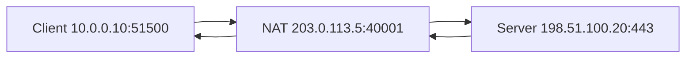

# Chapter 14 — Network Address Translation (NAT)

[← DHCP](../13-DHCP/README.md) · [Handbook](../README.md) · [VLANs →](../15-VLAN/README.md)

> **Learning objectives**
> - Distinguish SNAT, DNAT, static NAT, PAT/masquerading, and port forwarding.
> - Follow translations and connection state in both directions.
> - Explain why NAT is not a firewall and how it affects protocols and observability.
> - Diagnose translation, return-path, port-exhaustion, and hairpin failures.

## 1. Introduction

**Network Address Translation** changes IP addresses—and often transport ports—as packets cross a translating device. It lets many private hosts share public addresses, publishes internal services through mapped endpoints, and connects networks whose addressing cannot be routed directly.

NAT changes packet identity and requires state or deterministic rules for return traffic. It does not encrypt data, authenticate users, or automatically provide complete security.

## 2. Theory

### Translation vocabulary

| Term | What changes | Common use |
|---|---|---|
| SNAT | Source address, possibly source port | Internal clients reaching another network |
| DNAT | Destination address, possibly destination port | Publishing/forwarding to an internal service |
| Static NAT | Fixed one-to-one address mapping | Stable server mapping |
| Dynamic NAT | Address chosen from a pool | Outbound address allocation |
| PAT/NAPT | Address and port translation | Many flows share one public IPv4 address |
| Masquerade | SNAT using the outgoing interface address | Dynamic WAN address |
| Hairpin NAT | Internal client reaches internal service via external mapping | Consistent public service name internally |

Terminology differs across vendors. Always state the original tuple, translated tuple, direction, and capture point.

### PAT flow example

```text
Before NAT: 10.0.0.10:51500 → 198.51.100.20:443
After NAT:  203.0.113.5:40001 → 198.51.100.20:443
```

The translator records state so the reply to `203.0.113.5:40001` can be restored and forwarded to `10.0.0.10:51500`. Another internal client can use the same source port because the external translated tuple is kept unique.

### Direction and hook order

Conceptually, destination translation must happen before the final route decision so the device can route toward the translated destination. Source translation commonly happens after route selection as traffic leaves. Actual firewall frameworks have precise hook/chain order that must be understood when combining NAT and filtering.

### Port forwarding

A rule can translate public `203.0.113.5:8443` to internal `10.0.0.50:443`. For successful communication:

- the public packet must reach the translator;
- DNAT must match protocol/address/port;
- forwarding policy must permit it;
- the internal service must listen;
- the return path must traverse compatible NAT state;
- upstream and host firewalls must allow the flow.

### NAT and checksums

IPv4 header and TCP/UDP pseudo-header checksums depend on addresses. A translator updates affected checksums when changing addresses or ports. Some protocols embed addresses in application payloads and require NAT-aware helpers or application-level design; encryption can prevent middleboxes from rewriting embedded data.

### NAT is not a firewall

Stateful NAT often prevents unsolicited inbound traffic simply because no mapping exists, but that is a side effect of state and rules. A firewall explicitly permits or denies flows. Static DNAT can expose a service; NAT alone does not assess whether access should be allowed.

### NAT and IPv6

IPv6 restores abundant end-to-end addressing, so IPv6 deployments generally rely on routing and firewall policy rather than IPv4-style address conservation. Prefix translation mechanisms exist for specific cases, but “IPv6 means no firewall” is false.

> **Did you know?** A public website usually sees the translator or proxy address, not the private client address. Application identity must not rely only on the observed source IP.

> **Memory trick:** **S changes Source on the way out; D changes Destination on the way in.** Always verify from the rule's actual direction.

### Behind the scenes

Linux connection tracking records flow tuples, protocol state, timeouts, and translation relationships. TCP state is richer than UDP's timeout-based tracking. When the conntrack table or available translated ports is exhausted, new connections can fail even while existing flows continue.

## 3. Visual diagram



The server replies to the translated endpoint. The NAT device reverses the mapping before delivering the response internally.

## 4. Real-world example

A home router leases `192.168.1.50` to a laptop. When the laptop opens HTTPS, the router replaces its private source with the ISP-facing address and an available port. The server replies to that public tuple; the router maps the response back to the laptop.

### Real industry usage

NAT appears at Internet gateways, load balancers, Kubernetes egress, cloud public gateways, service publishing, partner integrations, migrations, and overlapping-network workarounds. It solves reachability/addressing constraints but adds operational state.

### Cloud perspective

Cloud NAT gateways commonly provide outbound Internet access for private subnets without accepting unsolicited inbound connections. Internet gateways, public IP mappings, load balancers, and NAT gateways are distinct resources. Routes must send traffic to the correct gateway, and return paths/policy still matter.

### DevOps perspective

Docker port publishing uses DNAT/forwarding concepts. Kubernetes can translate Service virtual IP/ports to Pod endpoints and may SNAT depending on traffic policy and path. Logging only the post-NAT tuple makes incident correlation difficult; preserve original and translated metadata where possible.

### Cybersecurity perspective

NAT hides internal addressing but is not confidentiality. Use explicit firewall policy, least exposure, authentication, encryption, patching, and logging. Record translation state with synchronized timestamps because multiple clients share one external IP.

## 5. Packet journey

### Outbound PAT

1. Client creates `10.0.0.10:51500 → 198.51.100.20:443`.
2. Gateway routes toward WAN and matches SNAT/PAT policy.
3. Translator selects `203.0.113.5:40001`, updates headers/checksums, and records state.
4. Server replies to `203.0.113.5:40001`.
5. State restores destination `10.0.0.10:51500` and forwards internally.

### Inbound port forwarding

1. External client targets `203.0.113.5:8443`.
2. DNAT changes destination to `10.0.0.50:443`.
3. Route and firewall send it to the internal server.
4. Return packet traverses the translator, which restores the public source mapping.

Asymmetric routing around the translator can break stateful return translation.

## 6. Linux commands

| Command | Purpose |
|---|---|
| `nft list ruleset` | Shows nftables filter/NAT configuration |
| `iptables -t nat -S` | Shows legacy/compat NAT rules |
| `conntrack -L` | Lists tracked flows/translations |
| `sysctl net.ipv4.ip_forward` | Shows IPv4 forwarding state |
| `ip route` | Verifies pre/post-translation paths |
| `ss -lntup` | Confirms destination listener |
| `tcpdump -ni IFACE FILTER` | Compares tuples on each side |

Read rules with appropriate authorization. Do not flush or replace a production ruleset during diagnosis.

Example evidence collection:

```bash
sudo nft list ruleset
ip route
sudo conntrack -L -p tcp 2>/dev/null
```

## 7. Practical example

Complete [Lab 12: Build NAT in namespaces](../../labs/12-nat-namespaces/README.md). It creates an isolated client, gateway, and server on one Linux host so you can observe translation without modifying the main network path.

## 8. Wireshark example

Capture on both sides of a translator. Filters:

```text
tcp.port == 443
ip.addr == 10.0.0.10
ip.addr == 203.0.113.5
icmp
```

Compare source/destination IPs, ports, IP ID/TTL, checksums, timestamps, and TCP sequence numbers. Sequence numbers normally remain for simple NAT, while application proxies create separate connections. One capture point cannot prove both sides of translation.

## 9. Common mistakes

- Calling NAT a security boundary equivalent to a firewall.
- Confusing SNAT and DNAT because “inbound/outbound” viewpoint is unstated.
- Opening a port-forward rule while the service listens only on loopback.
- Forgetting forwarding policy or `ip_forward`.
- Ignoring return-path symmetry.
- Assuming every internal client has a unique public IP.
- Capturing on one side and searching for the other side's tuple.
- Treating `MASQUERADE` as the best choice for stable static public addresses.
- Forgetting UDP/ICMP state and timeouts.

## 10. Troubleshooting

| Symptom | Evidence | Possible cause |
|---|---|---|
| Outbound packets leave private side only | two-sided captures | SNAT/routing/filter failure |
| Replies reach public side but not client | conntrack and route | missing state, asymmetric return, policy |
| Port forward times out | captures/listener/rules | upstream block, DNAT mismatch, forwarding denied |
| Connection refused after DNAT | `ss`, TCP RST source | no listener/wrong target port |
| Works externally, fails internally by public name | internal DNS and hairpin flow | missing hairpin NAT/split DNS |
| New flows fail under load | conntrack count and port usage | table/port exhaustion |

### Best practices

- Document original and translated tuples plus direction.
- Keep NAT and firewall policy explicit and reviewed.
- Monitor conntrack utilization, gateway ports, drops, and exhaustion.
- Prefer stable SNAT over masquerade for fixed addresses when appropriate.
- Capture both sides and correlate by time/sequence/payload characteristics.
- Use split DNS or tested hairpin design deliberately.
- Avoid overlapping networks; use translation as a controlled workaround, not default architecture.

## 11. Interview questions

### SNAT versus DNAT?

<details><summary>Answer</summary>

SNAT changes source information, commonly for outbound clients. DNAT changes destination information, commonly to publish/forward a service. A stateful flow reverses the change for replies.

</details>

### Why is PAT needed?

<details><summary>Answer</summary>

PAT uses transport ports to keep many simultaneous private flows unique while sharing one or a small number of public IPv4 addresses.

</details>

### Is NAT a firewall?

<details><summary>Answer</summary>

No. NAT translates addressing. Stateful translation may incidentally reject flows without mappings, but filtering policy is a separate security function.

</details>

### Why can asymmetric routing break NAT?

<details><summary>Answer</summary>

Return packets may bypass the device holding the translation/connection state, so mappings cannot be reversed and stateful policy cannot validate the flow.

</details>

## 12. Quiz

1. **Multiple choice:** Which translation publishes an internal server?  
   A. SNAT · B. DNAT · C. DNSSEC · D. DHCP
2. **True/false:** NAT encrypts the translated payload.
3. **Scenario:** Public `:8443` maps to internal `:443`, but the internal service listens on `127.0.0.1:443`. Why does it fail?
4. **Practical:** Which Linux command lists nftables NAT rules?
5. **Scenario:** Existing connections work but new outbound connections fail during high load. What resources do you inspect?
6. **True/false:** The server normally sees the client's RFC1918 source behind PAT.

<details><summary>Quiz answers</summary>

1. **B — DNAT.**
2. **False.** NAT rewrites headers; encryption is separate.
3. The listener accepts only local loopback traffic, not packets arriving on the internal interface.
4. `nft list ruleset` and inspect NAT chains/rules.
5. Conntrack capacity, translated source-port availability, gateway CPU/memory, drops, and timeouts.
6. **False.** It sees the translated source unless a proxy/application mechanism conveys original identity.

</details>

## FAQ

### Why does my public IP differ from `ip address`?

Your interface may hold a private address translated by a home, enterprise, cloud, or carrier NAT. External services observe a later gateway address.

### What is double NAT?

Traffic crosses two translators, such as a home router behind carrier-grade NAT. Inbound publishing and troubleshooting become harder because both mappings/policies matter.

### NAT or proxy?

NAT rewrites packet tuples while preserving one transport conversation conceptually. A proxy terminates a connection and creates a separate application/transport connection.

### Does NAT solve overlapping CIDRs?

It can translate one side to non-overlapping space, but adds complexity and protocol/observability limitations. Renumbering or sound address planning is usually cleaner when feasible.

## 13. Summary

NAT rewrites packet tuples using rules and often connection state. SNAT/PAT supports outbound sharing; DNAT publishes services; hairpin translation handles internal access through external mappings. Successful NAT requires routing, forwarding, filtering, listeners, state, and symmetric return paths. It conserves or adapts addresses but does not replace security.
