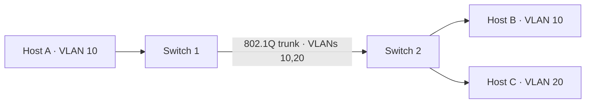

# Chapter 15 — Virtual LANs (VLANs)

[← NAT](../14-NAT/README.md) · [Handbook](../README.md) · [Switching →](../16-Switching/README.md)

> **Learning objectives**
> - Explain broadcast domains, access ports, trunks, VLAN IDs, and 802.1Q tags.
> - Follow frames across access and trunk links and explain inter-VLAN routing.
> - Diagnose native VLAN, allowed-list, tagging, and gateway failures.

## 1. Introduction

A **VLAN** logically divides a Layer 2 switching environment into separate broadcast domains. Hosts in different VLANs require Layer 3 routing to communicate even when connected to the same physical switch. VLANs improve organization, scale, and policy boundaries, but they do not provide security without correct switching, routing, and filtering.

## 2. Theory

### Access and trunk links

| Link/port | Behavior |
|---|---|
| Access | Carries one assigned VLAN for an endpoint; frames are normally untagged on the wire |
| Trunk | Carries multiple VLANs, normally using IEEE 802.1Q tags |
| Native VLAN | VLAN sent untagged on a trunk under common vendor behavior |

An 802.1Q tag adds four bytes containing priority information, the Drop Eligible Indicator, and a 12-bit VLAN ID. Usable VLAN IDs are conventionally `1–4094`; `0` and `4095` have reserved meanings.

### Frame behavior

An untagged frame entering an access port is classified into that port's VLAN. The switch forwards it only within the VLAN. On a trunk, the switch inserts or preserves a tag so the receiving switch knows the broadcast domain. Before sending through an access port, the switch transmits an ordinary untagged Ethernet frame.

### Inter-VLAN routing

Different VLANs are different Layer 2 domains. Routing can be provided by:

- router-on-a-stick using one tagged router interface with subinterfaces;
- switched virtual interfaces (SVIs) on a Layer 3 switch;
- firewall or cloud/virtual router interfaces.

Each VLAN normally has its own IP subnet and default gateway. VLAN and subnet are different concepts, though designs commonly map one subnet to one VLAN.

> **Did you know?** A VLAN tag is normally visible on trunk links, not endpoint access links. Host captures may also hide tags because of NIC offload.

> **Memory trick:** **Access = one local lane; trunk = labeled lanes.**

### Behind the scenes

The VLAN tag changes Ethernet framing but does not add IP routing. Switches maintain forwarding state per VLAN. Features such as voice VLANs, private VLANs, QinQ, and VXLAN extend segmentation but have different behavior and scale.

## 3. Visual diagram



Host A can reach Host B at Layer 2. Reaching Host C requires a router and permitted policy.

## 4. Real-world example

An office places employees in VLAN 10, voice phones in VLAN 20, guests in VLAN 30, and management interfaces in VLAN 99. Trunks carry the VLANs between switches, while a firewall routes and controls traffic between them.

### Real industry usage

VLANs segment offices, data centers, hypervisors, storage, management, and tenant networks. They reduce broadcast scope and align traffic with policy and operational ownership.

### Cloud perspective

Public cloud users usually configure subnets and virtual networks rather than physical VLAN trunks. Dedicated hosts, appliances, VMware environments, and private connectivity may still expose VLAN IDs. Do not assume a cloud subnet is literally an 802.1Q VLAN.

### DevOps perspective

Bare-metal Kubernetes, CI runners, hypervisors, and network appliances can require tagged interfaces. Infrastructure automation must coordinate VLAN IDs, switch ports, Linux subinterfaces, IP prefixes, gateways, and firewall policy as one change.

### Cybersecurity perspective

Disable unused ports, avoid default/native VLAN misuse, restrict allowed VLANs on trunks, protect management planes, and authenticate endpoint access where appropriate. VLAN hopping defenses depend on explicit port modes and correct native-tag behavior.

## 5. Packet journey

1. Host A sends an untagged frame into an access port assigned VLAN 10.
2. Switch learns A's source MAC in VLAN 10.
3. To cross a trunk, switch adds VLAN ID 10.
4. Receiving switch associates the frame with VLAN 10 and removes the tag for Host B's access port.
5. For a VLAN 20 destination, A sends to its gateway MAC; the router routes into VLAN 20 and creates a new frame.

## 6. Linux commands

| Command | Use |
|---|---|
| `ip -d link show` | Shows VLAN devices and IDs |
| `ip link add link eth0 name eth0.10 type vlan id 10` | Creates a VLAN subinterface |
| `bridge vlan show` | Shows bridge-port VLAN membership |
| `bridge link` | Shows Linux bridge port state |
| `tcpdump -eni IFACE vlan` | Captures tagged frames |

Only change interfaces in an authorized lab. Removing or retagging a remote management link can disconnect the host.

## 7. Practical example

Complete [Lab 13: Build VLANs with namespaces](../../labs/13-vlan-namespaces/README.md). It creates two isolated VLANs and validates separation without touching the host's physical interface.

## 8. Wireshark example

```text
vlan
vlan.id == 10
eth.type == 0x8100
```

Expand `802.1Q Virtual LAN` and inspect priority, DEI, VLAN ID, and encapsulated EtherType. If expected tags are absent, verify capture point and VLAN offload before assuming switch failure.

## 9. Common mistakes

- Treating a VLAN as an IP subnet or firewall rule.
- Configuring one side as access and the other as trunk.
- Forgetting to allow a VLAN across every trunk in the path.
- Using mismatched native VLANs.
- Assigning the same subnet to several routed VLANs.
- Expecting inter-VLAN communication without a gateway.

## 10. Troubleshooting

| Symptom | Check |
|---|---|
| Same VLAN works on one switch only | trunk state and allowed VLAN list |
| One VLAN fails across trunk | tag/allowed list and VLAN existence |
| Inter-VLAN ping fails | gateways, routes, ACL/firewall, host prefix |
| Untagged traffic lands incorrectly | native VLAN/PVID mismatch |
| Host sees no tagged frames | access port behavior or NIC offload |

### Best practices

- Configure port mode explicitly.
- Allow only required VLANs on trunks.
- Keep native VLAN consistent and unused for ordinary endpoints where design permits.
- Map VLAN, subnet, gateway, DHCP scope, security zone, and owner in one source of truth.
- Validate changes end to end before removing the old path.

## 11. Interview questions

### Access port versus trunk?

<details><summary>Answer</summary>

An access port associates endpoint traffic with one VLAN and normally sends untagged frames. A trunk carries several VLANs using tags, with possible native untagged behavior.

</details>

### Why do VLANs need routing?

<details><summary>Answer</summary>

Each VLAN is a separate Layer 2 broadcast domain. A Layer 3 device must forward packets between their IP subnets and apply policy.

</details>

### What is a native VLAN mismatch?

<details><summary>Answer</summary>

The two trunk ends classify untagged traffic into different VLANs, causing leakage, loss, or control-protocol issues.

</details>

## 12. Quiz

1. **True/false:** VLANs automatically block all routed traffic between them.
2. **Multiple choice:** Which standard tag commonly identifies VLAN membership? A. 802.1Q · B. ARP · C. TCP · D. OSPF
3. **Scenario:** VLAN 20 works locally but not across a trunk. Name three checks.
4. **Practical:** Which Linux command displays bridge VLAN membership?

<details><summary>Quiz answers</summary>

1. False; routing and policy control inter-VLAN traffic.
2. **A — IEEE 802.1Q.**
3. VLAN exists on both switches, trunk is operational, VLAN 20 is allowed/tagged consistently.
4. `bridge vlan show`.

</details>

## FAQ

### Does every VLAN need a different subnet?

Common routed designs use one subnet per VLAN. Multiple subnets on one VLAN or one subnet stretched across VLANs are possible in special designs but complicate operation.

### Can endpoints tag VLANs?

Yes when configured, such as hypervisors, servers, phones, or routers on trunk links. Ordinary clients usually connect through access ports.

### Is VXLAN the same as VLAN?

No. VXLAN encapsulates Layer 2 segments over an IP underlay and uses a larger VNI space; VLANs use 802.1Q on local Ethernet links.

## 13. Summary

VLANs create separate Layer 2 broadcast domains. Access links classify untagged endpoint frames; trunks carry VLAN identity using 802.1Q. Communication between VLANs requires routing and policy. Troubleshoot the complete path: port mode, tag, allowed list, VLAN existence, gateway, route, and security control.
