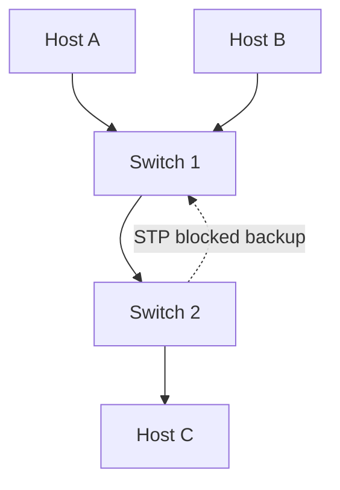

# Chapter 16 — Ethernet Switching

[← VLANs](../15-VLAN/README.md) · [Handbook](../README.md) · Next: Routing

> **Learning objectives**
> - Explain MAC learning, forwarding, filtering, flooding, and aging.
> - Distinguish unknown unicast, broadcast, and multicast behavior.
> - Explain loops, Spanning Tree, link aggregation, and switch security.

## 1. Introduction

An Ethernet switch connects devices in a Layer 2 domain and forwards frames using a MAC address table. It learns dynamically from source addresses and makes forwarding decisions from destination addresses. Switching is fast and local, but redundant links can create destructive loops unless a loop-prevention design exists.

## 2. Theory

### Learning and forwarding

For every received frame, a switch learns `source MAC → ingress port` within the VLAN. It then checks the destination:

| Destination state | Action |
|---|---|
| Known unicast on another port | Forward only to learned port |
| Known unicast on ingress port | Filter; no need to send back |
| Unknown unicast | Flood to eligible ports in that VLAN except ingress |
| Broadcast | Flood within the VLAN |
| Multicast | Flood or use snooping/control state to limit forwarding |

Dynamic entries age out so moved or disconnected devices can be relearned.

### Collision and broadcast domains

Each full-duplex switch port is its own collision domain; collisions are not expected in normal full-duplex Ethernet. A VLAN defines a broadcast domain. Routers do not forward ordinary Layer 2 broadcasts between subnets.

### Layer 2 loops

Ethernet frames have no TTL. A loop can circulate broadcasts and unknown unicasts indefinitely, causing broadcast storms, duplicated frames, and MAC-table instability. Redundant links require Spanning Tree or a loop-free multi-chassis/fabric technology.

### Spanning Tree Protocol

STP elects a root bridge and calculates a loop-free tree. Some redundant ports block/discard ordinary data while remaining available after topology change. Cost, bridge ID, port role, and port state determine the active topology. Modern variants converge faster and can manage several instances.

### Link aggregation

LACP combines compatible physical links into one logical bundle for capacity and redundancy. A hashing algorithm assigns flows to member links; one flow usually does not use the combined speed of every member. Both sides must agree on bundle configuration.

> **Did you know?** A switch learns from the source MAC, never from the destination MAC of an arriving frame.

> **Memory trick:** **Learn source, look up destination.**

### Behind the scenes

Hardware switches use specialized forwarding tables. MAC-table scale, multicast state, ACLs, VLANs, and overlays compete for finite resources. Linux bridges implement similar concepts in software and expose forwarding database (FDB) state.

## 3. Visual diagram



STP prevents both redundant paths from forwarding the same Layer 2 traffic simultaneously.

## 4. Real-world example

When Host A first sends to Host C, the switch may not know C and floods the frame. C's reply lets each switch learn C's source location, so later frames are forwarded only along the correct ports.

### Real industry usage

Switching connects access devices, servers, storage, hypervisors, and data-center fabrics. Operators design redundancy, failure domains, aggregation, VLAN boundaries, monitoring, and control-plane protection.

### Cloud perspective

Cloud providers virtualize Layer 2 and often prevent tenants from controlling STP or seeing physical switches. Virtual NICs, software switches, overlays, and provider fabrics still perform forwarding beneath the subnet abstraction.

### DevOps perspective

Linux bridges connect containers and VMs. Incorrect bridge/VLAN configuration can look like an application failure. Automation should validate MTU, VLAN membership, bond/LACP state, and expected MAC learning.

### Cybersecurity perspective

Use port security, 802.1X, DHCP snooping, Dynamic ARP Inspection, BPDU Guard, storm control, and management-plane isolation where supported. These controls complement—not replace—endpoint authentication and Layer 3 policy.

## 5. Packet journey

1. Frame enters a VLAN on port 1.
2. Switch learns source MAC on port 1.
3. Destination MAC is looked up in that VLAN's FDB.
4. Known destination is forwarded to one logical port; unknown/broadcast is flooded.
5. Trunk tagging is applied as needed.
6. The destination NIC accepts frames matching its MAC, broadcast, or joined multicast behavior.

## 6. Linux commands

| Command | Use |
|---|---|
| `bridge fdb show` | Displays forwarding/MAC table |
| `bridge link` | Shows bridge ports and state |
| `bridge vlan show` | Shows VLAN membership |
| `ip -d link show type bridge` | Shows bridge and STP-related properties |
| `ip -d link show type bond` | Shows bond configuration |
| `tcpdump -eni IFACE` | Shows Ethernet addresses and tags |

## 7. Practical example

Complete [Lab 14: Observe Linux bridge learning](../../labs/14-linux-bridge-switching/README.md). It creates isolated hosts, generates traffic, and watches the FDB learn and age.

## 8. Wireshark example

```text
eth.addr == 02:00:00:00:00:01
eth.dst == ff:ff:ff:ff:ff:ff
stp
lacp
```

STP BPDUs reveal root/bridge identifiers, cost, port identifiers, and timers. LACP frames show system/port keys and synchronization state. Capture on the relevant link; a host access capture may not see all control traffic.

## 9. Common mistakes

- Saying a switch learns destination MACs.
- Assuming unknown unicast is dropped by default.
- Connecting redundant links without STP/aggregation.
- Expecting one LACP flow to use all links.
- Confusing MAC table, ARP/neighbor table, and routing table.
- Treating STP blocked state as a failed link.

## 10. Troubleshooting

| Symptom | Evidence |
|---|---|
| Intermittent duplicate frames/storm | topology, STP events, broadcast counters |
| MAC moves between ports | FDB logs, loop/VM movement/bad cabling |
| LACP member not forwarding | actor/partner keys and state |
| One host unreachable | FDB, VLAN, port state, endpoint NIC |
| Slow recovery | STP variant, edge-port config, topology events |

### Best practices

- Use edge/PortFast only on verified endpoint ports with BPDU Guard.
- Aggregate parallel links rather than creating unmanaged loops.
- Monitor MAC flaps, topology changes, errors, discards, and broadcast rate.
- Keep management access separate and authenticated.
- Document physical and logical port relationships.

## 11. Interview questions

### How does a switch learn MAC addresses?

<details><summary>Answer</summary>

It records the source MAC and ingress port/VLAN of received frames. It uses destination MACs only for forwarding lookup.

</details>

### Why are Layer 2 loops dangerous?

<details><summary>Answer</summary>

Frames have no TTL, so broadcasts/unknown unicasts can circulate, multiply, destabilize learning, and consume links/CPU.

</details>

### What does STP do?

<details><summary>Answer</summary>

It elects a root and blocks redundant Layer 2 paths to create a loop-free active topology while retaining failover links.

</details>

## 12. Quiz

1. **True/false:** A switch learns from destination MAC.
2. **Scenario:** Destination MAC is unknown. What happens?
3. **Multiple choice:** Which protocol negotiates link aggregation? A. ARP · B. LACP · C. DNS · D. ICMP
4. **Practical:** Which Linux command shows the FDB?

<details><summary>Quiz answers</summary>

1. False; it learns source MAC.
2. The frame is flooded to eligible ports in the VLAN except ingress.
3. **B — LACP.**
4. `bridge fdb show`.

</details>

## FAQ

### Switch vs bridge?

They perform the same fundamental Layer 2 forwarding role. “Switch” commonly describes multiport hardware; Linux exposes software forwarding as a bridge.

### Does STP load-balance?

Traditional STP blocks redundant paths per spanning-tree instance. Multiple instances or modern fabrics can use different paths, but STP itself is primarily loop prevention.

### Why does the MAC table change?

Devices move, entries age, VMs migrate, links fail, or loops cause MAC flapping. Context determines whether change is normal.

## 13. Summary

Switches learn source locations and forward using destination MAC tables within each VLAN. Unknown/broadcast traffic is flooded, redundant paths require loop prevention, and LACP bundles compatible links. Diagnose with FDB, VLAN, port, STP, aggregation, counters, and captures as one system.
