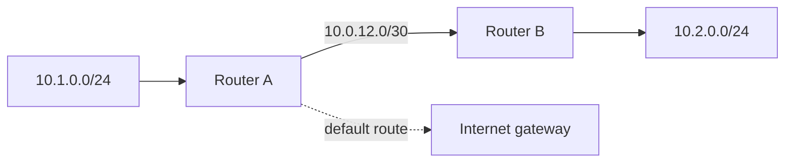

# Chapter 17 — IP Routing

[← Switching](../16-Switching/README.md) · [Handbook](../README.md) · [IPv6 →](../18-IPv6/README.md)

> **Learning objectives**
> - Explain forwarding, route tables, next hops, connected/static/default/dynamic routes.
> - Apply longest-prefix match and distinguish administrative preference from metric.
> - Explain routing protocols, convergence, ECMP, policy routing, and reverse paths.

## 1. Introduction

**Routing** selects a path for IP packets between networks. A host routes too: it decides whether a destination is on-link, uses a gateway, or is unreachable. Routers repeat that decision hop by hop using forwarding tables built from connected networks, static configuration, and routing protocols.

Routing answers “where should this packet go next?” Firewalls answer “is it permitted?” NAT answers “should its tuple change?” These functions can exist on one device but remain conceptually distinct.

## 2. Theory

### Route anatomy

| Field | Meaning |
|---|---|
| Prefix | Destinations matched by the route |
| Next hop | Router to receive the packet, if not directly connected |
| Interface | Outgoing link |
| Source/prefsrc | Preferred source for locally generated traffic |
| Metric/preference | Selection among comparable routes |
| Protocol | Origin: kernel, static, DHCP, OSPF, BGP, etc. |

### Longest-prefix match

Given routes `/0`, `10.0.0.0/8`, `10.20.0.0/16`, and `10.20.30.0/24`, destination `10.20.30.50` uses `/24`. Specificity is considered before metric across different prefix lengths.

### Route sources

- **Connected:** installed when an interface owns an address/prefix.
- **Static:** explicitly configured by an administrator/controller.
- **Default:** `0.0.0.0/0` or `::/0`, used when no more-specific route matches.
- **Dynamic:** learned through routing protocols.

### Control plane and data plane

The control plane learns/calculates routes. The data plane forwards packets using an optimized forwarding information base (FIB). A route can appear in a protocol database but not win installation into the active table.

### Interior and exterior protocols

| Protocol | Typical role |
|---|---|
| OSPF / IS-IS | Link-state routing inside an organization |
| RIP | Distance-vector educational/legacy environments |
| BGP | Policy-driven routing between autonomous systems and large internal fabrics |

Routing protocols exchange reachability, not application health. Convergence is the process of reaching a consistent topology after change.

### ECMP and asymmetry

Equal-Cost Multi-Path can install several next hops. Devices normally hash flows so packets from one flow remain ordered. Forward and return paths need not be identical; asymmetry becomes a problem when stateful firewalls/NAT expect both directions.

### Policy routing

Ordinary routing primarily matches destination. Policy routing can select tables using source address, marks, interface, or other attributes. It is powerful for multiple uplinks and tenant separation but adds invisible decision layers if undocumented.

> **Did you know?** `traceroute` reveals responding hops for probes, not the complete route table or guaranteed application path. Load balancing and filtering can change its output.

> **Memory trick:** **Most specific route wins; then compare equal candidates.**

### Behind the scenes

Routers decrement IPv4 TTL or IPv6 Hop Limit and discard at zero, commonly sending ICMP Time Exceeded. They resolve the next hop on the outgoing link and build new link framing. They do not normally preserve incoming MAC addresses.

## 3. Visual diagram



## 4. Real-world example

A server has a connected route for its subnet, a specific route to a private partner through a VPN, and a default route through the Internet gateway. Partner traffic chooses the longer specific prefix; all unrelated destinations use default.

### Real industry usage

Routing connects campuses, data centers, clouds, WANs, VPNs, Kubernetes nodes, and Internet providers. Design includes redundancy, summarization, failure detection, convergence, capacity, and policy.

### Cloud perspective

Cloud route tables associate with subnets or interfaces and target gateways, NAT, peering, transit hubs, appliances, or virtual interfaces. A route target does not override security groups, NACLs, appliance policy, or missing reverse routes.

### DevOps perspective

Containers and Kubernetes add routes, bridges, overlays, and policy rules. CI/VPN failures often come from overlapping CIDRs or a newly installed more-specific route. Capture `ip route`, `ip rule`, namespaces, and tunnel state in incident evidence.

### Cybersecurity perspective

Authenticate routing protocols, filter accepted/advertised prefixes, prevent route leaks, protect control planes, and apply reverse-path or anti-spoofing controls carefully. A malicious or mistaken route can redirect or black-hole large traffic ranges.

## 5. Packet journey

1. Host performs route lookup and sends remote traffic to a next hop.
2. Router removes link framing, validates IP, decreases TTL/Hop Limit.
3. FIB lookup chooses longest matching prefix and next hop(s).
4. Policy/firewall/NAT may process the flow.
5. Router resolves next-hop link address and emits new frame.
6. Destination replies using its own independent route lookup.

## 6. Linux commands

| Command | Use |
|---|---|
| `ip route` / `ip -6 route` | Active IPv4/IPv6 routes |
| `ip route get DEST` | Exact lookup including source/interface |
| `ip rule` | Policy-routing rules |
| `ip route show table all` | All routing tables |
| `traceroute DEST` / `tracepath DEST` | Probe hop/path behavior |
| `mtr DEST` | Repeated hop latency/loss observation |
| `sysctl net.ipv4.ip_forward` | Host forwarding state |

Example:

```bash
ip rule
ip route show table all
ip route get 198.51.100.20 from 192.0.2.10
```

## 7. Practical example

Complete [Lab 15: Build a routed topology](../../labs/15-routed-namespaces/README.md). It constructs two subnets and a router, then demonstrates forwarding and a missing reverse route.

## 8. Wireshark example

```text
icmp.type == 11
icmp.type == 3
ip.ttl <= 2
```

Compare the same packet on two router interfaces: link headers differ and TTL decreases. With NAT absent, IP endpoints and transport tuple remain. ICMP errors include part of the original packet, which helps identify the failed flow.

## 9. Common mistakes

- Saying metric beats a more-specific prefix.
- Adding only the forward route and forgetting return reachability.
- Using a default route where precise internal routes are required.
- Treating traceroute stars as proof a router is down.
- Confusing routing-table, ARP/neighbor, and MAC-table entries.
- Ignoring policy rules, VRFs, namespaces, tunnels, or ECMP.

## 10. Troubleshooting

| Symptom | Check |
|---|---|
| `Network is unreachable` | local route/rule/interface |
| Stops after gateway | next router route and policy |
| One-way traffic | reverse route, stateful firewall, NAT |
| Wrong uplink | more-specific route, metric, policy rule |
| Intermittent paths | ECMP hash/member health/convergence |
| Route present but unused | FIB winner, rule/table/VRF context |

### Best practices

- Design and test forward and reverse paths.
- Summarize only when all covered destinations are valid.
- Filter advertisements and set maximum-prefix protections.
- Monitor route count, changes, convergence, next-hop health, drops, and utilization.
- Document VRFs/tables, policy rules, owners, and failure behavior.

## 11. Interview questions

### What is longest-prefix match?

<details><summary>Answer</summary>

Among matching routes, forwarding selects the prefix with the greatest length because it describes the most specific destination range.

</details>

### Static versus dynamic routing?

<details><summary>Answer</summary>

Static routes are explicitly configured and predictable but do not automatically adapt. Dynamic protocols exchange reachability and converge after changes but require policy, security, and operational control.

</details>

### Why can traffic work one way only?

<details><summary>Answer</summary>

The return side may lack a route, choose a state-breaking asymmetric path, or face firewall/NAT policy different from the forward direction.

</details>

## 12. Quiz

1. Which wins for `10.1.2.3`: `10/8` metric 1 or `10.1/16` metric 100?
2. **True/false:** A route guarantees firewall permission.
3. What does a default route match?
4. Which command tests Linux's exact route decision?

<details><summary>Quiz answers</summary>

1. `10.1.0.0/16`; it is more specific.
2. False.
3. Every destination not matched by a more-specific route.
4. `ip route get DEST`.

</details>

## FAQ

### Gateway and router?

A default gateway is the next-hop router a host uses for otherwise unmatched remote destinations. A router can serve many other roles/routes.

### Why multiple routing tables?

They support policy routing, VRFs, multiple uplinks, VPNs, and tenant separation. Rules decide which table is consulted.

### Does BGP choose shortest physical path?

No. BGP is policy-driven and uses attributes; AS-path length is only one decision factor.

## 13. Summary

Routing forwards IP packets using longest-prefix match and valid next hops. Control planes build reachability; data planes forward; policy and stateful services modify the outcome. Diagnose source, table/rule context, selected next hop, each direction, and the exact failing boundary.
