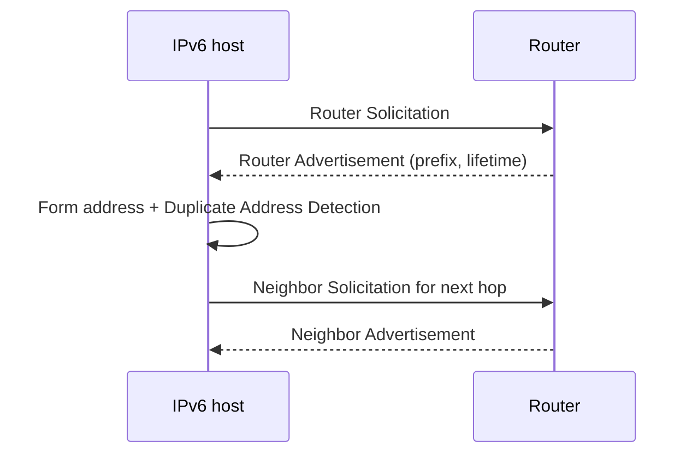

# Chapter 18 — IPv6

[← Routing](../17-Routing/README.md) · [Handbook](../README.md) · Next: Wireshark

> **Learning objectives**
> - Read, compress, and expand IPv6 addresses and prefixes.
> - Distinguish global, link-local, loopback, multicast, unique-local, and unspecified addresses.
> - Explain NDP, Router Advertisements, SLAAC, DHCPv6, and dual stack.

## 1. Introduction

IPv6 uses 128-bit addresses and was designed for Internet growth, efficient aggregation, autoconfiguration, and protocol evolution. It removes IPv4 broadcast, makes multicast and Neighbor Discovery central, and requires ICMPv6 for essential operation.

IPv6 is not “IPv4 with longer addresses.” Header structure, neighbor discovery, fragmentation, configuration, and operational practices differ.

## 2. Theory

### Notation

An IPv6 address has eight 16-bit hexadecimal groups:

```text
2001:0db8:0000:0000:0000:ff00:0042:8329
```

Leading zeros in each group may be removed, and one longest run of all-zero groups may be replaced once by `::`:

```text
2001:db8::ff00:42:8329
```

Do not use `::` twice; expansion would be ambiguous.

### Address types

| Prefix/address | Purpose |
|---|---|
| `::/128` | Unspecified |
| `::1/128` | Loopback |
| `fe80::/10` | Link-local; every interface uses local-link communication |
| `fc00::/7` | Unique local addresses (commonly `fd00::/8` locally generated) |
| `2000::/3` | Global unicast space |
| `ff00::/8` | Multicast |
| `2001:db8::/32` | Documentation |

IPv6 has no broadcast. Multicast groups provide targeted one-to-many behavior. Anycast uses ordinary unicast addresses assigned to multiple locations.

### Prefixes

`/64` is the standard subnet size for most IPv6 LANs and supports SLAAC. The enormous host space is not meant to be tightly packed like IPv4; hierarchical allocation and stable subnet boundaries matter more than conserving individual addresses.

### Neighbor Discovery Protocol

NDP uses ICMPv6 for:

- Router Solicitation and Router Advertisement;
- Neighbor Solicitation and Neighbor Advertisement;
- address resolution and reachability;
- Duplicate Address Detection;
- redirects and prefix/router information.

Blocking ICMPv6 broadly breaks IPv6. Apply specific policy rather than treating all ICMP as optional.

### Configuration

- **SLAAC:** host forms addresses from advertised prefixes.
- **DHCPv6:** stateful addresses or other configuration.
- **Static:** manually/controller configured.
- **Privacy addresses:** temporary source addresses reduce long-term tracking.

Router Advertisements supply default-router information. A host can have link-local, stable global, and temporary addresses simultaneously.

### IPv6 header

The fixed base header is 40 bytes with Version, Traffic Class, Flow Label, Payload Length, Next Header, Hop Limit, and 128-bit endpoints. Optional functions use extension headers. Routers do not fragment forwarded IPv6 packets; sources respond to ICMPv6 Packet Too Big and may use a Fragment header.

### Transition

Common strategies include dual stack, tunnels, translation such as NAT64 with DNS64, and IPv6-only segments. Dual stack means two independent network paths; IPv4 success does not prove IPv6 health.

> **Did you know?** Link-local addresses are reused on many links, so tools may require an interface zone such as `fe80::1%eth0`.

> **Memory trick:** **One `::` once; leading zeros leave.**

### Behind the scenes

Source-address selection considers scope, deprecation, temporary/stable status, prefix matching, and policy. Happy Eyeballs-style applications may race IPv6 and IPv4, hiding a slow/broken family while creating intermittent user experience.

## 3. Visual diagram



## 4. Real-world example

A host joins Wi-Fi, creates a link-local address, receives an RA advertising `2001:db8:10::/64`, forms global/temporary addresses, learns the default router, and uses NDP to reach it. DNS returns AAAA and A records; the application selects/races available paths.

### Real industry usage

ISPs, mobile networks, clouds, CDNs, and enterprises deploy IPv6 to scale addressing and simplify end-to-end routing. Operations must monitor both families, DNS, security policy, and transition gateways.

### Cloud perspective

Cloud IPv6 is often globally routable without IPv4-style NAT. Route tables and security controls still determine reachability. Egress-only gateways can allow outbound-initiated behavior without exposing unsolicited inbound flows.

### DevOps perspective

Applications must bind correctly, URLs must bracket IPv6 literals (`https://[2001:db8::10]/`), tests must cover AAAA and dual-stack behavior, and logs/parsers/databases must support 128-bit textual addresses. Kubernetes IPv6/dual-stack requires compatible CNI, services, policies, and infrastructure.

### Cybersecurity perspective

Apply equivalent IPv6 firewall/monitoring policy; otherwise attackers may use the less-observed family. Protect RA/NDP with appropriate switch controls, avoid predictable addressing where privacy matters, and retain required ICMPv6.

## 5. Packet journey

1. Host selects destination/source and longest-prefix route.
2. For on-link/next-hop delivery it uses NDP multicast, not ARP.
3. Frame carries EtherType IPv6 and the IPv6 packet.
4. Each router decreases Hop Limit and evaluates Next Header/routing policy.
5. Oversized packets trigger ICMPv6 Packet Too Big; source adjusts.
6. Destination uses extension/transport headers to deliver payload.

## 6. Linux commands

| Command | Use |
|---|---|
| `ip -6 address` | IPv6 addresses, scopes, lifetimes |
| `ip -6 route` | IPv6 routes/default routers |
| `ip -6 neighbor` | NDP neighbor state |
| `ping -6 ADDRESS` | ICMPv6 Echo/path test |
| `tracepath6 DEST` | IPv6 path/MTU probing |
| `dig AAAA NAME` | IPv6 DNS records |
| `sysctl net.ipv6.conf.all.disable_ipv6` | Shows global disable setting |

Example:

```bash
ip -6 address show scope global
ip -6 route
ip -6 route get 2001:db8::1
```

## 7. Practical example

Complete [Lab 16: Observe IPv6 and NDP](../../labs/16-ipv6-ndp/README.md). It creates an isolated `/64`, generates NDP, and examines routes and neighbors.

## 8. Wireshark example

```text
ipv6
icmpv6
icmpv6.type == 135 or icmpv6.type == 136
icmpv6.type == 134
```

Inspect Traffic Class, Flow Label, Payload Length, Next Header, Hop Limit, endpoints, extension headers, and ICMPv6 options such as source link-layer address and advertised prefix.

## 9. Common mistakes

- Blocking all ICMPv6.
- Using ARP terminology for IPv6 neighbor discovery.
- Assuming every IPv6 address is public/reachable.
- Removing zeros incorrectly or using `::` twice.
- Forgetting brackets around IPv6 literals with ports.
- Testing only IPv4 in a dual-stack service.
- Subnetting LANs smaller than `/64` without understanding feature impact.

## 10. Troubleshooting

| Symptom | Check |
|---|---|
| Link-local only | RA capture, interface config |
| Address exists, no default route | Router Advertisement lifetime/policy |
| Neighbor `FAILED` | NDP, VLAN/link, multicast/filtering |
| AAAA resolves but app slow | IPv6 path vs IPv4 fallback |
| Small works, large fails | ICMPv6 Packet Too Big/MTU |
| One family exposed unexpectedly | IPv6 listener/firewall parity |

### Best practices

- Plan hierarchical prefixes and use `/64` for normal LANs.
- Monitor/test IPv4 and IPv6 independently.
- Permit required ICMPv6 types securely.
- Apply firewall, logging, DNS, and asset inventory to both families.
- Prefer DNS over hard-coded literals.
- Document RA, DHCPv6, privacy, and source-selection policy.

## 11. Interview questions

### IPv6 ARP equivalent?

<details><summary>Answer</summary>

NDP Neighbor Solicitation/Advertisement over ICMPv6 performs address resolution and reachability functions, using multicast rather than broadcast ARP.

</details>

### Why is ICMPv6 essential?

<details><summary>Answer</summary>

It supports NDP, Router Advertisements, errors, and Path MTU Discovery. Broad blocking breaks core IPv6 operation.

</details>

### SLAAC vs DHCPv6?

<details><summary>Answer</summary>

SLAAC forms addresses from Router Advertisements. DHCPv6 can assign addresses or provide other configuration. RAs normally provide the default router.

</details>

## 12. Quiz

1. Compress `2001:0db8:0000:0000:0000:0000:0000:0010`.
2. **True/false:** IPv6 uses broadcast for neighbor discovery.
3. Which prefix is link-local?
4. Why must an IPv6 literal with a port use brackets?

<details><summary>Quiz answers</summary>

1. `2001:db8::10`.
2. False; it uses multicast-based NDP.
3. `fe80::/10`.
4. Brackets distinguish address colons from the port separator, e.g. `[2001:db8::10]:443`.

</details>

## FAQ

### Does IPv6 eliminate NAT?

It removes address-conservation need for ordinary IPv4 PAT, but translation mechanisms still exist. Security must come from explicit policy, not NAT dependence.

### Why several IPv6 addresses?

Interfaces commonly have link-local, stable global/ULA, and temporary privacy addresses with different scopes/lifetimes.

### Is `::/0` the default route?

Yes. It matches every IPv6 destination not covered by a more-specific route.

## 13. Summary

IPv6 uses 128-bit hierarchical addressing, NDP instead of ARP, multicast instead of broadcast, and Router Advertisements for critical configuration. Operate it as a first-class network: correct `/64` design, ICMPv6, DNS, routing, policy, monitoring, and independent dual-stack testing.
