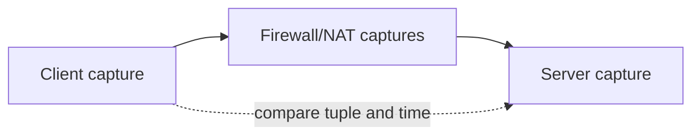

# Chapter 19 — Wireshark and Packet Analysis

[← IPv6](../18-IPv6/README.md) · [Handbook](../README.md) · [Linux Networking →](../20-Linux-Networking/README.md)

> **Learning objectives**
> - Capture safely at the correct location and distinguish capture from display filters.
> - Follow conversations, interpret protocol fields, and recognize capture limitations.
> - Build evidence without exposing credentials or unrelated traffic.

## 1. Introduction

Wireshark decodes packets visible at a capture interface. It is an evidence tool, not a magic view of the entire network. A capture proves what reached the capture point; it does not prove what happened before or after it. Correct analysis begins with a precise question, narrow scope, synchronized time, and documented topology.

## 2. Theory

### Capture versus display filters

| Type | Applied | Syntax example |
|---|---|---|
| Capture filter | Before packets are saved | `host 192.0.2.10 and port 443` |
| Display filter | After capture; hides/shows decoded packets | `ip.addr == 192.0.2.10 && tcp.port == 443` |

Capture filters reduce volume permanently. Display filters preserve data and let you explore it. Use capture filters cautiously because omitted evidence cannot be recovered.

### Capture points

Host, client side, server side, both sides of NAT/firewall, switch SPAN/TAP, container namespace, and tunnel interface can show different headers and tuples. Loopback captures differ from Ethernet; host offload can show giant segments or uncalculated checksums.

### Essential workflows

- **Follow Stream:** reconstructs TCP/UDP/HTTP conversation views.
- **Conversations/Endpoints:** summarizes addresses, ports, bytes, and packets.
- **Expert Information:** highlights retransmissions, malformed packets, resets, and warnings—clues that require interpretation.
- **Time references:** compare request/response gaps and correlate logs.
- **Name resolution:** disable during precise analysis when it hides numeric truth.

### Useful display filters

| Goal | Filter |
|---|---|
| One host | `ip.addr == 192.0.2.10` |
| TCP handshake | `tcp.flags.syn == 1` |
| Reset | `tcp.flags.reset == 1` |
| Retransmission | `tcp.analysis.retransmission` |
| DNS failures | `dns.flags.rcode != 0` |
| ICMP errors | `icmp.type == 3 or icmpv6.type < 128` |
| One TCP stream | `tcp.stream eq 0` |
| HTTP errors | `http.response.code >= 400` |

> **Did you know?** “Bad checksum” on outgoing host traffic often means checksum offload occurs after the capture point.

> **Memory trick:** **Question → point → filter → timeline → conclusion.**

### Behind the scenes

Snap length can truncate packets; ring buffers rotate files; promiscuous mode does not defeat switched forwarding; TLS hides application content; hardware offload changes host-side representation. Always save capture metadata with the file.

## 3. Visual diagram

## 4. Real-world example

A client reports timeout. Client capture shows repeated SYNs, firewall ingress shows them, firewall egress shows none. The evidence isolates the loss at firewall policy/routing; it does not justify changing the application.

### Real industry usage

Packet analysis validates handshakes, DNS, retransmissions, resets, MTU, load balancers, asymmetric paths, and protocol compliance during incidents and performance work.

### Cloud perspective

Cloud packet mirroring and flow logs complement host captures. Managed fabrics may not allow arbitrary SPAN. Flow logs show metadata, not full payloads, and provider load balancers create separate connections.

### DevOps perspective

Capture inside the correct container/network namespace and correlate with proxy, ingress, application, and node logs. Short captures around a reproducible health check are safer than broad production captures.

### Cybersecurity perspective

PCAPs can contain passwords, cookies, tokens, personal data, and internal topology. Restrict access, minimize scope, encrypt storage, define retention, and sanitize before committing or sharing.

## 5. Packet journey

For HTTPS, observe DNS, TCP SYN/SYN-ACK/ACK or QUIC, TLS handshake, encrypted application records, and closure. At routers, link headers change; at NAT, tuples change; at proxies, a new connection begins. Correlate rather than assuming one end-to-end stream.

## 6. Linux commands

| Command | Use |
|---|---|
| `tcpdump -D` | List interfaces |
| `tcpdump -ni eth0 -s 0 -w file.pcap FILTER` | Full packet capture |
| `tcpdump -nn -r file.pcap` | Read without name resolution |
| `tshark -r file.pcap -Y 'FILTER'` | CLI display filtering |
| `capinfos file.pcap` | Capture metadata |
| `editcap` / `mergecap` | Slice or merge captures |

Use rotation for longer authorized captures: `tcpdump -C SIZE -W COUNT`.

## 7. Practical example

Complete [Lab 17: Evidence-driven packet analysis](../../labs/17-packet-analysis/README.md).

## 8. Wireshark example

Select a TCP stream and answer: who initiated, whether SYN-ACK returned, handshake RTT, where delay occurs, who sent FIN/RST, whether retransmissions are real, and which application protocol/TLS metadata is visible. A marked packet is not a root cause until topology and timing support it.

## 9. Common mistakes

- Capturing the wrong interface or namespace.
- Confusing capture and display filter syntax.
- Declaring packet loss from one-sided retransmissions alone.
- Treating Expert Info as an automatic diagnosis.
- Ignoring offload, truncation, NAT, tunnels, and proxies.
- Publishing unsanitized PCAPs.

## 10. Troubleshooting

| Observation | Next question |
|---|---|
| SYN, no SYN-ACK | Did SYN leave every boundary and reach listener? |
| SYN-ACK reaches client, ACK absent | Client policy/path/capture point? |
| RST | Which device sent it and why? |
| DNS answer, no connection | Route/port/policy/service? |
| Retransmissions | Real loss, reordering, capture drop, or offload? |
| Long request-response gap | Network RTT or server/application time? |

### Best practices

- Write the hypothesis before capturing.
- Capture both sides of disputed boundaries.
- Synchronize clocks and record timezone.
- Use numeric addresses and narrow time windows.
- Preserve original read-only evidence and analyze copies.
- Document command, interface, namespace, filter, snap length, topology, and consent.

## 11. Interview questions

### Capture vs display filter?

Answer
Capture filters decide what is recorded using BPF syntax. Display filters select decoded packets from already captured data.

### Why might checksums look invalid?

Answer
Host capture can occur before NIC checksum offload. Verify direction/offload and compare a wire-side capture.

### Does retransmission prove network loss?

Answer
No. It proves the sender did not receive acknowledgment as expected; reverse-path loss, capture loss, reordering, or receiver behavior can contribute.

## 12. Quiz

1. Filter one TCP conversation. 2. Why capture both NAT sides? 3. What does snap length change? 4. Is promiscuous mode enough to see all switched traffic?

Quiz answers

1. `tcp.stream eq N`. 2. Tuples differ across translation and one side cannot prove the other. 3. Maximum recorded bytes per packet; truncation can remove payload/headers. 4. No; a SPAN/TAP or relevant endpoint is required.

## FAQ

### Can Wireshark decrypt HTTPS?

Only with authorized session secrets/keys and supported handshakes. Do not weaken TLS or collect secrets casually.

### PCAP or PCAPNG?

PCAPNG supports richer metadata and multiple interfaces; tool compatibility may guide format choice.

## 13. Summary

Packet analysis is disciplined evidence collection. Choose the right capture point, preserve context, filter carefully, compare both directions/boundaries, and separate observations from conclusions.
