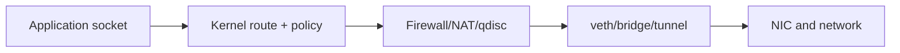

# Chapter 20 — Linux Networking

[← Wireshark](../19-Wireshark/README.md) · [Handbook](../README.md) · [Troubleshooting →](../21-Troubleshooting/README.md)

> **Learning objectives**
> - Inspect interfaces, addresses, neighbors, routes, sockets, DNS, namespaces, bridges, and firewalls.
> - Understand the Linux packet path and select evidence safely.
> - Build isolated labs without modifying the host's production route.

## 1. Introduction

Linux networking is a programmable stack shared by servers, routers, containers, Kubernetes nodes, firewalls, and appliances. The kernel owns interfaces, routes, neighbor state, sockets, forwarding, filtering, NAT, queueing, and namespaces; user-space managers configure and observe it.

## 2. Theory

### Object map

| Object | Question | Tool |
|---|---|---|
| Link | Is interface up? errors/MTU/MAC? | `ip -s -d link` |
| Address | Which IP/prefix/scope? | `ip address` |
| Neighbor | Is next-hop resolution working? | `ip neighbor` |
| Route/rule | Where will packet go? | `ip route get`, `ip rule` |
| Socket | Is process listening/connected? | `ss -tulpen` |
| Resolver | Which DNS path? | `resolvectl`, `dig`, `getent` |
| Firewall/NAT | Is flow allowed/translated? | `nft list ruleset`, `conntrack` |
| Namespace | Which isolated network stack? | `ip netns`, `nsenter` |

### Packet path

Locally generated packets pass route/policy selection, output filtering, possible source translation, queueing, driver, and NIC. Forwarded packets enter an interface, pass validation/prerouting, route selection, forwarding policy, postrouting/NAT, then exit. Locally destined packets reach input policy and a socket.

### Namespaces and virtual links

Network namespaces isolate interfaces, routes, neighbor tables, sockets, firewall state, and `/proc` views. Veth pairs act like connected virtual cables. Bridges switch frames; bonds aggregate links; VLAN interfaces tag frames; tunnels encapsulate packets.

### Configuration ownership

NetworkManager, systemd-networkd, netplan, distribution scripts, cloud-init, container runtimes, and orchestration tools may manage the same objects. Manual `ip` changes are temporary and can conflict with the controller of record.

> **Did you know?** `netstat`, `ifconfig`, `route`, and `arp` are legacy tools; modern Linux uses `ss`, `ip`, and `bridge`.

> **Memory trick:** **Link → Address → Neighbor → Route → Socket → App.**

### Behind the scenes

The kernel uses routing caches/FIB structures, qdiscs, offload, conntrack, and eBPF hooks. A container's `eth0` is usually one end of a veth; the peer exists in another namespace attached to a bridge or dataplane.

## 3. Visual diagram



## 4. Real-world example

A service listens on `127.0.0.1:8080`. Firewall permits `8080`, but remote clients fail because the socket is not bound to an external address. `ss -lntp`, not another firewall change, exposes the root cause.

### Real industry usage

Linux runs load balancers, VPNs, Kubernetes nodes, cloud VMs, routers, observability agents, and application servers. Operators need a common read-only evidence workflow before altering configuration.

### Cloud perspective

The guest sees a virtual NIC and routes while the cloud fabric applies additional routes/security outside it. Host evidence must be correlated with provider route tables, security groups, NACLs, load balancers, and flow logs.

### DevOps perspective

Container port publishing, CNI, service meshes, and build networks create namespaces, veths, routes, iptables/nftables/eBPF state, and DNS configuration. Diagnose from the failing namespace, not only the host.

### Cybersecurity perspective

Minimize listeners, restrict capabilities/root, review firewall changes, protect namespace entry, monitor unexpected interfaces/routes, and preserve command output for audit. A process bound to `0.0.0.0` may be exposed on more networks than intended.

## 5. Packet journey

An application writes to a socket; kernel selects route/source, resolves neighbor, applies firewall/NAT, queues to an interface, and transmits. On receive, driver/kernel decode, apply prerouting/input or forwarding logic, match connection/socket, and wake the process. Namespaces determine which tables and sockets apply.

## 6. Linux commands

```bash
ip -brief link
ip -brief address
ip neighbor
ip rule
ip route show table all
ss -tulpen
resolvectl status
sudo nft list ruleset
```

| Command | Output focus |
|---|---|
| `ip route get DEST` | exact source, next hop, interface |
| `ss -ti` | TCP state/RTT/MSS/retransmission details |
| `ethtool IFACE` | link/driver features |
| `tc -s qdisc show` | queueing/drops |
| `ip netns exec NS CMD` | execute inside namespace |
| `nsenter -t PID -n CMD` | enter process network namespace |

## 7. Practical example

Use the repository namespace labs to experiment safely. For a real host, begin with the read-only evidence bundle in the troubleshooting chapter.

## 8. Wireshark example

Use `tcpdump -ni any` for broad diagnosis, then move to a specific interface. Linux `any` uses cooked capture and may not expose ordinary Ethernet headers. Compare host, bridge, veth, and tunnel capture points to follow encapsulation.

## 9. Common mistakes

- Editing temporary state while a manager immediately overwrites it.
- Diagnosing host namespace when failure is inside container namespace.
- Flushing firewall or routes instead of reading counters.
- Assuming `0.0.0.0` route and bind mean the same thing.
- Ignoring IPv6 listeners/routes.
- Using `ping` as the only application test.

## 10. Troubleshooting

| Failure | First evidence |
|---|---|
| Interface | `ip -s link`, `ethtool` |
| Address/prefix | `ip address`, manager state |
| On-link resolution | `ip neighbor`, ARP/NDP capture |
| Route | `ip rule`, `ip route get` |
| Port | `ss -lntup`, client SYN capture |
| DNS | `getent`, `resolvectl`, `dig` |
| Policy/NAT | nft counters, conntrack, two-sided capture |

### Best practices

- Collect state before changing it.
- Identify the configuration owner/controller.
- Work from the affected namespace.
- Use explicit, reversible commands in isolated labs.
- Save timestamps, kernel/distro, interface, routes, and relevant counters.

## 11. Interview questions

### `ip route` vs `ip rule`?

<details><summary>Answer</summary>Rules select routing tables/policy; route tables select next hops for prefixes.</details>

### `0.0.0.0:80` listener?

<details><summary>Answer</summary>It accepts on all local IPv4 addresses subject to firewall/policy. It does not itself create routing or public reachability.</details>

### What is a veth pair?

<details><summary>Answer</summary>Two linked virtual Ethernet interfaces; a frame entering one exits the peer, often connecting namespaces.</details>

## 12. Quiz

1. Command for listening sockets? 2. Exact route decision? 3. Why `tcpdump -i any` lacks Ethernet detail? 4. What does a namespace isolate?

<details><summary>Quiz answers</summary>

1. `ss -lntup`. 2. `ip route get DEST`. 3. It uses Linux cooked capture across interfaces. 4. Interfaces, routes, neighbors, sockets, and much network state.

</details>

## FAQ

### Are `ip` changes persistent?

Usually not. Persist through the system's configuration manager/IaC.

### iptables or nftables?

nftables is the modern framework; some systems expose iptables compatibility backed by nftables. Determine the actual owner/backend.

## 13. Summary

Linux exposes networking as inspectable objects. Identify namespace and configuration owner, then follow link, address, neighbor, route, socket, resolver, firewall/NAT, and application evidence before changing state.
