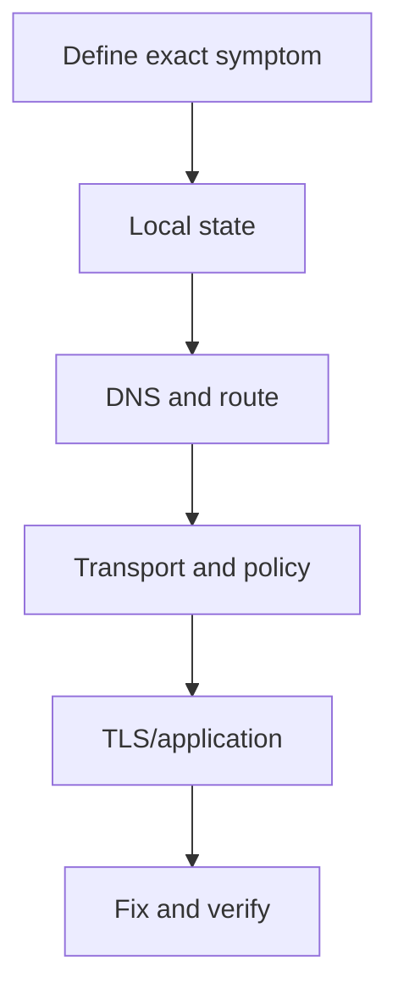

# Chapter 21 — Network Troubleshooting

[← Linux Networking](../20-Linux-Networking/README.md) · [Handbook](../README.md) · [Interview Preparation →](../22-Interview/README.md)

> **Learning objectives**
> - Turn vague symptoms into precise flows and testable hypotheses.
> - Isolate link, address, route, DNS, transport, TLS, and application failures.
> - Produce an evidence timeline and verify the smallest safe fix.

## 1. Introduction

Professional troubleshooting is controlled uncertainty reduction. Start with source, destination, protocol, port, time, expected result, actual result, and scope. Do not start with random commands or “restart everything.”

## 2. Theory

### The evidence loop

1. Define the flow and reproduce safely.
2. Establish what changed and who is affected.
3. Form one hypothesis.
4. Choose a test that can disprove it.
5. Compare with known-good behavior.
6. Apply the smallest reversible fix.
7. Repeat the same test and monitor.
8. Record root cause and prevention.

### Failure vocabulary

| Symptom | Meaning |
|---|---|
| DNS NXDOMAIN | Name does not exist according to response path |
| Network unreachable | Local route lookup failed/rejected |
| Timeout | Expected response absent before deadline; many possible causes |
| Connection refused | Active rejection/no accepting TCP listener |
| TLS error | Identity, trust, protocol, time, interception, or cipher issue |
| HTTP 4xx/5xx | Application/proxy returned a response; lower layers largely worked |

### Baseline and blast radius

Compare one user vs all, one site vs all sites, IPv4 vs IPv6, hostname vs IP, local vs remote, one subnet vs all, and new vs established flows. Scope often identifies the responsible boundary faster than command output.

> **Did you know?** A failed ping can coexist with a healthy HTTPS service because ICMP policy and application transport differ.

> **Memory trick:** **Flow, scope, layer, evidence, fix, verify.**

### Behind the scenes

Retries, caches, load balancing, failover, NAT, proxies, and Happy Eyeballs can mask failures. One successful request does not prove every backend/path works; sample enough to identify intermittent patterns.

## 3. Visual diagram



## 4. Real-world example

`curl` says “Could not resolve host.” `ip route` and pinging an approved IP work. `resolvectl` shows VPN DNS assigned to the wrong interface. The fix is resolver routing/configuration—not opening TCP 443.

### Real industry usage

Incident teams correlate metrics, logs, traces, packets, configuration changes, and provider status. Clear timestamps and ownership reduce mean time to recovery and unsafe duplicate actions.

### Cloud perspective

Check guest route, subnet route table, security group, NACL, gateway/load balancer, target health, DNS zone, flow logs, and return path. Provider abstractions create multiple boundaries.

### DevOps perspective

Compare desired IaC/Kubernetes state with actual objects. Inspect readiness, endpoints, Service ports, ingress/gateway routes, CNI policy, node routes, DNS, and application logs. Rollback may be safer than live mutation.

### Cybersecurity perspective

Preserve evidence, respect authorization, avoid disabling controls as a test, and distinguish outage from attack. Emergency changes need audit, time limits, owners, and rollback.

## 5. Packet journey

At every boundary ask: did request arrive, did it leave, did response arrive, did it leave? Follow DNS then the actual IP flow through client, gateway, firewall/NAT/load balancer, server, and reverse path. A two-sided capture isolates the first disappearance or transformation.

## 6. Linux commands

```bash
date -Is
ip -brief link
ip -brief address
ip neighbor
ip rule
ip route
ss -tulpen
resolvectl status
```

Targeted tests:

```bash
ip route get DEST
dig NAME
curl -v --connect-timeout 5 URL
tracepath DEST
sudo tcpdump -ni IFACE 'host DEST and port PORT'
```

## 7. Practical example

Complete [Lab 17: Evidence-driven packet analysis](../../labs/17-packet-analysis/README.md), then write a short incident report with symptom, evidence, root cause, fix, and prevention.

## 8. Wireshark example

Build a timeline: DNS response, connection attempt, reply/reset, TLS, request, response. Use `frame.time_relative`, stream filters, and captures on both sides. Label observation (“three SYNs, no SYN-ACK at client”) separately from inference (“return path or downstream boundary likely fails”).

## 9. Common mistakes

- Changing several variables simultaneously.
- Testing a different destination than the application.
- Assuming correlation is root cause.
- Ignoring reverse path, IPv6, caches, and intermittent backends.
- Restarting before collecting evidence.
- Leaving emergency firewall rules in place.

## 10. Troubleshooting

| Stage | Question | Proof |
|---|---|---|
| Link | Interface/carrier/errors? | counters and link state |
| Address | Correct IP/prefix/lease? | address and DHCP data |
| Neighbor | Gateway resolution? | ARP/NDP and capture |
| Route | Correct table/next hop/source? | `ip route get` |
| DNS | Correct answer from relevant resolver? | `getent`/`dig` |
| Transport | SYN/SYN-ACK or UDP response? | socket and capture |
| TLS | Valid name/time/chain/protocol? | `curl -v`/TLS logs |
| App | Status, dependency, latency? | logs/traces/response |

### Best practices

- Maintain healthy baselines and tested runbooks.
- State facts, hypotheses, and actions separately.
- Timestamp every test and configuration change.
- Prefer reversible fixes and define rollback.
- Verify from the original user's path.
- Write prevention actions with owners and deadlines.

## 11. Interview questions

### Timeout vs refused?

<details><summary>Answer</summary>Refused is an active rejection, commonly TCP RST. Timeout means the expected response did not arrive; investigate path, policy, state, listener, load, and return traffic.</details>

### IP works, hostname fails?

<details><summary>Answer</summary>Isolate DNS/system resolver path, while remembering the hostname may select different addresses/TLS/application behavior.</details>

### First step in an outage?

<details><summary>Answer</summary>Define precise symptom, scope, time, impact, and flow; preserve evidence before risky changes.</details>

## 12. Quiz

1. Why test same destination? 2. What proves an HTTP 500? 3. How isolate a firewall boundary? 4. Why verify from original path?

<details><summary>Quiz answers</summary>

1. Different destinations use different DNS/routes/policy. 2. Application-layer response arrived; it does not prove every dependency. 3. Synchronized captures/counters on ingress and egress. 4. Alternate paths may bypass the failure.

</details>

## FAQ

### Should I always start at Layer 1?

No. Start where symptom/evidence points, then verify dependencies above and below.

### Is rebooting a fix?

It may restore service but destroys state and rarely explains root cause. Use only with impact/rollback awareness and collect evidence first.

## 13. Summary

Define the exact flow, narrow scope, test one hypothesis, follow evidence across boundaries and both directions, apply the smallest safe fix, and verify through the original path. The goal is root cause and prevention, not merely a disappearing symptom.
