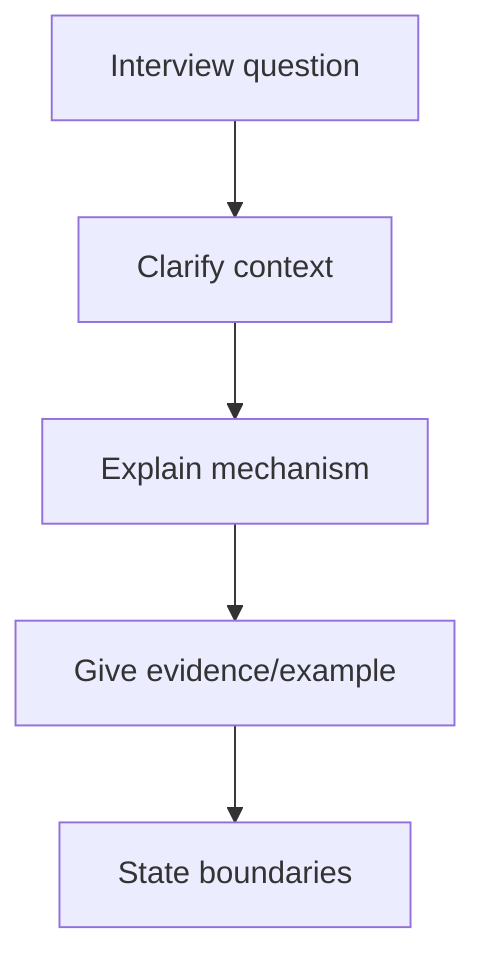

# Chapter 22 — Networking Interview Preparation

[← Troubleshooting](../21-Troubleshooting/README.md) · [Handbook](../README.md) · [Comprehensive Quiz →](../23-Quiz/README.md)

> **Learning objectives**
> - Answer networking questions with definition, mechanism, evidence, and example.
> - Handle beginner, intermediate, advanced, DevOps, cloud, CCNA, and scenario questions.
> - Demonstrate reasoning instead of reciting memorized lines.

## 1. Introduction

Strong interview answers are structured and honest. Define the concept, explain how it works, connect it to a real flow, state important exceptions, and name evidence you would collect. For troubleshooting questions, clarify the source, destination, protocol, port, scope, and symptom before proposing changes.

## 2. Theory

### Answer framework

```text
Define → Explain mechanism → Give example → Mention boundary/exception → Verify with evidence
```

For scenarios:

```text
Clarify → Hypothesize → Test → Isolate boundary → Fix safely → Verify → Prevent
```

### What interviewers evaluate

- correct mental model and vocabulary;
- ability to connect layers;
- safe diagnostic judgment;
- Linux/tool fluency;
- awareness of cloud/container abstraction;
- communication under uncertainty.

> **Did you know?** Saying “I would check the firewall” is weak unless you state which flow, direction, rule, counter, and expected packet behavior.

> **Memory trick:** **D-M-E-V:** Definition, Mechanism, Example, Verification.

### Behind the scenes

Many scenario questions are deliberately incomplete. Asking two precise questions can be stronger than guessing. State assumptions explicitly and avoid pretending that ping, one log line, or one capture proves more than it does.

## 3. Visual diagram



## 4. Real-world example

Question: “A website is down. What do you do?” A strong answer narrows user scope and exact error, separates DNS from IP, checks route and transport, validates TLS/HTTP, correlates load balancer/backend health, compares a known-good path, and avoids destructive changes before evidence.

### Real industry usage

The same structure is used in incident response, design review, handoff, and postmortems. Clear reasoning matters more than naming the largest number of commands.

### Cloud perspective

Mention guest networking and provider controls: VPC/subnet routes, security groups, NACLs, gateways, load balancers, private DNS, flow logs, and return paths.

### DevOps perspective

Connect listeners, container port mapping, Kubernetes Service/targetPort, ingress/gateway, CNI, NetworkPolicy, health checks, and CI runner egress.

### Cybersecurity perspective

Never propose disabling a firewall or TLS validation as the default fix. Use authorized, scoped tests and preserve audit/evidence.

## 5. Packet journey

Use one web request to connect answers: DNS resolves, route selects next hop, ARP/NDP resolves local delivery, TCP/QUIC establishes transport, TLS authenticates/protects, HTTP exchanges data, and every router/firewall/load balancer can alter or reject the path.

## 6. Linux commands

Be ready to explain—not just name:

| Goal | Command |
|---|---|
| Interfaces/addresses | `ip -brief address` |
| Exact route | `ip route get DEST` |
| Neighbors | `ip neighbor` |
| Listeners/connections | `ss -tulpen`, `ss -tan` |
| DNS | `getent ahosts`, `dig` |
| Application/TLS | `curl -v` |
| Capture | `tcpdump -ni IFACE FILTER` |
| Firewall/NAT | `nft list ruleset`, `conntrack -L` |

## 7. Practical example

Pick five questions below. Answer aloud in 90 seconds each, then rewrite each answer in five lines. Record assumptions, verification commands, and one common exception.

## 8. Wireshark example

Be prepared to interpret SYN/SYN-ACK/ACK, RST versus timeout, DNS response code/TTL, ARP/NDP, ICMP errors, retransmissions, NAT tuple changes, TLS handshake metadata, and capture-point limitations.

## 9. Common mistakes

- Giving a command list without a hypothesis.
- Confusing switch, router, gateway, DNS, and DHCP roles.
- Saying TCP guarantees application success.
- Calling private addresses secure.
- Treating NAT as a firewall.
- Memorizing OSI names without packet behavior.
- Hiding uncertainty instead of stating an assumption.

## 10. Troubleshooting

When stuck, return to this matrix:

| Question | Evidence |
|---|---|
| Who is affected? | scope/baseline |
| Which exact flow? | tuple and timestamp |
| Does name resolve? | system resolver + DNS query |
| Which route/source? | `ip route get` |
| Does handshake complete? | socket + capture |
| Does TLS/app respond? | `curl -v`, logs/traces |

### Best practices

- Answer the question before adding detail.
- Draw a small topology when possible.
- Use documentation IPs in examples.
- Distinguish fact, inference, and next test.
- End scenario answers with verification and prevention.

## 11. Interview questions

### Beginner

1. What happens when you enter a URL?
2. Switch versus router?
3. TCP versus UDP?
4. Public versus private IPv4?
5. DNS versus DHCP?
6. What does a subnet mask do?
7. What are a default gateway and default route?
8. Why can ping fail while HTTPS works?

### Intermediate

1. Explain encapsulation and which fields change at a router.
2. Calculate `192.0.2.141/27`.
3. Explain ARP for local and remote destinations.
4. TCP three-way handshake and four-way close.
5. RST versus timeout.
6. Access port versus trunk and native VLAN.
7. MAC learning and unknown-unicast flooding.
8. Longest-prefix match.
9. Recursive versus authoritative DNS.
10. DHCP relay and DORA.

### Advanced

1. Flow control versus congestion control.
2. Path MTU black hole symptoms.
3. Asymmetric routing with stateful NAT/firewalls.
4. STP root election and loop prevention.
5. ECMP behavior and per-flow hashing.
6. Route summarization risks.
7. IPv6 NDP, RA, SLAAC, and required ICMPv6.
8. DNS caching during a migration.

### DevOps and cloud

1. Docker `-p 8080:80` packet path.
2. Kubernetes `port`, `targetPort`, and `nodePort`.
3. Pod can resolve DNS but cannot reach Service.
4. Security group allows 443 but connection times out.
5. Private subnet outbound Internet path.
6. Overlap between VPN, VPC, Docker, and Pod CIDRs.
7. Load balancer health checks pass but users receive 503.
8. How to capture in the correct network namespace.

### CCNA-style scenarios

1. VLAN works on one switch but not another.
2. STP blocks a redundant link—is it a failure?
3. Host ARPs for a destination that should be routed.
4. Router knows forward route but replies never return.
5. One subnet in a summary is black-holed.
6. DHCP clients receive the wrong scope.

<details><summary>Model-answer guidance</summary>

Use the linked handbook chapter for each concept. A model answer must include mechanism, relevant packet/address fields, one verification command/capture, and an important boundary. Scenario answers must define the exact flow and reverse path.

</details>

## 12. Quiz

Practice rapid-fire:

1. Which table maps IP next hop to MAC? 2. Which device decrements TTL? 3. Which TCP flag actively resets? 4. Which DNS code means nonexistent name? 5. Which route wins: `/16` or `/24`?

<details><summary>Answers</summary>

1. ARP/neighbor table. 2. Router/Layer 3 forwarding device. 3. RST. 4. NXDOMAIN. 5. `/24` when both match.

</details>

## FAQ

### How long should an answer be?

Start with 20–40 seconds, then let the interviewer request depth. Scenario answers can be longer but should remain structured.

### What if I do not know?

Say what you know, state the missing fact, and describe how you would verify it. Do not invent protocol behavior.

## 13. Summary

Interviews reward clear mental models and safe reasoning. Define, explain mechanism, give a concrete example, acknowledge boundaries, and verify with evidence. Use the comprehensive quiz next to expose weak areas.
