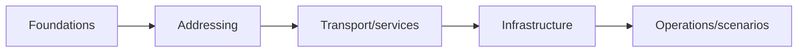

# Chapter 23 — Comprehensive Networking Quiz

[← Interview Preparation](../22-Interview/README.md) · [Handbook](../README.md) · Next: Cheatsheets

> **Assessment goal:** Test understanding from networking basics through IPv6, packet analysis, Linux, cloud, DevOps, and troubleshooting. Complete it without notes, then review weak chapters.

## 1. Introduction

This assessment mixes recall, calculation, command interpretation, packet reasoning, and scenarios. Suggested time: **90 minutes**. Total: **60 points**. Do not open answers until finished.

## 2. Theory

Scoring guide:

| Score | Interpretation |
|---:|---|
| 54–60 | Strong; explain answers aloud and attempt advanced labs |
| 45–53 | Good; review missed mechanisms and scenarios |
| 36–44 | Developing; repeat weak chapters and labs |
| Below 36 | Rebuild foundations in chapter order |

For written scenarios, award the point only when the reasoning includes evidence, not merely a guessed cause.

## 3. Visual diagram

## 4. Real-world example

Treat scenario questions like incidents: define the flow, isolate the first failing boundary, propose the smallest safe test, and verify the fix.

### Real industry usage

The quiz reflects junior network, cloud, DevOps, support, and SRE interviews where practical reasoning matters more than isolated definitions.

### Cloud perspective

Cloud questions include routes, security groups, NAT gateways, load balancers, private DNS, and overlapping CIDRs.

### DevOps perspective

Expect sockets, containers, Kubernetes ports, namespaces, service discovery, and health-check paths.

### Cybersecurity perspective

Safe answers preserve controls, scope captures, protect evidence, and distinguish NAT/segmentation from authentication and encryption.

## 5. Packet journey

Before answering scenarios, mentally follow: name resolution → route/source → next-hop resolution → frame → routers/policy/NAT → transport → TLS/application → reverse path.

## 6. Linux commands

Some questions use output from `ip`, `ss`, `dig`, `curl`, `tcpdump`, `bridge`, and `nft`. Explain fields rather than guessing from command names.

## 7. Practical example

Write answers in a separate file. For subnetting, show work. For scenarios, use: **Observation → Hypothesis → Test → Expected evidence**.

## 8. Wireshark example

Packet questions assume capture-point awareness. State when one capture cannot prove the conclusion.

## 9. Common mistakes

- Checking answers after each question.
- Awarding points for vague command lists.
- Ignoring reverse paths and IPv6.
- Doing subnet math without validating boundaries.
- Treating a plausible cause as proven root cause.

## 10. Troubleshooting

If a question feels ambiguous, write the assumption that changes your answer. In real networking, context is part of correctness.

### Best practices

- Set a timer.
- Mark confidence high/medium/low.
- Review low-confidence correct answers too.
- Create a weak-topic list linked to handbook chapters.
- Repeat only missed questions after 48 hours.

## 11. Interview questions

### Part A — Multiple choice (15 points)

1. Which OSI layer routes IP packets? A L2 · B L3 · C L4 · D L7
2. Which value changes at every normal router? A TCP port · B destination IP · C TTL/Hop Limit · D DNS name
3. `/27` has how many traditional usable hosts? A 14 · B 30 · C 32 · D 62
4. A remote IPv4 destination frame uses which destination MAC? A remote server · B default gateway · C DNS server · D broadcast always
5. Unknown unicast at a switch is normally: A routed · B flooded in VLAN · C dropped always · D NATed
6. TCP listener absent usually returns: A SYN-ACK · B RST · C DHCPNAK · D DNS SERVFAIL
7. DNS authoritative server does what? A leases IPs · B publishes zone records · C routes packets · D translates NAT
8. DHCPv4 server port is: A 22 · B 53 · C 67 · D 68
9. Which publishes an internal service? A SNAT · B DNAT · C SLAAC · D STP
10. Which route wins for matching destination? A lowest prefix · B longest prefix · C oldest · D default
11. STP primarily prevents: A DNS loops · B L2 loops · C TCP retransmission · D NAT exhaustion
12. IPv6 neighbor discovery uses: A ARP · B ICMPv6 · C TCP · D DHCPv4
13. Capture filter is applied: A after saving · B before recording · C only to TLS · D by DNS
14. `0.0.0.0:8080` listener means: A default route · B all local IPv4 addresses · C public reachability guaranteed · D UDP only
15. HTTP 403 primarily proves: A cable failed · B application response arrived · C DNS failed · D no TCP connection

### Part B — True or false (10 points)

16. Private IPv4 is automatically secure.
17. TCP preserves application message boundaries.
18. VLAN and subnet are identical concepts.
19. MAC addresses normally change at routed hops.
20. DNS success proves HTTPS health.
21. NAT encrypts traffic.
22. IPv6 uses broadcast for NDP.
23. A default route is used only when no more-specific route matches.
24. Wireshark Expert Info automatically identifies root cause.
25. A valid DHCP lease can contain a wrong gateway.

### Part C — Calculations and commands (15 points)

26. Find network/broadcast/host range for `192.0.2.141/27`.
27. Smallest traditional subnet for 50 hosts?
28. Summarize `10.0.0.0/24` through `10.0.3.0/24`.
29. What does `ip route get 198.51.100.20` reveal?
30. Command to show listening TCP/UDP sockets with processes?
31. Command to show neighbor/ARP/NDP state?
32. `ss` shows `SYN-SENT` repeatedly. What does that mean?
33. `dig` returns NXDOMAIN. Meaning?
34. Filter one TCP stream in Wireshark.
35. Filter IPv6 Neighbor Solicitation/Advertisement.
36. `ip route`: `10/8 via A`, `10.20/16 via B`; destination `10.20.5.1` uses?
37. Why can `frame.len` exceed `ip.len`?
38. Difference between MTU and TCP MSS?
39. Why might outgoing checksum appear bad?
40. Command to show Linux bridge FDB?

### Part D — Scenarios (20 points)

41. IP works, hostname fails. Give next three checks.
42. DNS resolves; TCP 443 times out. Give evidence plan.
43. TCP returns refused. What is proven and what next?
44. VLAN 20 works locally but not across trunk. Diagnose.
45. Host ARPs for a destination that should use gateway. Likely error?
46. Forward packets reach server, replies never reach client. Investigate.
47. Small requests work; large transfers stall through VPN. Hypothesis/test?
48. Public port forward times out although rule exists. List dependencies.
49. Docker container listens on `127.0.0.1:3000`; published port fails. Why?
50. Kubernetes Service has no endpoints. What layer/object is wrong?
51. Security group allows 443 but traffic still times out. Name four other boundaries.
52. DHCP Discover repeats with no Offer. Diagnose.
53. Users retain old DNS address after migration. Explain and fix plan.
54. STP blocks a backup link. Is that failure?
55. Many new NAT flows fail while established flows work. Suspect?
56. IPv4 works but application pauses before fallback; AAAA exists. Plan?
57. Client capture shows SYN; server capture does not. What is isolated?
58. Server capture shows SYN/SYN-ACK; client never sees SYN-ACK. Next boundary?
59. HTTP health check succeeds but users get 503 intermittently. Plan?
60. Give a safe eight-step troubleshooting workflow.

## 12. Quiz

<strong>Answer key — open only after finishing</strong>

### Part A

1 B; 2 C; 3 B; 4 B; 5 B; 6 B; 7 B; 8 C; 9 B; 10 B; 11 B; 12 B; 13 B; 14 B; 15 B.

### Part B

16 F; 17 F (TCP is a byte stream); 18 F; 19 T (link framing changes); 20 F; 21 F; 22 F; 23 T; 24 F; 25 T.

### Part C

26. `/27` block 32: network `192.0.2.128`, broadcast `.159`, hosts `.129–.158`.  
27. `/26` (62 usable).  
28. `10.0.0.0/22`.  
29. Selected route, next hop, interface, source and related decision data.  
30. `ss -tulpen`.  
31. `ip neighbor`.  
32. SYN sent but handshake not completed; inspect reply/path/policy/listener.  
33. Queried name does not exist according to that resolution path.  
34. `tcp.stream eq N`.  
35. `icmpv6.type == 135 or icmpv6.type == 136`.  
36. B via `/16`.  
37. Frame includes link headers/tags/trailer around IP.  
38. MTU limits network-layer packet on link; MSS is TCP payload size.  
39. NIC checksum offload after host capture.  
40. `bridge fdb show`.

### Part D — expected points

41. Compare `getent`, configured resolver/search path, `dig` relevant name/type/server.  
42. Route/source, SYN capture both sides, listener, firewall/NAT/return path.  
43. Responding device actively rejected; verify correct tuple/listener/policy and RST source.  
44. VLAN existence, trunk mode/state, allowed/tag/native consistency, STP/path.  
45. Prefix too broad or wrong connected route.  
46. Reverse route, asymmetric stateful policy, NAT state, server gateway.  
47. MTU black hole; `tracepath`, safe size probes, ICMP Too Big/fragmentation evidence.  
48. Upstream reachability, DNAT match, forwarding/firewall, listener/bind, internal route, reverse NAT.  
49. Loopback-only bind inside namespace; listen on intended container interface/address.  
50. Selector/readiness/Pod membership; Service has no backend targets.  
51. Guest listener/firewall, subnet route, NACL, gateway/LB/target health, return path.  
52. VLAN/link, relay/helper, server/pool exhaustion, policy/capture and logs.  
53. TTL/cache layers; lower TTL before change, wait old TTL, verify authoritative and multiple resolvers.  
54. Normally expected loop prevention; verify correct root/path and failover.  
55. Conntrack or translated-port exhaustion/resource limit.  
56. Test IPv6 route/NDP/firewall/AAAA endpoint independently; capture Happy Eyeballs behavior.  
57. Loss/policy lies between client capture point and server capture point.  
58. Trace reverse path and captures across each boundary.  
59. Sample repeated flows, identify backend, correlate LB/app health/logs and dependency failures.  
60. Define flow/scope, baseline/change, hypothesis, targeted evidence, isolate boundary, smallest reversible fix, same-path verification, document prevention.

## FAQ

### Can I use notes?

First attempt without notes. Review chapters, then retake missed questions only.

### What score is job-ready?

No score guarantees readiness. Aim above 80%, but prioritize explaining scenarios and completing labs independently.

## 13. Summary

The quiz measures mechanisms and evidence, not vocabulary alone. Convert every mistake into a chapter/lab action, retest after 48 hours, and practice explaining the packet journey aloud.
