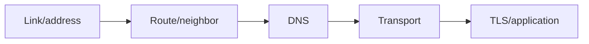

# Chapter 24 — Networking Cheatsheets Collection

[← Comprehensive Quiz](../23-Quiz/README.md) · [Handbook](../README.md) · [DevOps Networking →](../25-DevOps-Networking/README.md)

> **Purpose:** Fast recall after concepts are understood. Cheatsheets are not replacements for the handbook chapters or official references.

## 1. Introduction

This collection organizes the commands, protocol fields, calculations, and troubleshooting checks used throughout the handbook. Use it during labs, interviews, and incidents after you understand the underlying mechanism.

## 2. Theory

| Reference | Best use |
|---|---|
| [PDU and Headers](../../cheatsheets/pdu-and-headers.md) | Encapsulation, sizes, router changes, Wireshark fields |
| [IPv4 Subnetting](../../cheatsheets/ipv4-subnetting.md) | Masks, capacity, block size, VLSM |
| Command map below | First-line Linux evidence |
| Filter map below | Packet analysis |
| Failure matrix below | Symptom isolation |

> **Did you know?** The fastest command is useless if it tests a different destination, namespace, address family, or protocol than the failing application.

> **Memory trick:** **Address → Route → Name → Port → Packet → Application.**

### Behind the scenes

Command output changes by kernel, distribution, privileges, network manager, and namespace. Record environment and interpret fields instead of matching screenshots blindly.

## 3. Visual diagram



## 4. Real-world example

For “website timeout,” use `getent`/`dig`, `ip route get`, `ss` or connection test, `curl -v`, then a narrow capture. Do not begin by flushing DNS, routes, or firewall state.

### Real industry usage

Runbooks use concise commands and expected evidence, linked to deeper explanations and safe rollback.

### Cloud perspective

Pair guest commands with provider route tables, security groups/NACLs, gateways, load balancer health, DNS, and flow logs.

### DevOps perspective

Run commands inside the failing container/Pod namespace as well as the node. Map Docker/Kubernetes published/service ports to actual listeners.

### Cybersecurity perspective

Authorize captures/scans, minimize data, avoid publishing topology or tokens, and do not disable controls as a shortcut.

## 5. Packet journey

```text
DNS → source/route → ARP/NDP → frame → routers/firewall/NAT
    → TCP/UDP/QUIC → TLS → application → reverse path
```

## 6. Linux commands

| Question | Command |
|---|---|
| Interface/address? | `ip -brief link; ip -brief address` |
| Gateway/path/source? | `ip route get DEST` |
| ARP/NDP? | `ip neighbor` |
| Listening port? | `ss -lntup` |
| TCP state? | `ss -tan; ss -ti` |
| Resolver path? | `resolvectl status; getent ahosts NAME` |
| DNS record? | `dig NAME A; dig NAME AAAA` |
| TLS/HTTP? | `curl -v --connect-timeout 5 URL` |
| Path/MTU? | `tracepath DEST` |
| Packet evidence? | `tcpdump -ni IFACE FILTER` |
| Firewall/NAT? | `nft list ruleset; conntrack -L` |
| Bridge/VLAN? | `bridge link; bridge fdb show; bridge vlan show` |

## 7. Practical example

Choose any failed quiz scenario and collect a five-command read-only evidence bundle. Write what each command proves and what it cannot prove.

## 8. Wireshark example

| Goal | Display filter |
|---|---|
| DNS | `dns` |
| ARP | `arp` |
| ICMP | `icmp or icmpv6` |
| Handshake | `tcp.flags.syn == 1` |
| Reset | `tcp.flags.reset == 1` |
| Retransmission | `tcp.analysis.retransmission` |
| One stream | `tcp.stream eq N` |
| VLAN | `vlan` |
| NDP | `icmpv6.type == 135 or icmpv6.type == 136` |

## 9. Common mistakes

- Copying commands without replacing placeholders.
- Running destructive renew/flush/restart commands remotely.
- Ignoring IPv6 and namespaces.
- Treating a cheat value such as `2^h−2` as universal.
- Using display-filter syntax as a capture filter.

## 10. Troubleshooting

| Symptom | First split |
|---|---|
| Name fails | IP reachability vs resolver path |
| Timeout | request departure vs response return |
| Refused | correct tuple vs listener/policy |
| Local works, remote fails | bind/firewall/route/NAT |
| Small works, large fails | MTU/fragmentation/ICMP |
| Intermittent | backend/path/address-family/cache variation |

### Best practices

- Keep commands read-only first.
- Test the exact flow.
- Timestamp output.
- Capture both sides of a disputed boundary.
- Link every runbook action to rollback and expected evidence.

## 11. Interview questions

1. Explain what `ip route get` adds beyond `ip route`.
2. Why can `ss` show a listener while remote access fails?
3. What is the difference between `getent` and `dig`?
4. Why might host and wire captures differ?

<details><summary>Answer guidance</summary>

Discuss exact kernel lookup; bind versus end-to-end reachability; system name-service policy versus direct DNS; offload/capture point/link type.

</details>

## 12. Quiz

1. Command for FDB? 2. Filter TCP reset? 3. Command for IPv6 routes? 4. Which tool shows DNS response code and TTL?

<details><summary>Answers</summary>

1. `bridge fdb show`. 2. `tcp.flags.reset == 1`. 3. `ip -6 route`. 4. `dig` (and Wireshark for captured DNS).

</details>

## FAQ

### Should I memorize commands?

Memorize the object-to-tool mapping and learn to read help/manual pages. Exact flags can be checked.

### Where are the sources?

See the repository-wide [References](../../REFERENCES.md), mapped by chapter.

## 13. Summary

Cheatsheets accelerate recall only after the mental model exists. Start read-only, match the real flow and namespace, interpret evidence, and return to the full chapter or official source for uncertainty.
