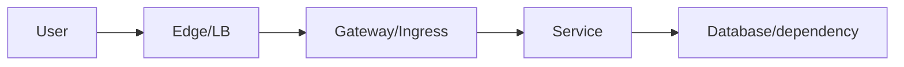

# Chapter 25 — DevOps Networking

[← Cheatsheets](../24-Cheatsheets/README.md) · [Handbook](../README.md) · Next: Docker Networking

> **Learning objectives**
> - Map application delivery, CI/CD, observability, and reliability to network dependencies.
> - Design health checks, timeouts, service discovery, segmentation, and evidence collection.
> - Treat network configuration as tested, reviewable Infrastructure as Code.

## 1. Introduction

DevOps networking connects code delivery to real packet paths. Builds require DNS and registries; deployments require APIs and health checks; applications require discovery, load balancing, encryption, and policy; incidents require correlated metrics, logs, traces, and packets.

The goal is not for every engineer to configure carrier routers. It is to understand dependencies well enough to design, automate, observe, and troubleshoot systems safely.

## 2. Theory

### Delivery-path model

| Stage | Network dependencies |
|---|---|
| Source/build | Git, package mirrors, DNS, proxies, artifact registries |
| Deploy | cloud/Kubernetes APIs, SSH/agents, credentials endpoints |
| Runtime | service discovery, listeners, load balancers, east-west policy |
| Observe | log/metric/trace exporters, time sync, collectors |
| Recover | failover routes, DNS/traffic shift, rollback connectivity |

### Health checks

- **Liveness:** should the process/container be restarted?
- **Readiness:** should it receive new traffic?
- **Startup:** does it need extra initialization time?
- **Load-balancer health:** can the balancer reach a meaningful endpoint?

A TCP connect check proves a listener accepts connections; it does not prove dependencies or business behavior. A deep check can be accurate but costly and can amplify failures. Design checks around the decision they control.

### Timeouts, retries, and budgets

Every network call needs a finite timeout. Retries must be bounded, delayed with jitter, and limited to safe/idempotent operations. Layered retries can multiply traffic into a retry storm. Align client, proxy, load balancer, and server timeouts so failures terminate predictably.

### Service discovery and load balancing

DNS, registries, Kubernetes Services, cloud load balancers, and service meshes map logical names to changing endpoints. Cache TTL, endpoint readiness, connection reuse, and draining determine how quickly a deployment or failure is observed.

### Network as code

CIDRs, routes, security rules, gateways, DNS, load balancers, policies, and observability should be version-controlled, reviewed, validated, and deployed with rollback. Tests should catch overlap, overly broad exposure, missing reverse paths, and environment drift.

> **Did you know?** A deployment can be “successful” while no users reach it because readiness, listener binding, Service target port, or load-balancer path is wrong.

> **Memory trick:** **Resolve → Route → Reach → Ready → Respond.**

### Behind the scenes

Modern requests can traverse client DNS, CDN, WAF, load balancer, ingress/gateway, service mesh sidecars, application, database proxy, and managed service endpoints. Each hop may terminate TLS, create a new connection, translate addresses, retry, and emit separate telemetry.

## 3. Visual diagram



## 4. Real-world example

A new release returns 503. The load balancer is healthy, but ingress has no ready endpoints because the readiness probe uses the wrong port. The safe fix corrects the probe/port mapping, verifies endpoints, then confirms the original user path.

### Real industry usage

Platform teams provide network patterns, DNS, certificates, ingress/egress, policy, observability, and paved-road modules so application teams do not reinvent fragile connectivity.

### Cloud perspective

Cloud paths combine VPC routes, security groups/NACLs, private endpoints, NAT/Internet gateways, managed load balancers, DNS zones, and cross-account/region connectivity. Availability-zone placement and egress cost are architectural concerns.

### DevOps perspective

CI should lint CIDRs/policies, scan accidental public exposure, test DNS and health endpoints, and run ephemeral integration environments. CD should use progressive delivery and observe network/application signals before promotion.

### Cybersecurity perspective

Default-deny where operationally supported, minimize egress, authenticate workloads, encrypt sensitive flows, rotate certificates, protect metadata endpoints, and log policy decisions. Avoid IP-only identity where dynamic workloads and proxies exist.

## 5. Packet journey

Follow the logical request and each physical connection separately. DNS returns edge endpoint; edge may terminate TLS; gateway selects service; proxy creates an upstream connection; service resolves a database; return responses cross the reverse chain. Capture and logs must identify original request IDs plus each hop's tuple.

## 6. Linux commands

```bash
getent ahosts SERVICE
ip route get DEST
ss -tulpen
curl -v --connect-timeout 5 URL
openssl s_client -connect HOST:443 -servername NAME
tcpdump -ni IFACE 'host DEST and port PORT'
```

Inside containers/Pods, also inspect namespace-specific resolver files, addresses, routes, and sockets.

## 7. Practical example

Create a dependency map for one project: source → build → registry → deploy API → runtime ingress → service → database → telemetry. For each edge record DNS name, protocol/port, timeout, retry owner, policy, health signal, and failure behavior.

## 8. Wireshark example

Use packet capture to verify handshake/latency and tuple transitions, then correlate with proxy access logs and distributed traces. TLS can hide payload; trace IDs and timestamps bridge application and packet evidence.

## 9. Common mistakes

- Using `localhost` across containers/Pods as if it meant another workload.
- Confusing container, host, Service, and external ports.
- Infinite or layered aggressive retries.
- Health checks that always return 200 without testing readiness.
- Hard-coded IPs instead of discovery.
- Broad `0.0.0.0/0` access as a permanent fix.
- Monitoring averages while one path/backend fails.

## 10. Troubleshooting

| Symptom | First split |
|---|---|
| Pipeline cannot download | DNS/proxy/egress/registry auth |
| Deployment API timeout | runner route/VPN/policy/API health |
| 502/503 | gateway route, endpoints, readiness, upstream port |
| Only new Pods fail | CNI/IPAM/policy/DNS/node path |
| Intermittent latency | backend/path/retries/connection pool/address family |
| Telemetry missing | exporter DNS/egress/TLS/backpressure |

### Best practices

- Maintain dependency diagrams and ownership.
- Standardize timeouts, retries, health checks, and graceful draining.
- Validate CIDR overlap and policy in CI.
- Observe golden signals per hop, not only end-to-end averages.
- Test rollback and failure modes before incidents.
- Preserve original user path during verification.

## 11. Interview questions

### Readiness versus liveness?

<details><summary>Answer</summary>Readiness controls whether traffic is sent; liveness decides whether the process should be restarted. Mixing them can create restart loops or send traffic too early.</details>

### Why are retries dangerous?

<details><summary>Answer</summary>They multiply load during failure, repeat non-idempotent actions, and combine across layers. Use budgets, backoff, jitter, and ownership.</details>

### How would you diagnose 503 after deployment?

<details><summary>Answer</summary>Identify who generated 503, inspect gateway route and ready endpoints, validate port/probe/listener, correlate release change, test upstream directly, then verify user path.</details>

## 12. Quiz

1. Does TCP health prove app readiness? 2. Why align timeouts? 3. What data belongs in a dependency edge? 4. Why can `localhost` fail between containers?

<details><summary>Answers</summary>

1. No. 2. To bound failure and prevent conflicting retries/timeouts. 3. Name/address, protocol/port, policy, timeout/retry, owner, telemetry, failure behavior. 4. Each container usually has its own network namespace; localhost refers to itself.

</details>

## FAQ

### Should applications know network topology?

They should use stable discovery abstractions but teams must understand paths, failure domains, policies, and latency dependencies.

### Network or platform team's problem?

Ownership is shared across interfaces. Clear contracts and evidence prevent handoff loops.

## 13. Summary

DevOps networking makes delivery paths explicit, automated, observable, secure, and recoverable. Design discovery, ports, health, timeouts, retries, policy, and telemetry together; verify the real user path and every connection boundary.

## References

See [repository references](../../REFERENCES.md), especially Linux, Docker, Kubernetes, and AWS official documentation.
