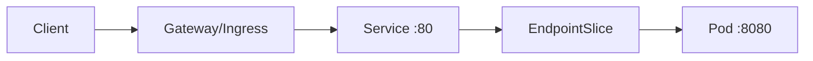

# Chapter 27 — Kubernetes Networking

[← Docker Networking](../26-Docker-Networking/README.md) · [Handbook](../README.md) · [AWS Networking →](../28-AWS-Networking/README.md)

> **Learning objectives**
> - Explain Pod, Service, node, ingress/gateway, DNS, and egress traffic.
> - Distinguish `port`, `targetPort`, `nodePort`, endpoints, and NetworkPolicy.
> - Diagnose Kubernetes networking from workload, Service, node, and infrastructure layers.

## 1. Introduction

Kubernetes networking gives each Pod an address, enables Pod-to-Pod communication through a CNI implementation, and provides stable virtual Services in front of changing endpoints. Kubernetes defines the model and APIs; CNI plugins and infrastructure implement routing, overlays, policy, and dataplane behavior.

## 2. Theory

### Four paths

1. container-to-container inside one Pod uses shared network namespace/localhost;
2. Pod-to-Pod uses Pod addresses across nodes;
3. Pod-to-Service uses virtual IP/DNS and endpoint selection;
4. external-to-Service uses LoadBalancer, NodePort, ingress, or Gateway APIs.

### Service mapping

| Field/type | Meaning |
|---|---|
| `port` | Port exposed by the Service |
| `targetPort` | Backend Pod port/name |
| `nodePort` | Port exposed on nodes for NodePort/LoadBalancer path |
| ClusterIP | Internal virtual Service address |
| Headless | No ClusterIP; DNS returns endpoint records |
| EndpointSlice | Ready backend addresses/ports used by Service dataplane |

A Service with no ready endpoints cannot forward to Pods even if its ClusterIP exists.

### CNI and dataplane

CNI plugins configure Pod interfaces, addresses, routes, and sometimes overlays/eBPF and NetworkPolicy. Service forwarding may use iptables, IPVS, eBPF, or provider-specific dataplanes. Do not assume one implementation when troubleshooting.

### DNS

CoreDNS commonly publishes Service names such as `api.namespace.svc.cluster.local`. Pod resolver search domains enable short names. `ndots`, search expansion, DNS policy, and upstream forwarding can affect latency and unexpected queries.

### NetworkPolicy

NetworkPolicy selects Pods and describes allowed ingress/egress. Enforcement requires a supporting network plugin. Policies are additive; once a Pod is isolated for a direction, allowed traffic must match applicable rules. NetworkPolicy is primarily Layer 3/4 and does not replace application authorization.

### Ingress and Gateway

Ingress/Gateway resources describe application routing, but a controller must implement them. External load balancer, controller listener, route rule, Service, EndpointSlice, readiness, Pod listener, and return path must all align.

> **Did you know?** Containers in the same Pod share one IP and port namespace, so two containers cannot bind the same address/port combination.

> **Memory trick:** **Name → Service port → EndpointSlice → targetPort → Pod listener.**

### Behind the scenes

Traffic can be SNATed based on external/internal traffic policy, node locality, masquerade rules, or plugin behavior. Service VIPs may not exist as ordinary interfaces. Inspect the active dataplane and CNI documentation.

## 3. Visual diagram



## 4. Real-world example

Service exposes `port: 80`, forwards to `targetPort: 8080`, but the container listens on 3000. DNS and ClusterIP work, yet connections fail. Inspect Service, EndpointSlice, Pod readiness, and `ss` inside the Pod.

### Real industry usage

Clusters use Services for discovery/load distribution, Gateway/Ingress for north-south traffic, NetworkPolicy for segmentation, and CNI for Pod connectivity. Multi-cluster and service mesh add more discovery, routing, and identity layers.

### Cloud perspective

Managed Kubernetes integrates cloud load balancers, VPC routes/interfaces, security groups, IP limits, and DNS. Pod density may be constrained by subnet/interface address capacity depending on CNI mode.

### DevOps perspective

Deployments should validate readiness, Service selectors, EndpointSlices, ports, DNS, policies, and rollouts. Use ephemeral debug containers where permitted, and test from the same namespace/path as the workload.

### Cybersecurity perspective

Use default-deny policies with required DNS/egress exceptions, workload identity, TLS, least-privilege RBAC, admission controls, and restricted metadata access. NetworkPolicy alone does not secure the cluster control plane.

## 5. Packet journey

Pod resolves Service DNS, routes to ClusterIP, dataplane selects a ready endpoint, packet is translated/routed to Pod IP and targetPort, CNI/policy enforce the path, listener responds, and reverse translation/state returns traffic. External paths add load balancer and gateway/controller connections.

## 6. Linux commands

```bash
kubectl get pods -o wide
kubectl get svc
kubectl get endpointslice
kubectl describe svc NAME
kubectl get networkpolicy
kubectl exec POD -- ip route
kubectl exec POD -- getent hosts SERVICE
kubectl exec POD -- ss -lntup
```

Use `kubectl debug` and node-level tools only with authorization.

## 7. Practical example

Complete [Lab 19: Trace a Kubernetes Service](../../labs/19-kubernetes-service/README.md).

## 8. Wireshark example

Capture inside Pod, node, and CNI interface where permitted. Filter Service/Pod IP and target port. Account for DNAT/SNAT, overlay headers, and separate ingress-controller upstream connections.

## 9. Common mistakes

- Confusing `port`, `targetPort`, `containerPort`, and `nodePort`.
- Assuming Service selects Pods without checking labels/endpoints.
- Expecting NetworkPolicy enforcement from unsupported CNI.
- Testing from node when Pod policy/DNS is failing.
- Assuming ClusterIP is a normal bound interface.
- Forgetting readiness removes endpoints.

## 10. Troubleshooting

| Symptom | Checks |
|---|---|
| Service DNS fails | Pod resolv.conf, CoreDNS Service/Pods/logs, policy |
| DNS works, Service fails | ClusterIP/port, EndpointSlice, dataplane |
| Endpoint direct works, Service fails | Service rules/eBPF/IPVS/iptables |
| No endpoints | selector, readiness, namespace, named port |
| Cross-node only fails | CNI route/overlay/MTU/cloud policy |
| External only fails | LB/controller/Gateway route/Service policy |

### Best practices

- Monitor DNS, endpoint count, CNI health, drops, IP capacity, and LB targets.
- Use named ports carefully and consistently.
- Define NetworkPolicy with tested DNS and observability paths.
- Document Pod, Service, node, and external CIDRs without overlap.
- Validate dual-stack behavior when enabled.

## 11. Interview questions

### Service versus Ingress?

<details><summary>Answer</summary>Service provides stable access to endpoints, commonly L4. Ingress describes HTTP(S) routing implemented by a controller and forwards to Services.</details>

### Service has no endpoints?

<details><summary>Answer</summary>Check selector labels, namespace, Pod readiness, EndpointSlices, and target/named ports.</details>

### What does CNI do?

<details><summary>Answer</summary>Plugins configure container/Pod networking such as interfaces, addresses, routes, connectivity, and optionally policy/dataplane features.</details>

## 12. Quiz

1. `port` vs `targetPort`? 2. Can two containers in one Pod bind same port? 3. Does every CNI enforce NetworkPolicy? 4. Why might cross-node traffic alone fail?

<details><summary>Answers</summary>

1. Service-facing versus backend Pod port. 2. Not on the same address/protocol because they share namespace. 3. No. 4. CNI underlay/overlay route, MTU, node firewall, or cloud path.

</details>

## FAQ

### Pod IP stable?

No. Pods are replaceable; use Services/discovery.

### Does Kubernetes require an overlay?

No. The implementation must provide the networking model; it can use routed, overlay, cloud-native, or eBPF designs.

## 13. Summary

Kubernetes networking joins Pod namespaces, CNI connectivity, Service virtual endpoints, DNS, policy, and external gateways. Diagnose the exact chain from name to ready endpoint and active dataplane.

## References

- [Kubernetes Services and Networking](https://kubernetes.io/docs/concepts/services-networking/)
- [Services](https://kubernetes.io/docs/concepts/services-networking/service/)
- [DNS for Services and Pods](https://kubernetes.io/docs/concepts/services-networking/dns-pod-service/)
- [NetworkPolicy](https://kubernetes.io/docs/concepts/services-networking/network-policies/)
