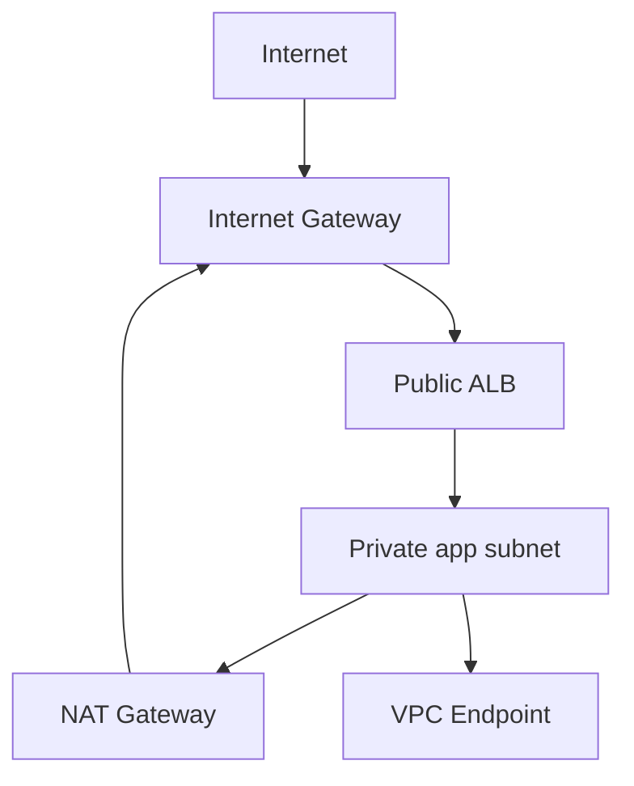

# Chapter 28 — AWS Networking

[← Kubernetes Networking](../27-Kubernetes-Networking/README.md) · [Handbook](../README.md) · [Home →](../../README.md)

> **Learning objectives**
> - Explain VPCs, subnets, route tables, gateways, ENIs, security groups, and NACLs.
> - Design public/private paths, NAT, load balancing, endpoints, peering, and transit connectivity.
> - Diagnose AWS flows using guest evidence, Reachability Analyzer, and VPC Flow Logs.

## 1. Introduction

Amazon VPC provides logically isolated networking with CIDR blocks, subnets, virtual interfaces, routes, security controls, gateways, DNS, and connectivity services. AWS hides physical switching, but ordinary addressing, longest-prefix routing, state, MTU, DNS, and return-path principles still apply.

## 2. Theory

### Core objects

| Object | Role |
|---|---|
| VPC | Regional routing/address domain |
| Subnet | AZ-scoped IP prefix associated with route table |
| ENI | Virtual network interface with addresses/security groups |
| Route table | Destination-to-target forwarding rules |
| Internet Gateway | VPC Internet connectivity target; public IPv4 mapping behavior |
| NAT Gateway | Outbound-initiated translation for private workloads |
| Security Group | Stateful allow rules attached to resources/ENIs |
| Network ACL | Stateless ordered subnet-boundary allow/deny rules |
| VPC Endpoint | Private access to supported services |

### Public and private subnets

A subnet is “public” when its effective route table sends Internet-bound traffic to an Internet Gateway and the resource has appropriate public addressing/policy. A private subnet commonly sends IPv4 default traffic to a NAT Gateway in a public path, or uses VPC endpoints without Internet egress.

### Route selection

AWS route tables use longest-prefix match. Targets include local VPC routing, IGW, NAT gateway, ENI/appliance, peering, Transit Gateway, virtual private gateway, and endpoints. Security controls are evaluated separately.

### Security groups versus NACLs

| Security group | Network ACL |
|---|---|
| Stateful | Stateless |
| Resource/ENI association | Subnet association |
| Allow rules | Ordered allow and deny rules |
| Return traffic allowed by state | Return direction/ephemeral ports need rules |

### Connectivity services

- VPC peering: direct non-transitive VPC connectivity.
- Transit Gateway: hub for VPC/on-premises routing.
- Site-to-Site VPN / Direct Connect: hybrid connectivity.
- PrivateLink: service exposure through interface endpoints without broad routing.
- Route 53 private hosted zones/resolvers: private DNS and forwarding.

> **Did you know?** Opening a security group does not create a listener, route, public address, Internet Gateway path, or healthy load-balancer target.

> **Memory trick:** **Address + Route + Policy + Gateway + Return.**

### Behind the scenes

AWS reserves addresses in each subnet and implements VPC routing through the fabric rather than a visible customer router hop. Traceroute may not reveal logical AWS objects. Managed services have quotas, AZ scope/HA characteristics, and cost implications that must be checked in current docs.

## 3. Visual diagram



## 4. Real-world example

An ALB in public subnets receives HTTPS, security group allows clients, and forwards to app instances in private subnets on port 8080. App egress uses a NAT gateway; S3 traffic uses a gateway endpoint. Instances need no public IPv4 address.

### Real industry usage

Production VPCs use multi-AZ subnets, controlled ingress/egress, centralized transit, endpoints, hybrid links, flow logs, IPAM, DNS, and Infrastructure as Code.

### Cloud perspective

Availability and cost depend on AZ placement, NAT/data-processing paths, load balancer nodes, cross-AZ traffic, endpoint choices, and quota planning. Consult current regional service documentation.

### DevOps perspective

Terraform/CloudFormation should validate non-overlap, explicit subnet-route associations, least-privilege rules, flow logs, endpoint policies, and HA. CI should reject `0.0.0.0/0` management exposure and accidental route replacement.

### Cybersecurity perspective

Layer security groups, NACLs where justified, WAF, workload identity, private endpoints, egress controls, TLS, GuardDuty/flow logs, and IAM. Protect metadata service access and use VPC Reachability Analyzer as evidence, not as application health proof.

## 5. Packet journey

Internet-to-ALB: DNS returns ALB addresses, IGW/public fabric delivers to ALB listener, listener rule selects target group, ALB creates a separate connection to target ENI/private address, target SG/listener responds, and health/return state complete both connections.

Private egress: instance route `0.0.0.0/0 → NAT`, NAT translates, public NAT path reaches IGW, reply returns through same state. Route table, SG egress, NACL both directions, NAT state, and destination policy all matter.

## 6. Linux commands

Inside EC2:

```bash
ip address
ip route
ss -lntup
resolvectl status
curl -v URL
tracepath DEST
```

AWS evidence includes route tables, ENIs, security groups, NACLs, target health, VPC Flow Logs, Reachability Analyzer, NAT metrics, DNS resolver query logs, and CloudTrail changes.

## 7. Practical example

Complete [Lab 20: Trace an AWS VPC flow](../../labs/20-aws-vpc-flow/README.md). It is a design/evidence lab and does not create billable resources automatically.

## 8. Wireshark example

Guest capture shows traffic at the ENI OS boundary, not every AWS fabric decision. Compare with Flow Logs (`ACCEPT`/`REJECT` metadata), load-balancer logs, target health, and Reachability Analyzer. An `ACCEPT` flow log does not prove application success.

## 9. Common mistakes

- Calling a subnet public only because instances have public IPs.
- Treating SG and NACL as equivalent.
- Forgetting NACL ephemeral return ports.
- Placing a NAT gateway in a subnet without an IGW route for public egress.
- Assuming peering is transitive.
- Using overlapping VPC/on-premises/container CIDRs.
- Opening SG while service binds only loopback.

## 10. Troubleshooting

| Symptom | Checks |
|---|---|
| EC2 no Internet | address, subnet route, IGW/NAT, SG egress, NACL, DNS |
| ALB unhealthy target | target port/listener, SG chain, route/NACL, health path/status |
| Peering fails | routes both VPCs, CIDR overlap, SG/NACL, DNS settings |
| Endpoint fails | subnet route/DNS, endpoint SG/policy, service IAM policy |
| One AZ fails | subnet associations, NAT/LB targets/routes, capacity |
| Flow log ACCEPT but timeout | listener/app/return path/downstream |

### Best practices

- Use IPAM and non-overlapping hierarchical CIDRs.
- Design multi-AZ routing and NAT/endpoints deliberately.
- Associate route tables explicitly.
- Restrict management access and review SG references.
- Enable useful flow/config/change logging with retention.
- Test failure modes and quotas before production.
- Keep architecture diagrams synchronized with IaC.

## 11. Interview questions

### Security group vs NACL?

<details><summary>Answer</summary>SG is stateful allow policy on resources/ENIs. NACL is stateless ordered allow/deny policy at subnet boundary; both directions matter.</details>

### What makes a subnet public?

<details><summary>Answer</summary>An effective route to an Internet Gateway plus suitable resource public addressing and policy for the intended flow.</details>

### NAT Gateway role?

<details><summary>Answer</summary>Provides managed source translation for outbound-initiated connectivity from private workloads; it is not an inbound publishing service.</details>

## 12. Quiz

1. Is VPC peering transitive? 2. Does SG allow create a route? 3. Why NACL needs ephemeral ports? 4. Flow Log ACCEPT proves what?

<details><summary>Answers</summary>

1. No. 2. No. 3. It is stateless, so reply direction must be explicitly permitted. 4. The logged fabric flow action was accepted at that observation; not listener/application success.

</details>

## FAQ

### NAT Gateway or VPC endpoint?

Endpoints keep supported service traffic private and can reduce NAT dependence; NAT supports broader outbound destinations. Design for service, policy, HA, and cost.

### Can traceroute show the NAT Gateway?

Not reliably. AWS logical fabric components may not appear as ordinary router hops.

## 13. Summary

AWS networking combines VPC prefixes, AZ subnets, route targets, ENIs, stateful SGs, stateless NACLs, gateways, load balancers, endpoints, DNS, and hybrid connectivity. Diagnose guest and fabric evidence together and verify both connections and return paths.

## References

- [Amazon VPC User Guide](https://docs.aws.amazon.com/vpc/latest/userguide/what-is-amazon-vpc.html)
- [VPC route tables](https://docs.aws.amazon.com/vpc/latest/userguide/VPC_Route_Tables.html)
- [Security groups](https://docs.aws.amazon.com/vpc/latest/userguide/vpc-security-groups.html)
- [NAT gateways](https://docs.aws.amazon.com/vpc/latest/userguide/vpc-nat-gateway.html)
- [VPC Flow Logs](https://docs.aws.amazon.com/vpc/latest/userguide/flow-logs.html)
